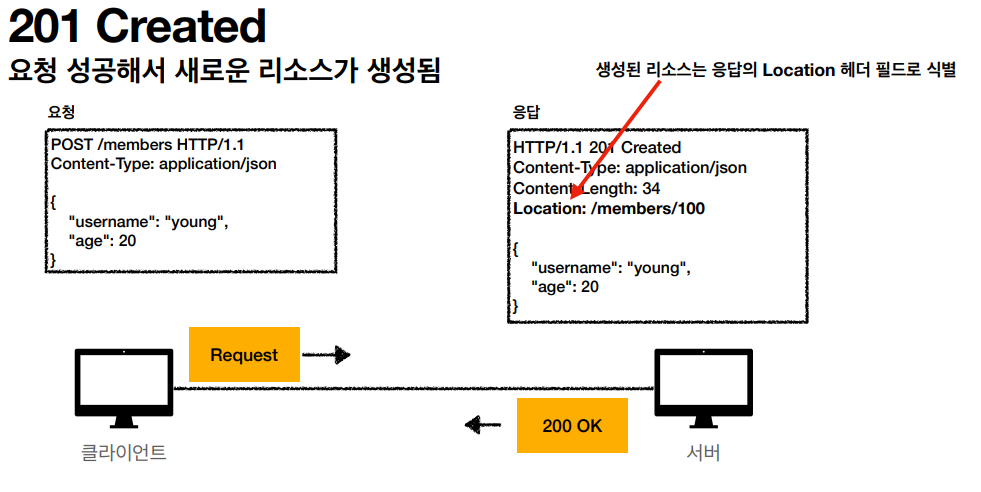
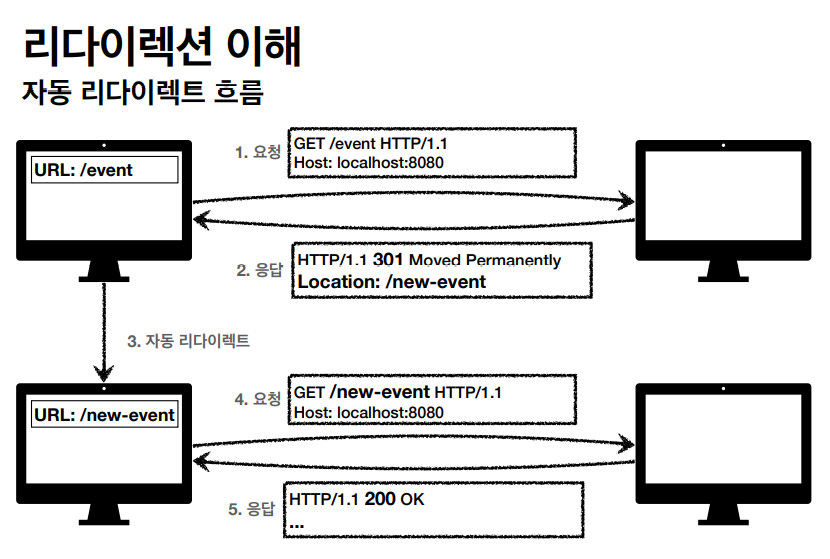
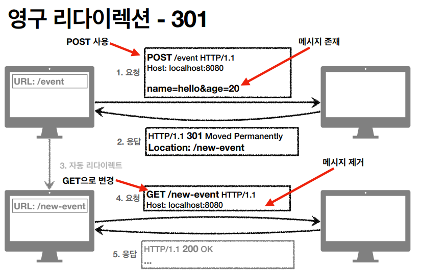
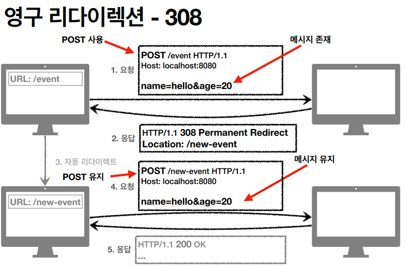
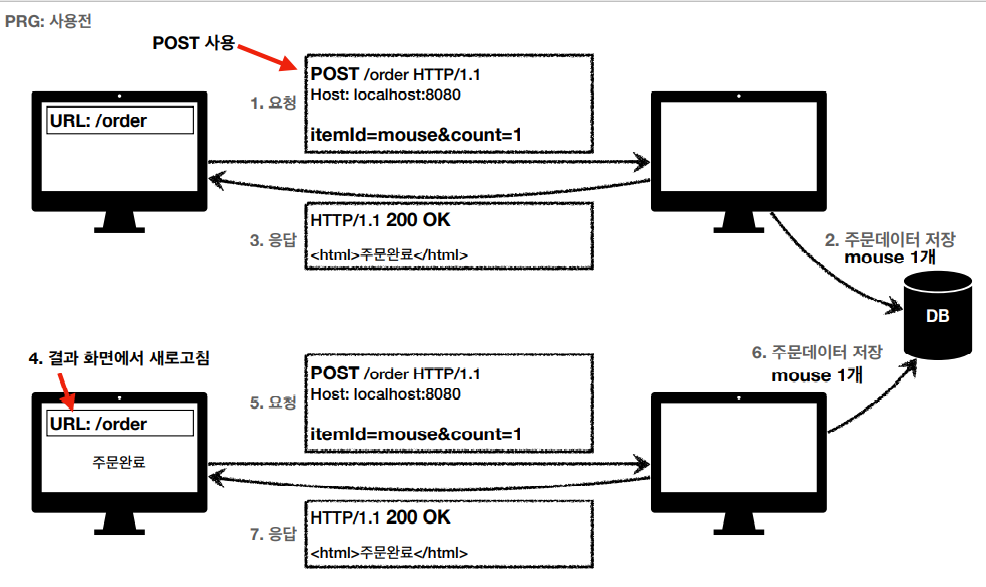

# HTTP 상태코드

###  상태 코드

- 클라이언트가 보낸 요청의 처리 상태를 응답(리스폰스)에서 알려주는 기능
  - 1XX (Inforamtional) : 요청이 수신되어 처리중 - 거의 사용 X
  - 2XX (Successful) : 요청 정상처리
  - 3XX (Redirection) : 요청을 완료하려면 추가 행동이 필요
  - 4XX (Client Error) : 클라이언트 오류, 잘못된 문법등으로 서버가 요청을 수행할  수 없음
  - 5XX (Server Error) : 서버 오류, 서버가 정상 요청을 처리하지 못함

### 만약 모르는 상태 코드가 나타나면?

- 클라이언트가 인식할 수 없는 상태코드를 서버가 반환하면?
- 클라이언트는 상위 상태코드로 해석해서 처리
- 미래에 새로운 상태 코드가 추가 되어도 클라이언트를 변경하지 않아도됨
- ex)
  - 299 ??? -> 2XX
  - 451 ??? -> 4XX
  - 599 ??? -> 5XX

### 1XX (Informational)

- 요청이 수신되어 처리 중
- 거의 사용하지 않으므로 생략

## 2XX (Successful)

- 클라이언트의 요청을 성공적으로 처리
- 200 OK
- 201 Created
  - 클라이언트 요청한 것을 가지고 서버가 리소스를 생성함
  - 주로 POST
- 202 Accepted
- 204 No Content

### 201

- 생성된 리소스는 응답의 Location 헤더 필드로 식별

### 202 Accepted

- 요청이 접수되었으나 처리가 완료되지 않았음

- 배치 처리 같은 곳에서 사용
- 요청 접수 후 1시간 뒤에 배치 프로세스가 요청을 처리함 (잘 사용 X)

### 203 No Content

- 서버가 요청을 성공적으로 수행했지만, 응답 페이로드 본문에 보낼 데이터가 없음
- ex) 웹 문서 편집기에서 save 버튼
- save 버튼의 결과로 아무 내용이 없어도 된다.
- save 버튼을 눌러도 같은 화면을 유지해야한다.
- 결과 내용이 없어도 204 메시지 (2XX)만으로 성공을 인식할 수 있다.

----------------------

- 개발할 때 각 팀들이 내부에서 어느 정도 범위까지만 사용하자고 약속하고 개발

## 3XX - 리다이렉션

- 요청을 완료하기 위해 유저 에이전트의 추가 조치 필요

- 300 Mulitple Choices (거의 안씀)

- 301 ~ 308이 중요

- 이해

  - 웹 브라우저는 3XX 응답의 결과에 Loaction 헤더가 있으면, Location 위치로 자동 이동 (리다이렉트)

    

- 종류
  - 영구 리다이렉션
    - 특정 리소스의 URI가 영구적으로 이동
    - 예)
      - /members -> /users
      - /event -> /new-evet
  - 일시 리다이렉션 - 일시적인 변경
    - 주문 완료 후 주문 내역으로 화면으로 이동
    - PRG : Post / Redirect / Get
  - 특수 리다이렉션
    - 결과 대신 캐시를 사용

### 영구 리다이렉션

- 301, 308
- 리소스의 URI가 영구적으로 이동
- 원래 URL를 사용 X , 검색 엔진 등에서도 변경 인지
- 301 Moved Permanently
  - (POST 전송 시)
  - 리다이렉트시 요청 메서드가 GET으로 변하고, 본문이 제거될 수 있음 (MAY)
- 308 Permanent Redirect
  - 301과 기능은 같음
  - 리다이렉트 시 요청 메서드와 본문 유지(처음 POST를 보내면 리다이렉트도 POST 유지)

- 새로운 이벤트 페이지에서 등록을 다시 해야함 (name, age)

- 새로운 이벤트 페이지에서 메시지 유지해서 다시 요청
- 사실 거의 이렇게 안씀 (새로운 페이지 폼이 다 달라지기 떄문에)

--------------------

301도 거의 안쓰고 일시적인 리다이렉션 많이 사용

### 일시적으로 리다이렉션

- 302, 307, 303
  - 3가지 기능이 거의 똑같음
  - 302 Found
    - 리다이렉트시 요청 메서드가 GET으로 변하고 본문 제거될 수 있음
  - 307 Temporary Redirect
    - 요청 메서드와 본문 유지 (변경하면 안된다. MUST NOT )
  - 303 See Other
    - 리다이렉트시 요청 메서드가 무조건 GET으로 변경
- 리소스의 URI가 일시적으로 변경
- 따라서 검색 엔진 등에서 URL을 변경하면 안됨

- 예시  (PRG 사용전)
  - POST로 주문 후에 웹 브라우저 새로 고침하면?
  - 새로고침은 다시 요청
  - 중복 주문이 될 수 있다.

- 예시 PRG사용
  - POST로 주문 후에 새로 고침으로 인한 중복 주문 방지
  - POST로 주문 후에 주문 결과 화면을 GET 메서드로 리다이렉트
  - 새로 고침해도 결과 화면을 GET으로 조회
  - 중복 주문 대신에 결과 화면만 GET으로 다시 요청

- PRG 이후 리다이렉트
  - URL이 이미 POST -> GET으로 리다이렉트 됨
  - 새로 고침해도 GET으로 결과 화면만 조회

### 그래서 뭘 써야하나요?

- 302, 307, 303

- 잠깐 정리
  - 302 : GET으로 변할 수 있음 (거의 변함)
  - 307 : 메서드가 변하면 안됨
  - 303 : 메서드가 GET으로 변경
- 역사
  - 처음 302 스펙의 의도는 HTTP 메서드를 유지하는 것
  - 그런데 웹 브라우저들이 대부분 GET으로 바꾸어버림
  - 그래서 모호한 302 대신 명확한 307 303이 등장함
- 현실
  - 307 303 을 권장하지만 현실적으로 이미 많은 어플맄이션 라이브러리들이 302를 기본값으로 사용
  - 자동 리다이렉션시에 GET으로 변해도 되면 그냥 302를 사용해도 큰 문제 없음

### 기타 리다이렉션

- 300 304
- 300 거의 안씀
- 304 진짜 많이 씀
  - Not Modified
  - 캐시를 목적으로 사용
  - 서버가 클라이언트에게 리소스가 수정되지 않았음을 알려준다
  - 따라서 클라이언트는 로컬 PC에 저장된 캐시를 재사용한다. (캐시로 리다이렉트한다.)
  - 304 응다븐 응답에 메시지 바디를 포함하면 안된다. (로컬 캐시를 사용해야 하므로)
  - 조건부 GET, HEAD 요청시 사용

## 4XX - 클라이언트 오류, 5XX - 서버 오류

### 4XX

- 클라이언트 오류
- 클라이언트의 요청에 잘못된 문법 등으로 서버가 요청을 수행할 수 없음
- 오류의 원인이 클라이언트에 있음
- 중요! 클라이언트가 이미 잘못된 요청, 데이터를 보내고 있기 때문에, 똑같은 재시도가 실패함
  - 5XX는 똑같은 요청을 보내도 성공할 수 있음

### 400 Bad Request

- 클라이언트가 잘못된 요청을 해서 서버가 요청을 처리할 수 없음
- 요청 구문, 메시지 등등 오류
- 클라이언트는 요청 내용을 다시 검토하고, 보내야함
- ex) 요청 파라미터가 잘못되거나, API 스펙이 맞지 않을 때

- 백엔드 개발자는 철저히 다 막아야한다. 입구 컷
  - 스펙이 안맞으면 바로 처리해야한다.
  - 클라이언트 잘못인 것을 명확하게...

### 401 Unauthorized

- 클라이언트가 해당 리소스에 대한 인증이 필요함
- 인증 되지 않음
- 401 오류 발생 시 응답에 WWW-Authenticate 헤더와 함께 인증 방법을 설명
- 참고
  - 인증(Authentication) : 보인이 누구인지 확인, (로그인)
  - 인가(Authorization) : 권한부여 (ADMIN 권한처럼 특정 리소스에 접근할 수 있는 권한, 인증이 있어야 인가가 있음)
  - 오류 메시지가 Unauthorized 이지만 인증 되지 않음 (이름이 아쉬움) // 그렇지만 인증에 대한 부분 오류이다.!

### 403 Forbidden

- 서버가 요청을 이해했지만 승인을 거부함
- 주로 인증 자격 증명은 있지만, 접근 권한이 불충분한 경우
- ex) 어드민 등급이 아닌 사용자가 로그인은 했지만, 어드민 등급의 리소스에 접근하는 경우

### 404 Not Found

- 요청 리소스를 찾을 수 없음
- 요청 리소스가 서버에 없음
- 또는 클라이언트가 권한이 부족한 리소스에 접근할 때 해당 리소스를 숨기고 싶을 때

### 5XX (Server Error)

- 서버 문제로 오류 발생
- 서버에 문제가 있기 때문에 재시도 하면 성공할 수 있음

### 500 Internal Server Error

- 서버 내부 문제로 오류 발생
- 애매하면 500 오류

### 503 Service Unavailable

- 서비스 이용 불가
- 서버가 일시적인 과부하 또는 예정된 작업으로 잠시 요청을 처리할 수 없음
- Rerty - After 헤더 필드로 얼마 뒤에 복구 되는지 보낼 수 있음

--------------

- 왠만해서 서버에서 500 오류를 만들어 내면 안됨

- 비지니스 로직 상 예외 케이스 이런 것에 절대 500 케이스를 내면 안됨
  - 인출하는데 인출 금액이 예금 금액보다 큰 경우 등등