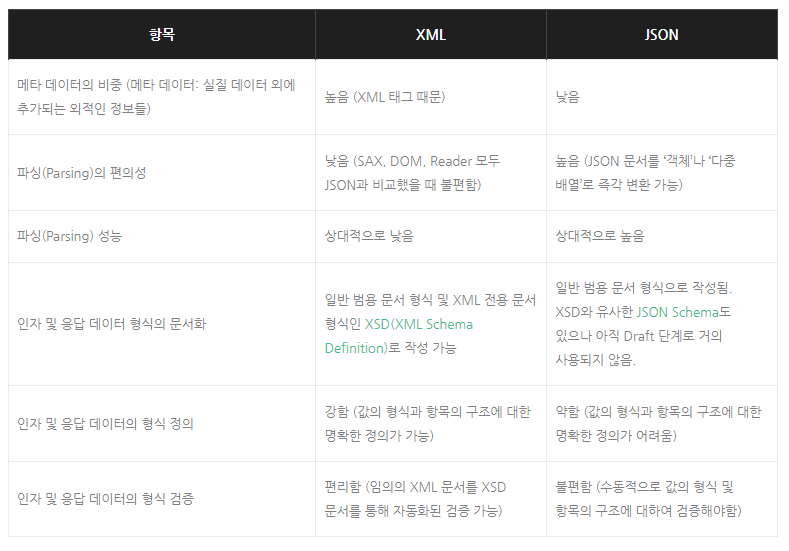
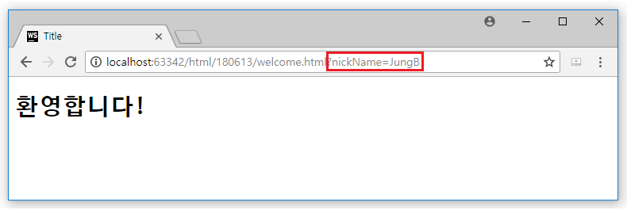
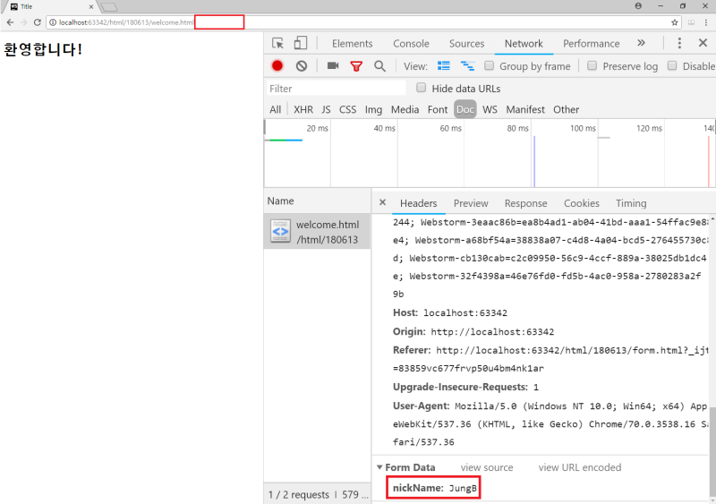
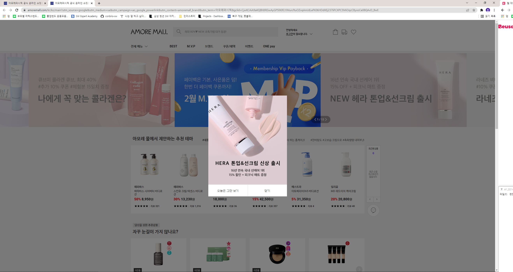
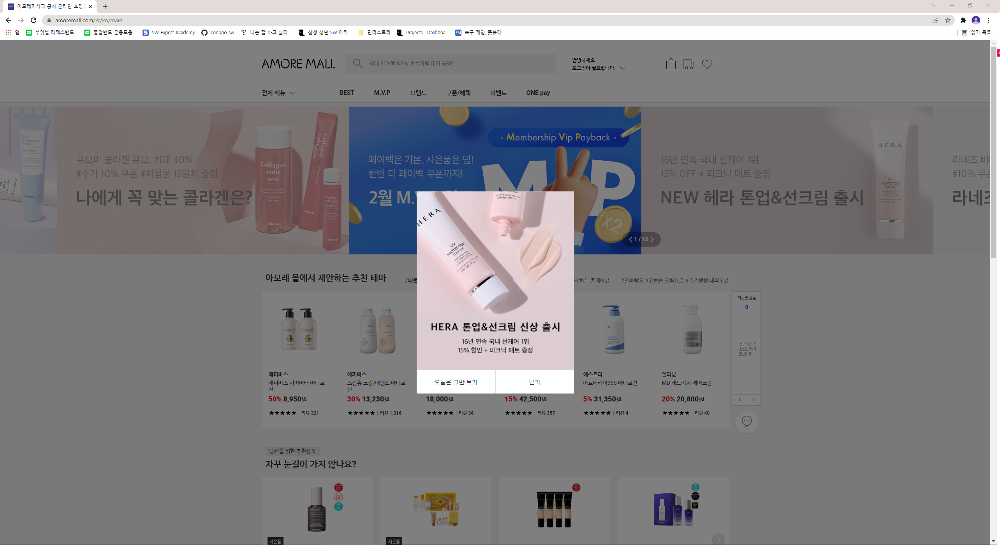

## JSON vs XML

### JSON

- JavaScript Object Notation
- 브라우저 통신을 위한 키-값 쌍으로 이루어진 데이터 포맷

### XML

- eXtensible Markup Language
- 문자 기반의 마크업 언어
- 데이터를 보여주는 목적이 아닌 데이터를 저장하고 전달하는 목적
- 태그를 사용자가 직접 정의할 수 있다.

### 공통점

- 데이터를 저장하고 전달하기 위해 사용
- 계층적인 데이터 구조
- 다양한 프로그래밍 언어에 의해 파싱 가능

### 차이점

- 파싱속도
  - XML 문서는 XML DOM을 이용하여 해당 문서에 접근,
  - JSON은 문자열을 전송받은 후에 해당 문자열을 바로 파싱하므로 더 빠르다.

### 현재 JSON이 대세가 된 이유

- 상대적으로 더 적은 데이터의 양
  - 헤더와 태그 등의 요소로 인해
- 상대적으로 더 높은 처리 성능
- 그러면 XML은 이제 사라져야하는가..?

### XML 사용 고려 이유

-  입출력 데이터의 형식적 무결성 확보
  - 데이터 무결성
    - 데이터의 정확성과 일관성을 유지하고 보증하는 것
- 입출력 데이터의 무결성 확보를 위해 커스텀 데이터 규약을 정의하는 문서 작성
  - 이를 웹 개발자와 이용자들이 공유
  - 강제성이 필요하다
- 규약 문서를 통해 일차적으로 자동 검증
  - 규약 문서에 강제성을 제공하여 규약 문서가 실질적인 영향력을 가질 수 있도록
  - 규약을 어기면 웹 API가 에러를 유발하고 규약의 어느 부분을 어겼는지 알려주는 무결성 판단 도구
- 데이터의 무결성이 확보되야, 웹 API 개발자는 모든 문제를 웹 API의 실제 구현부로 가정 가능
  - 웹 API가 에러나면 적어도 규약을 지키지 않은 입력 데이터가 원인이 아닌 것을 알 수 있게 된다.
  - 출력 데이터의 무결성까지 확보가 된다면 웹 API가 잘못된 형식의 데이터를 Client에게 보내어 파싱을 실패하는 경우도 사라짐
- 이런 무결성 부분에서 XML은 엄청난 강점을 갖고 있다.
  - XML의 규약 문서로 사용되는 XSD(XML 스키마 Definition)은 정교하고 강력
  - 웹 API의 XSD 파일을 공유하고 확인하는 것만으로 웹 API의 호출 규약을 이해하고 문제없이 사용 가능

### 아리까리

- namespace 유무도 XML 사용에 대한 강력한 이유가 될까...?
- 게임 데이터를 보면 XML이 많은데 위와 같은 이유 때문일까...?

## HTML FORM

- Why only GET&POST?

  - form은 서버에 정보를 제출하기 위해 사용
  - GET과 POST는 form에 존재하는 대화형 컨트롤에 입력된 값을 보낸다.
    - POST에서의 요청 대상 리소스는 동봉된 representation을 처리하는 주체
    - PUT에서는 동봉된 representation은 대상 리소스의 상태를 대체 (리소스 그 자체)
  - GET & POST
    - GET : form에 있는 정보를 줄테니 나에게 리소스를 줘라
    - POST : form에 있는 정보를 줄테니 이걸로 처리를 좀 해라
  - DELETE & PUT
    - URI는 리소스를 정확하게 식별하고 요청을 보내기 때문에 form을 통해 값을 전달할 게 없다.
  - 라고 Ian Hickson이 생각해서..?
- GET & POST 작동시...

### POST vs PUT

- 기본적으로 생성(create) vs 수정(update)의 관계

- POST는 같은 내용을 가진 리소스가 계속 생성된다.
  - why? -> 경로지정이 없어서
- PUT은 경로까지 지정을 하기 때문에 같은 메시지를 보내도 결과가 늘 동일하다.
  - 즉 멱등하다...!

### URI 설계 

- https://dzone.com/articles/7-rules-for-rest-api-uri-design-1
- URI 마지막에는 슬래쉬 포함 x
- / 는 계측 관계를 나타날 때 사용
- _말고 - 사용
- 소문자 사용
- 파일 확장명 포함 시키면 안됨
  - Content-Type이라는 헤더를 통해 전달되는 대로 미디어 타입을 사용하여 body의 콘텐츠를 처리하는 방법 사용
- 복수형 사용
  - 단수 복수형 사용하는 것 고민 줄여줌

## 쿼리 파라미터

https://www.amoremall.com/kr/ko/main?utm_source=google&utm_medium=sa&utm_campaign=ao_google_powerlink&utm_content=amoremall_brand&utm_term=%EC%95%84%EB%AA%A8%EB%A0%88%ED%8D%BC%EC%8B%9C%ED%94%BD&gclid=CjwKCAiA9aKQBhBREiwAyGP5lX0fLYJMurcftuOZvqAmJdLeFK06HDdXEj237liFCXPC5MiOqcCByxoCe08QAvD_BwE

https://www.amoremall.com/kr/ko/main

- 위는 구글에서 [광고]로 써져있는 거 누른 모습

- 아래는 원래 주소

- 개념
  - 웹 서버에 저장된 프로그램을 웹 브라우저로 전달하는 것
  - key = value 구조
  - 여러 개 일 겨우 & 로 이어짐

- 활용
  - 광고 효과 측정
    - url을 달리줘서 광고를 경유하여 방문한 사용자 수나 전환 사용자 수 측정 가능
  - 고객 특정 활용
    - 메일 같은 경우 기재한 URL에 자동으로 고객을 특정짓는 유저 ID를 파라미터로 부여하는 기능