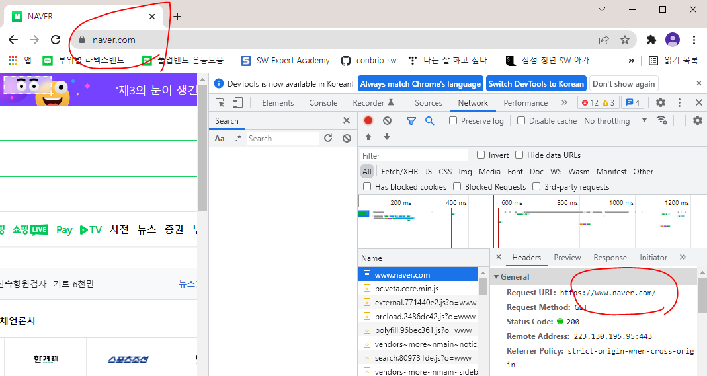

주문할 때

PRG 같은 것을 이용해서 

중복 주문을 막는 것이 신기했다...

## Redirections in HTTP

- URL 리다디렉션은 페이지 같은 실제 리로스, form, 전체 웹 에플리케이션이 다른 URIL에 위치하고 있는 상태에서 링크를 존속시키는 기술
- HTTP는 많은 목표를 위해 사용되는 이런 동작을 수행하기 위해 특별한 종류의 응답인 HTTP 리다이렉트를 제공
  - 사이트 유지관리가 진행 중인 상태에서의 일시적인 리다이렉션
  - 사이트 아키텍쳐의 변경 이후에도 외부 링크를 동작하는 상태로 유지시키기 위한 영구적인 리다이렉션
  - 파일 업로드 시 진행 상태 페이지

### 원칙

- HTTP에서 리다이렉션은 요청에 대한 특별한 응답을 전송함으로써 발생
- 3XX 상태 코드를 지닌 응답
- 리다이렉트 응답을 수신한 브라우저는 제공된 새로운 URL을 사용하며 그것을 즉시 로드한다.
- 대부분의 경우, 리다이렉션은 사용자에게는 보이지 않는데다가 적은 성능 저하을 일으킨다.

### 대체 방법

- HTML 리다이렉션

  - 웹 개발자가 서버에 대한 제어권을 가지고 있지 않거나 그것을 구성할 수 없는 경우도 있다.

  - refresh를 설정하기 위해 페이지 `<head>`내에 `<meta>` 엘리먼트와 `http-quiv` 속성으로 HTML 페이지를 만들 수 있다.

  - 해당 페이지를 나타날 때 브라우저는 이 엘리먼트를 발견 하고 표시된 페이지로 이동

    ```HTML
    <head>
        <meta http-equiv="refresh" content="0;URL='http://www.example.com/'">
    </head>
    ```

    - content 속성은 주어진 URL로 리다렉트 하기 이전에 브라우저가 얼마만큼의 시간(초)을 기다려야 하는 지를 나타내는 숫자로 시작된다. (접근성을 위해 항상 0으로 설정 권장)

  - 이 메서드는 HTML 페이지 에서만 동작한다.

- 자바스크립트 리다이렉션

  - `window.location` 프로퍼티에 값을 설정해서 만들어지며, 새로운 페이지가 로드된다.

    ```javascript
    window.loaction = "http://www.example.com/";
    ```

  - 자바스크립트를 실행한 클라이언트에서만 동작
  - 다른점은, 어떤 조건이 충족되는 경우에만 리다이렉션을 발생시킬 수 있다는 점에서 더 많은 가능성

- 우선순위

  1. 페이지가 읽힌 적도 없고 전송된 적도 없는 경우 HTTP 리다이렉트가 항상 먼저 실행
  2. 어떤 HTTP 리다이렉트로 없는 경우에, HTML 리다이렉트 `<meta>`가 실행
  3. 자바스크립트 리다이렉트는 최후의 수단으로 사용, 클라이언트 측에서 자바 스크립트를 활성화 시킨 경우에만 사용가능

  --------------

  - 가능한 경우 항상 HTTP 리다이렉트를 사용해야 하며, `<meta>` 엘리먼트를 사용해서는 안된다.
  - 만약 개발자가 HTTP 리다이렉트를 변경하고, HTML 리다이렉트를 잊는다면, 리다이렉트는 더 이상 동일한 것 이나거나, 무한 루프로 종료되거나 다른 에러 발생 가능

### 사용 케이스

- 리다이렉트들은 성능과 직결되므로, 리다이렉트의 사용은 최소한으로 유지되어야 한다.

- 도메인 엘리어싱
  - 이상적으로는 하나의 로케이션, 하나의 리소스, 하나의 URL
  - 그러나 대체 이름을 갖고 싶을 때도 있다.
    - www 쓰기 싫어, 더 짧은 URL 등등
  - 이런 경우, 리소스를 복제하기 보다는 실제(정식) URL에 대한 리다이렉트를 사용하는 것이 더 유리
  - 예시
    - 사이트 범위 확장 `www.naver.com`
      - `naver.com` 로도 접근 가능
      - 일반적으로 사용되는 별칭 혹은, 도메인 이름에 빈번히 일어나는 오타 URL 등등
    - 다른 도메인으로의 이동 (옛날 회사 이름...) 




- 링크 유지하기 (기존의 웹 사이트를 새로 만드는 경우)
  - 웹 사이트를 다시 만들 때 리소스의 URL도 변경된다.
  - 새로운 네이밍 계획과 일치하도록 웹 사이트의 내부 링크를 갱신할 수 있는 경우조차도, 외부 리소스에 의해 사용되는 URL에 대해서는 어쩔 수 가 없다
  - 해당 링크를 깨뜨리고 싶지 않을 것이기 때문에 이전 URL에서 새로운 URL로의 리다이렉트 설정

- 안전하지 않은 요청에 대한 일시적인 응답
  - 안전하지 않은 리퀘스트가 서버의 상태를 수정할 경우 이것을 클라이언트가 재반복해서는 안된다.
  - PUT, POST, DELETE 같은 요청을 재전송하기를 바라지 않는다.
  - 이런것을 방지하기위해 303 응답 코드를 보내서 오리지 GET으로 다시 URL을 재전송하게 될 것이다.
- 긴 요청에 대한 일시적인 응답

### 리다이렉션 루프

- 리다이렉션 루프는 리다이렉션이 성공적으로 이루어졌을 때 그 응답이 이전의 리다이렉션을 다시 따라갈 때 일어남
- 결코 끝나지 않으면 어떤 페이지도 볼 수 없는 무한 루프에 빠지게 된다.
- 대부분의 경우 이런 문제는 서버 측 문제이고 서버가 이를 감지할 수 없다면 500 코드를 응답하게 됨


- [리다렉션 사용시 속도 저하](https://dm-note.tistory.com/entry/slow-bitly)

