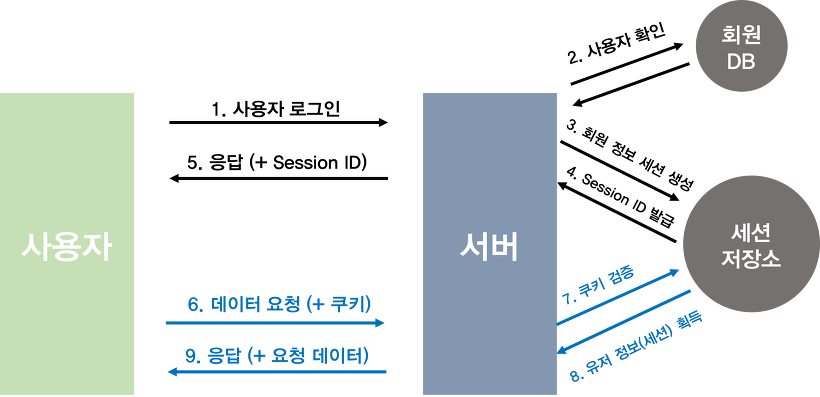

- why 쿠키?
  - 매직 쿠키라는 용어에서 비롯
    - 프로그램이 수신 후 변경하지 않은 채로 반환하는 데이터의 패킷
    - 포츈 쿠키에서 따왔다는 썰
    - 헨젤과 그레텔에서 작은 부스러기로 흔적을 남긴다에서 따왔다는 썰

---------------------


- HTTP 프로토콜은 무상태를 지향한다
  - 통신이 끝나면 상태정보를 유지하지 않는다.
  - 페이지를 이동할 때마다, 클라이언트의 로그인 정보 혹은 입력한 값 등이 초기화 된다.
  - 이러한 문제점을 해결하기 위해 쿠키, 세션, 웹 스토리지 사용

### 쿠키

- 클라이언트 로컬에 저장되는 키와 값 형태의 작은 파일

- 이름, 값, 만료 시간, 경로 정보를 포함한다.

- 목적

  - 세션 관리
    - 서버에 저장해야할 로그인, 장바구니, 게임 스코어 등의 정보 관리
  - 사용자 맞춤
    - 사용자가 선호하는 옵션이나 테마 등의 세팅
  - 사용자 추적
    - 사용자의 행동을 기록하고 분석하는 용도

- **Response Header**의 `set-cookie` 속성을 사용하면 클라이언트에 쿠키를 만들 수 있으며 만들어진 쿠키는 클라이언트가 따로 설정하지 않아도 브라우저가 **Request Header**에 넣어서 서버로 전송하게 된다.

- 서버의 HTTP 응답 헤더에서 쿠키를 설정한다.

  ```http
  HTTP/1.0 200 OK
  Content-type: text/html
  Set-Cookie: name=hellozin
  Set-Cookie: job=developer
  ```

- 이후, 클라이언트에서 보내는 모든 요청에브라우저는 `cookie` 헤더를 통해 저장된 모든 쿠키를 전송한다.

  ```http
  GET /sample_page.html HTTP/1.1
  Host: www.example.org
  Cookie: name=hellozin; job=developer
  ```

- 예시
  - "아이디와 비밀번호 저장하실?"

### 세션

- 일정시간 동안 같은 브라우저로부터 들어오는 일련의 요구를 하나의 상태를 보고 그 상태를 유지하는 기술
- 서버에 클라이언트의 상태 정보를 저장하는 기술 (쿠키를 기반으로 한다)
  - 클라이언트의 정보는 서버에 두고, 세션 아이디를 이용해서 인증받고 정보를 이용하는 방식
- 클라이언트가 Request를 보내면 Response에 Set-Cookie를 통해 클라이언트의 유일한 ID값을 생성해 부여하고 이를 통해 사용자 정보는 안전한 서버에 존재하며 클라이언트와 서버 간에는 ID 값만을 전달해 보안 위협을 감소 시켜준다.
- 이때 클라이언트에 저장되는 쿠키는 세션 종료 시 함게 소멸되는 Memoey Cookie 타입을 가져 브라우저가 종료되면 세션과 관련된 쿠키도 삭제된다.
- 동작 방식
  - 클라이언트가 서버에 접속 시 세션 ID를 발급 받음
  - 클라이언트는 세션 ID에 대해 쿠키를 사용해서 자장하고 가지고 있음
  - 클라이언트는 서버에 요청할 때 이 쿠키의 세션 ID를 같이 서버에 전달해서 요청
  - 서버는 세션 ID를 전달받아서 별 다른 작업 없이 세션 ID로 세션에 있는 클라이언트 정보를 가져와서 사용
  - 클라이언트 정보를 가지고 서버 요청을 처리하여 클라이언트에 응답
- 예시
  - 로그인 상태 유지

### 웹 스토리지

- 서버가 아닌 클라이언트에 데이터를 저장할 수 있도록 지원하는 HTML5의 새로운 기능
- 쿠키와 기능 자체는 유사하지만 4KB밖에 저장하지 못하는 쿠키와 다르게 웹 스토리지는 약 5MB까지 저장공간을 이용할 수 있다.
- 종류
  - local Storage
  - session Stroage

- 로컬 스토리지
  - 브라우저 자체에 반 영구적으로 데이터 저장
  - 브라우저 종료해도 데이터 유지
  - 도메인이 다른 경우 로컬 스토리지에 접근 X
    - naver.com 로컬 스토리지에서 저장한 데이터는 google.com에서 접근할 수 없다
- 세션 스토리지
  - 각 세션마다 데이터가 개별적으로 저장
  - 로컬 스토리지와 다르게 세션을 종료하면 자동으로 제거
  - 같은 도메인이라도 세션이 다르면 데이터에 접근할 수 없다.


------------------------------------

### 캐시랑 쿠키 차이는 ??

- 캐시는 이미지 같은 파일 등을 브라우저나 서버 앞 단에 저장해놓고 사용하는 것
- 한번 캐시에 저장되면 브라우저를 참고하기 때문에 서버에서 변경되어도 사용자는 변경되지 않게 보일 수 있음
  - 그래서 가끔씩 캐시를 지워라! 하는 팁 들이 나옴
  - 혹은 서버에서 클라이언트로 응답을 보낼 때 header에 캐시 만료 시간을 명시하기도 함
- 가장 큰 차이
  - 캐시는 웹 페이지 요소를 저장하기 위한 임시 저장소 (웹 페이지를 빠르게 렌더링)
  - 쿠키/세션은 정보를 저장하기 위해 사용 (사용자 인증 등을 도와줌)

----------------------------

### 쿠키랑 세션의 차이?

- 둘 다 비슷한 역할, 동작원리도 비슷
  - 왜냐? => 세션도 쿠키 사용
- 가장 큰 차이점은 사용자의 정보가 저장되는 위치
  - 쿠키는 서버의 자원 사용 X
  - 세션은 서버의 자원 사용
- 쿠키
  - 보안에 취약하다
    - 클라이언트 로컬에 저장되기 때문
  - 라이플 사이클
    - 파일로 저장되기 때문에 브라우저를 종료해도 정보가 남아 있을 수 있다.
- 세션
  - 보안에 비교적 우수
    - 쿠키를 이용해서 sessionid만 저장하고 그것으로 구분해서 서버에서 처리하기 때문
  - 라이플 사이클
    - 브라우저  종료시 삭제
    - 같은 브라우저일 경우 다른 탭을 사용해도 세션 공유 (로그인 등등)
    - 다른 브라우저 사용하면 다른 세션 사용
- 세션의 최대 단점
  - 서버의 메모리를 사용하기 때문에 서버에 무리가 갈 수 있고
  - 서버 오류 발생 시 세션을 날리게 됐을 대 사용자의 정보를 다시 갱신해야된다.

- 최근에는 토큰 기반의 인증방식을 사용하는 추세
  - 세션이 사용자의 수만큼 서버의 메모리를 차지하기 때문에 

------------------------------------

### 쿠키 vs 웹스토리지

- 웹스토리지
  - 쿠키와  달리, 필요할 대만 꺼내 쓰므로 자동 전송의 위험성이 없다.
    - 다른 도메인에서 요청하는 경우에는 못 꺼내쓴다.
      - 도메인 단위로 접근이 제한되는 특성 대문에 (CSRF 안전)
        - **Cross-site request forgery** : 사이트 간 요청 위조
        - 웹 사이트 취약점 공격의 하나
        - 사용자가 자신의 의지와는 무관하게 공격자가 의도한 행위를 특정 웹사이트에 요청하게 하는 공격
  - 5MB 까지 데이터 저장, 유효기간이 존재하지 않는다.
  - **HTML5를 지원하지 않는 브라우저에서는 사용 x**
  - 모든 쿠키를 다 넘기는 것과 다르게, 개발자가 선별해서 데이터를 넘김
    - http 통신 부하 줄이기

- 대부분 웹스토리지가 더 좋다 (쿠키의 보완하기 위해 나온 것이기 때문)
  - 다만 사용하기는 까다롭다
  - 시간 제한도 없고, 데이터는 영속성을 띈다.
  - 항상 코드를 작성해서 데이터를 넘겨줘야하기 때문에 유지보수가 어렵다
    - 모든 정보를 넘기는 쿠키랑은 다르다.

------------------------------------------------------

### 인증방식

- 계정정보를 요청 헤더에 넣는 방식
  - HTTP 요청에 인증할 수단에 비밀번호를 넣는다.
  - HTTP 요청을 intercept하면 사용자의 계정 정보를 알 수 있다.
    - 실제로는 저어얼대 안씀
  - 장점
    - 인증을 테스트 할 때 빠르게 시도 가능
  - 단점
    - 보안에 매우 취약
    - 서버에서 신호가 올 때마다 id, pw를 통해 유저가 맞는지 인증해야한다. (비효율적)

- 세션/쿠키 방식

  

  - 절차
    - 사용자 로그인
    - 서버에서는 계정정보를 읽어 사용자 확인 후, 사용자의 고유한 ID값을 부여하여 세션 저장소에 저장한 후, 이와 연결되는 세션 ID를 발행
    - 사용자는 서버에서 해당 세션 ID를 받아 쿠키에 저장을 한 후, 인증이 필요한 요청마다 쿠키를 헤더에 실어 보냄
    - 서버에서는 쿠키를 받아 세션 저장소에서 대조를 한 후 대응되는 정보를 가져옴
    - 인증이 완료되고 서버는 사용자에 맞는 데이터를 보내줌
  - 세션은 서버에서 가지고 있는 정보, 쿠키는 사용자에게 발급된 세션을 열기 위한 열쇠를 의미
    - 쿠키만으로 인증을 사용한다는 말은 서버의 자원 사용X
      - 첫번째 방식처럼 HTTP 요청 탈취 당하면 다 털림
      - 보안과 상관없는 장바구니, 자동로그인 설정 같은 경우에만 사용
    - 인증의 책임을 서버에 지게하기 위해 세션을 사용하는 것.
  - 장점
    - 쿠키가 담긴 HTTP 요청이 노출되더라도 쿠키 자체는 유의미한 값을 갖고 있지 않다.
    - 고유의 ID값을 발급되게 되므로 서버에서는 쿠키 값을 받았을 때 일일이 회원정보를 확인할 필요가 없다
      - 서버의 자원에 접근 용이
  - 단점
    - 쿠키를 훔쳐서 이것을 이용해서 HTTP 요청을 보내면 서버의 세션 저장소에서는 클라이언트로 오인해서 정보를 노출할 수 있다.
      - HTTPS를 사용하면 요청 자체를 탈취해도 안의 정보를 읽게 힘들게 한다.
      - 세션에 유효시간을 넣어준다.
    - 서버에 추가적인 저장공간을 필요로 하고, 자연스럽게 부하도 높아짐.

- 토큰 기반 인증 방식 (JWT)

  - JWT는 세션/쿠키와 더불어 모바일과 웹의 인증을 책임지는 대표적인 방법
  - Jseon Web Token, 인증에 필요한 정보들을 암호화시킨 토큰
  - 세션/쿠키 방식과 유사하게 클라이언트는 Access Token(jwt 토큰)을 HTTP 헤더에 실어 보내게 됨.
  - 필요 요소
    - Header : 방식과 타입 등이 들어감
    - Payload : 서버에 보낼 데이터가 들어감, 유저 고유 ID, 유효기간
    - Verify Signaure : Base64 방식으로 인코딩한 header,payload 그리고 SECRET KEY를 더한 후 서명
    - 헤더와 페이로드는 누구나 디코딩하여 확인 가능 (중요 정보 들어가면 안됨)
    - Verify Signaure는 SECRET KEY를 알지 못하면 복호화 할 수 없음

  


- - 절차
    - 사용자가 로그인
    - 서버에서 계정정보를 읽어 사용자를 확인 후, 사용자의 고유한 ID값을 부여한 후, 기타 정보와 함께 Payload에 넣는다
    - JWT 토큰의 유효기간 설정
    - 암호화할 SECRET KEY를 이용해 ACCESS TOKEN 발급
    - 사용자는 ACCESS TOKEN을 받아 저장한 후, 인증이 필요한 요청마다 토큰을 헤더에 실어보냄
    - 서버에서는 해당 토큰의 Verify Signatue를 SECRET KEY로 복호환 후, 조작 여부 유효기간을 확인
    - 검증이 완료된다면, Payload를 디코딩하여 사용자의 ID에 맞는 데이터를 가져온다.
  - 차이
    - 토큰 안에 유저의 정보들이 넣어짐
      - 세션/쿠키는 세션 저장소에 유저의 정보가 있다
      - 서버 측에서 인증을 위해 암호화를 하냐, 별도의 저장소를 이용하냐의 차이가 발생
  - 장점
    - 간편
      - 추가 저장소 관리 필요 x
      - Stateless 한 서버를 만드는 데 큰 강점
      - 서버를 확장 유지 보수 유리
    - 확장성이 뛰어남
      - 토큰 기반으로 하는 다른 인증 시스템에 접근 가능
      - 선택적으로 이름이나 이메을등을 받을 수 있는 권한도 얻을 수 있음

  - 단점
    - 이미 발급된 JWT에 대해서는 더이상 변화 불가
      - 한번 발급되면 유효기간이 완료될 떄 까지 계속 사용
      - 악의적인 사용자는 유효기간이 지나기전까지 정보가 털림
        - 유효기간을 짧게 하고 refresh token이라는 새로운 토큰 발급
          - refresh 토큰은 다음에...
    - 유저의 중요한 정보들은 Payload에 넣을 수 없다.
    - JWT의 길이가 길다. (서버의 자원 낭비 발생)


출처 : https://tansfil.tistory.com/58

