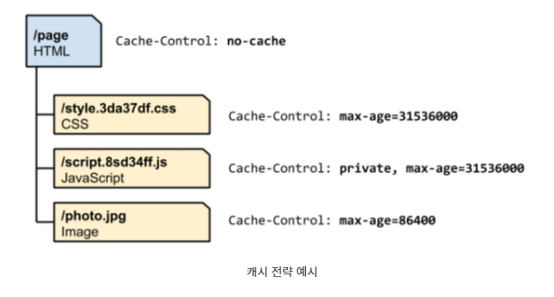

## 프록시

- 클라이언트와 서버 사이에서 데이터를 전달해 주는 서버
- 클라이언트가 자신을 통해서 다른 네트워크 서비스에 간접적으로 접속할 수 있게 해주는 시스템
- 목적
  - 속도 향상
    - 캐시를 사용해 리소스 접근 빠르게
  - 보안 목적
    - 익명으로 컴퓨터 유지 가능
    - IP 추적 방지

### 

----------

### 캐시 컨트롤

- 성능 최적화의 관점에서는 서버와 통신하지 않는 요청이 가장 좋은 요청

  - 캐시는 네트워크 레이턴시를 줄여주고 데이터 통신에 드는 데이터 비용을 감소시켜 준다.

- no-cache, no-stroe

- public vs private

  - private : 중간 매개체들은 캐시할 수 없다.

  

  - HTML
    - HTML 리소스는 새로 배포가 이루어질 때마다 값이 바뀔 수 있다.
    - 때문에 HTML 파일을 불러올 때 새로운 배포가 있는 지 확인
      - no-cache
      - max-age=0
  - CSS & JS & 이미지파일
    - 고유한 번호를 두어서 고유 URL 설정
    - 따라서 버전이 바뀌면 URL도 바뀌게 됨
    - 그렇기 때문에 max-age=1년 이라고 설정
      - 어차피 바뀌면 URL이 바뀌게 되서 캐시를 안쓰게 되니깐
    - js 에는 private이 붙는다.
      - 예시에서 중간 서버에서 캐시하면 안되는 개인정보가 포함되었다고 유추 가능.

-----------------

### 캐시 컨트롤 공격

- HTTP GET Flooding with Cache-Control

- 웹서버의 부하를 막기 위해 캐싱 기법을 사용
- 공격자들은 HTTP 캐시 컨트롤을 조작해서 웹 서버의 자원을 소진시킨다.
  - no-store
    - 캐시 저장 금지
    - 클라이언트로부터 요청받은 데이터를 디스크나 메모리, 별도의 캐싱 서버에 저장하는 것을 방지
  - must-revalidate(캐시 검증)
    - 웹서버와 별도로 캐싱 서버를 운용하는 경우 웹 서버는 캐싱 서버에 저장된 캐시 데이터에 대한 검증을 요구한다.

------------------

### CDN (Content delivery networks)

- 분산된 서버 네트워 사용해 사용자들에게 리소스 제공함으로써 사이트 서능 향상
- 서버 로드를 줄이기 때문에 서버 비용 절감, 트래픽 급증 처리에 적합
- 원칙
  - 사용자들에게 원래 서버보다 더 가깝다.
  - 네트워크 최적화를 통해 원래 서버보다 컨텐츠 제공하는 것이 빠르다
  - CDN 캐시를 사용하면 요청하지 않는다.

- 캐시

  - CDN ㅅ버에서 리소스를 캐싱하면 리소르를 제공받기 위해 오리진 서버까지 요청할 필요가 없다.

  - 리소스 추가

    - 필요한 리소스를 CDN 서버에서 리소스를 pull 하는 것이다.
    - 특정 리소스를 캐시하면 CDN에서 처음 요청하면 CDN은 오리진 서버에 요청받고 응답받은 것을 캐시한다.
    - 이러한 방식으로 캐시되지 않은 리소스들이 캐시된다.

  - 제거 (Cache eviction)

    - 캐시는 한정된 저장 용량을 가지고 있다. 저장 용량이 꽉 차게 되면 최근 접근하지 않은 리소스 제거 or 큰 리소스 제거
    - 하나의 CDN 서버에서 제거된 리소스가 전체 CDN 서버에서 제거되는 것은 아님

  - 퍼징 (Purging)

    - 자동으로 캐시가 삭제되는 것을 기다리는 것이 아니라 바로 제거
    - 동적인 컨텐츠를 관리하는데 용이하다. (긴 TTL : time to live를 사용하는 컨텐츠)
      - 오랜 시간동안 캐시하게 만들어주고 파일이 변경이 있을 때 퍼징하여 캐시된 컨첸츠 삭제하고 새로운 컨첸츠 캐시

  - CDN에 캐시 가능한 리소스

    - Public Resources

    - dynamic contents

      - API 응답, 쇼핑몰 등

      - 트래픽이 몰릴 시간에 매우 짧은 시간 동안 캐싱하면 데이터 갱신 영향 최소화하면서 오리진 서버 부하 줄일 수 있음.

    - Static contents

      - 자주 변경되지 않는 이미지, 비디오, 라이브러리 등 리소스 유형
      - 긴 TTL로 캐시

    - 예시?

      - 온라인 게임 정식 서비스 시작 시점에 클라이언트 다운로드 수요 늘어날 경우
        - CDN으로 트래픽을 분산한다.

- 필요기술

  - Load Balane
    - 클라이언트에게 콘텐츠 전송 요청을 받았을 때, 최적의 네트워크 환경을 찾아 연결하는 기술
    - 물리적으로 가장 가깝거나 여유 트래픽이 남아 있는 곳으로 접속을 유도하는 기술

  - 컨텐츠를 배포하는 기술
    - 컨텐츠의 삭제나 수정이 일어났을 때 이를 관리할 수 있는 기술이 필요하다.
  - CDN의 트래픽을 감지하는 기술
    - 통계자료를 고객에게 제공하기 위해 필요
    - 트래픽을 분산하기 위해서 필요
  - 

출처 https://pjh3749.tistory.com/264

