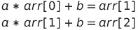
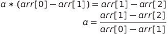
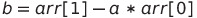

# 백준1111

### 문제

IQ Test의 문제 중에는 공통된 패턴을 찾는 문제가 있다. 수열이 주어졌을 때, 다음 수를 찾는 문제이다.

예를 들어, 1, 2, 3, 4, 5가 주어졌다. 다음 수는 무엇인가? 당연히 답은 6이다. 약간 더 어려운 문제를 보면, 3, 6, 12, 24, 48이 주어졌을 때, 다음 수는 무엇인가? 역시 답은 96이다.

이제 제일 어려운 문제를 보자.

1, 4, 13, 40이 주어졌을 때, 다음 수는 무엇일까? 답은 121이다. 그 이유는 항상 다음 수는 앞 수*3+1이기 때문이다.

은진이는 위의 3문제를 모두 풀지 못했으므로, 자동으로 풀어주는 프로그램을 작성하기로 했다. 항상 모든 답은 구하는 규칙은 앞 수*a + b이다. 그리고, a와 b는 정수이다.

수 N개가 주어졌을 때, 규칙에 맞는 다음 수를 구하는 프로그램을 작성하시오.

------

### 입력

첫째 줄에 N이 주어진다. N은 50보다 작거나 같은 자연수이다. 둘째 줄에는 N개의 수가 주어진다. 이 수는 모두 절댓값이 100보다 작거나 같은 정수이다.

------

### 출력

다음 수를 출력한다. 만약 다음 수가 여러 개일 경우에는 A를 출력하고, 다음 수를 구할 수 없는 경우에는 B를 출력한다.

---------

------------

------------

### 로직

- 입력받기
  - int N
  - int arr[] = new int[N]
- 규칙에 맞는 다음 수 구하기
- 출력
  - 다음 수 출력
  - 다음 수 못 구하는 경우 B
  - 다음 수가 여러개일 경우 A

---------------------------------------------------------------------------------

### 입력에 따른 출력 형태

- 입력 받는 수 1개
  - 무조건 A 출력
- 입력 받는 수 2개
  - 두 수가 같을 떄
    - B 출력
  - 두 수가 다를 때
    - A 출력
- 입력 받는 수 3개 이상
  - 평범한 경우
    - a*arr[N-1] + b 출력
  - a, b가 정수가 아닐 때
    - B 출력
  - for문을 도는데 규칙에 벗어날 때
    - B 출력

### 규칙 구하기 (a, b 계산하기)

--------

### 특이사항

- a를 계산할 때 제로 디비젼 오류가 나오는 경우가 있어서 별도로 조건 처리해야함

- 정수 체크를 굳이 안해줘도 통과 가능
  - 테스트 케이스 중에 a, b가 정수가 아닌 경우가 없는 것은 아님
  - 근데 a, b를 그냥 int형으로 해도 오류는 나지 않음
    - 아마도 for문을 돌면서 처리되는 모양인 듯
    - int A = (int) a 과정에서 유리수가 정수로 버려지면서 값이 달라져서 for문을 돌면서 B를 출력!
