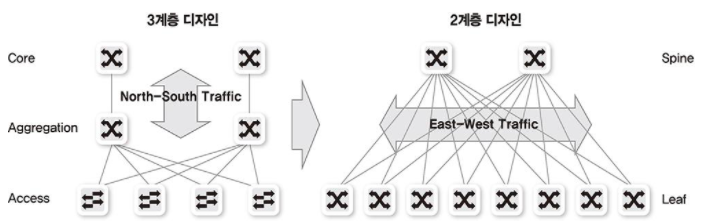
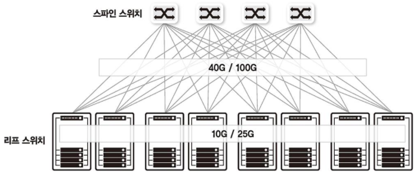
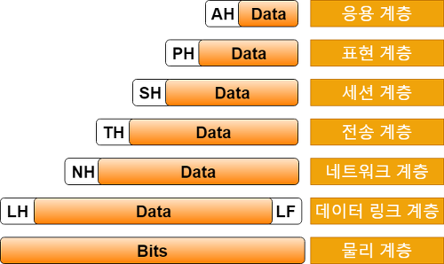
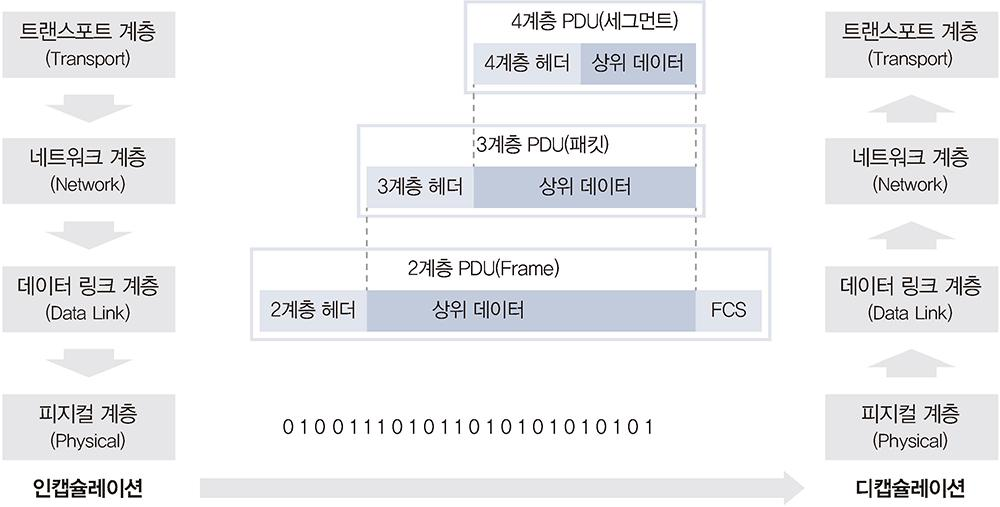

# 1장 네트워크 시작하기

## 1.1 네트워크 구성도 살펴보기

- 네트워크는 서비스를 받는 입장과 서비스를 제공하는 입장으로 나뉜다.
  - 받는 입장
    - 집에서 인터넷 접속
    - 회사에서 인터넷 접속
  - 제공하는 입장
    - 클라우드 / 데이터 센터/ 회사 기계실에 서버를 두고 클라이언트에게 제공
    - 네트워크에 접속한 구성원 수, 필요한 네트워크 속도 등을 고려

### 1.1.1 홈 네트워크

- 인터넷 - 모뎀 - 공유기 - 기기(노트북, 스마트폰, 테블릿, 데스크톱 등등)
  - 물리적 연결이 필요
    - 무선 연결
      - 무선 랜 카드와 무선 신호를 보낼 수 있는 매체(공기) 필요
    - 유선 연결
      - 유선 랜 카드(이더넷 랜 카드), 랜 케이블(랜선)이 필요
  - 정리하자면,
    - 인터넷을 케이블로 모뎀에 연결하고
    - 모뎀에서 케이블로 공유기로 연결하고
    - 공유기에서 와이파이 신호 혹은 케이블론 단말로 연결

### 1.1.2 데이터 센터 네트워크

- 데이터 센터 네트워크는 안정적이고 빠른 대용량 서비스 제공을 목표로 구성된다.
- 안정적인 서비스 제공을 위해 다양한 이중화 기술 사용
- 많은 서버와 서비스가 한 네트워크에 연결되어 있으므로 높은 통신량 수용
- 기존에는 3계층 구성
  - Core
  - Aggregation
  - Access
- 현재는 2계층 구성
  - Spine
  - Leaf
  - 가상화 기술과 높은 대여폭을 요구하는 스케일 아웃(scale-out) 기반의 애플리케이션과 서비스 등장하면서 스파인-리프 구조로 바뀜
  - 스파인-리프 구조는 서버 간 통신이 늘어나는 최근 트래픽 경향을 지원하기 위해 제안됨

​																	 데이터 센터 네트워크 구성도, 리프 스위츤 랙에 장착되어 해당 렉의 서버 통신을 책임진다.

## 1.2 프로토콜

- 최근에는 복잡하고 산재되어 있던 여러가지 프로토콜 기술이 **이더넷-TCP/IP** 기반 프로토콜로 변경되고 있다.
  - 물리적 측면
    - 데이터 전송 매체, 신호 규약, 회선 규격 등
    - 이더넷이 널리 쓰인다.
  - 논리적 측면
    - 장치들끼리 통신하기 위한 프로토콜 규격
    - TCP/IP가 널리 쓰인다.
- 옛날에는 자연어를 처리할 수 없었다.
  - 적은 컴퓨터 자원과 매우 느린 네트워크 속도를 이용해 최대한 효율적으로 통신하는 것이 목표
  - 그래서 2진수 bit 기반으로 만들어짐
  - 따라서 매우 치밀하게 서로 간의 약속(프로토콜)을 정의해야했음
    - 그래야만 통신이 가능
- 현재, 애플리케이션 레벨의 프로토콜은 문작 기반의 프로토콜을 많이 사용
  - HTTP, SMTP
  - 비트 기반 프로토콜보다 효율성은 떨어지지만 다양한 확장이 가능
- 일반적으로 TCP/IP는 프로토콜이라고 부르지 않고 프로토콜 스택이라고 부름
  - 둘은 별도의 레이어에서 동작하지만 함께 사용하고 있는데 이런 프로토콜 묶음을 프로토콜 스택이라고 부름
  - 실제로 TCP/IP 프로토콜 스택에는 UDP, ICMP, ARP, HTTP, SMTP, FTP와 같은 매우 다양한 애플리케이션 레이어 프로토콜이 존재
  - TCP / IP 프로토콜은 4부분으로 나뉨
    - 물리 부분인 이더넷
    - 데이터가 목적지를 찾아가도록 해주는 네트워크 계층
    - 잘린 패킷을 데이터 형태로 잘 조합하도록 도와주는 전송 계층과 애플리케이션 계층

## 1.3 OSI 7 계층과 TCP/IP

- 과거에는 통신용 규약이 표준화되어 있지 않았고 각 벤더에서 별도로 개발했기 때문에 호환되지 않는 시스템이나 애플리케이션이 많았고 통신 불가능
  - 이를 하나의 규약으로 통합하려는 노력이 현재의 OSI 7계층
- 2가지 계층으로 나누기
  - 1~4 계층
    - 데이터 플로 계층(Data Flow Layer) / 하위 계층(Lower Layer)
  - 5~7 계층
    - 애플리케이션 계층(Application Layer) / 상위 계층 (Upper)
- 애플리케이션 개발자는 하향식 (탑 다운)으로 네트워크를 바라보고 네트워크 엔지니어는 상향식 (바텀 업) 형식으로 네트워크를 인식

### 1.3.2 TCP /IP 프로토콜 스택

- 현대 네트워크는 대부분 TCP/IP와 이더넷으로 이루어짐

- OSI 레퍼런스 모델은 7계층으로 이루어진 반면, TCP/IP 모델은 4계층으로 구분

  - 현실에 쉽게 반영하다록 간단히 구분하는 TCP/IP 프로토콜 스택의 성향

  - 위 그림 참고

## 1.4 OSI 7계층별 이해하기

### 1.4.1 1계층 (피지컬 계층)

- 물리 계층으로 물리적 연결과 관련된 정보를 정의
- 전기 신호를 전달하는 것에 초점
- 장비
  - 허브, 리피터
    - 네트워크 통신을 중개하는 네트워크 장비
  - 케이블, 커넥터
    - 케이블
  - 트랜시버
    - 컴퓨터의 랜 카드와 케이블 연결
  - 탭
    - 네트워크 모니터링과 패킷 분석을 위해 전기 신호를 다른 장비로 복제
- 1계층 장비는 주소의 개념이 없으므로 전기 신호가 들어온 포트를 제외하고 모든 포트에 같은 전기 신호를 전송

### 1.4.2 2계층 (데이터 링크 계층)

- 전기 신호를 모아 우리가 알아볼 수 있는 데이터 형태로 처리
- 전기 신호를 정확히 전달하기 보다는 주소 정보를 정의하고 정확한 주소로통신이 되도록 하는데 초점
- 출발지와 도착지 주소를 확인하고 내게 보낸 것이 맞는지, 내가 처리해야하는지에 대해 검사한 후 데이터 처리를 수행
- 주소 체계가 생기면서 여러 통신이 한꺼번에 이루어지는 것을 구분하기 위한 기능이 주로 정의

- 데이터에 대한 에러를 탐지하거나 고치는 역할 수행

- 플로 컨트롤

  - 무작정 데이터를 던지는 것이 아니라 받는 사람이 현재 데이터를 받을 수 있는지 확인하는 작업부터 해야함
  - 서버에서 데이터를 전송
  - 스위치에서 혼잡 상황이 발생하면 포즈 프레임 전송
  - 포즈(pause) 프레임 수신 후 대기

- 2계층 네트워크 구성 요소

  - 네트워크 인터페이스 카드
  - 스위치

- 가장 중요한 특징

  - MAC 주소 체계
  - 인터페이스 카드와 스위치 모두 MAC주소를 이해할 수 있고, 스위치는 MAC 주소를 보고 통신해야 할 포트를 지정해 내보내는 능력이 있다.

- 네트워크 인터페이스 카드 동작 방식

  - 전기 신호를 데이터 형태로 만든다

  - 목적지 MAC 주소와 출발지 MAC 주소를 확인한다.

  - 네트워크 인터페이스 카드의 MAC 주소를 확인한다

  - 목적지 MAC 주소와 네트워크 인터페이스 카드가 갖고 있는 MAC 주소가 맞으면 데이터를 처리하고 다르면 데이터를 폐기한다.

  - -------------------------------

  - 자신에게 들어오는 전기 신호가 아니면 버리고 맞으면 이 데이터를 상위 계층에서 처리할 수 있도록 메모리에 적재

- 스위치

  - 단말이 어떤 MAC 주소인지, 연결된 포트는 어느 것인지 주소 습득 과정에서 알 수 있다.
  - 이 데이터를 기반으로 단만들이 통신할 때 포트를 적절히 필터링하고 정확한 포트로 포워딩해준다.
    - 1 계층의 허브는 한 포트에서 전기 신호가 들어오면 전체 포트로 전기 신호 전달
      - 전체 네트워크에서 동시에 하나의 장비만 데이터를 보낼 수 있다.
  - 스위치의 적절한 필터링과 포워딩 기능으로 통신이 필요한 포트만 사용하고 네트워크 전체에 불필요한 처리 감소
    - 이더넷 네트워크 효율성 크게 향상되어 이더넷 기반 네트워크가 급증하는 계기

### 1.4.3 3계층 (네트워크 계층)

- IP 주소와 같은 논리적인 주소가 정의됨
  - 데이터 통신 시 2가지 주소
    - 2계층의 물리적인 MAC 주소
    - 3계층의 논리적인 IP 주소
- 3계층을 이해할 수 있는 장비나 단말은 네트워크 주소 정보를 이용해 자신이 속한 네트워크와 원격지 네트워크를 구분가능
  - 원격지 네트워크를 가려면 어디로 가야하는 지 경로를 지정하는 능력이 있다.
- 라우터는 3계층에서 정의한 IP 주소를 이해 가능
  - IP 주소를 사용해 최적의 경로를 찾아주고 해당 경로로 패킷을 전송하는 역할

### 1.4.4 4계층 (트랜스포트 계층)

- 실제로 데이터들이 정상적으로 잘 보내지도록 확인하는 역할
  - 1~3 계층은 신호와 데이터를 올바른 위치로 보내고 실제 신호를 잘 만들어내는 데 집중
- 패킷 네트워크는 데이터를 분할해 패킷에 실어보내다 보니, 중간에 패킷이 유실되거나 순서가 바뀌는 경우가 생김
  - 패캣이 유실되거나 순서가 바뀌었을 때 바로잡아주는 역할이 4계층
- 시퀀스 번호, ACK 번호, 포트 번호를 사용해 상위 애플리케이션을 구분
- 장비
  - 로드 밸런서와 방화벽
  - 부하를 분산하거나 보안 정책을 수립해 패킷을 통과 차단하는 기능 수행

### 1.4.5 5계층 (세션 계층)

- 양 끝단의 응용 프로세스가 연결을 성립하도록 도와주고 연결이 안정적으로 유지되도록 관리하고 작업 완료 후에는 이 연결을 끊는 역할
- 세션을 관리하는 것이 주요 역할

### 1.4.6 6계층 (프레젠테이션 계층)

- 표현방식이 다른 애플리케이션이나 시스템 간의 통신을 돕기 위해 하나의 통일된 구문 형식으로 변환시키는 기능 수행
- 일종의 번역기나 변환기 역할 수행
- MIME 인코딩이나 암호화, 암축, 코드 변환과 같은 동작 수행

### 1.4.7 7계층 (애플리케이션 계층)

- 애플리케이션 프로세스를 정의하고 애플리케이션 서비스를 수행한다.
- UI 부분이나 사용자 입출력 부분을 정의하는 역할
- 대표 프로토콜
  - FTP, SMTP, HTTP, TELNET

## 1.5 인캡슐레이션과 디캡슐레이션

- 상위 계층에서 하위 계층으로 데이터를 보내면 물리 계층에서 전기 신호 형태로 네트워크를 통해 신호를 보냄
- 받는 쪽에서는 다시 하위 계층에서 상위 계층으로 데이터를 보냄
- 이런 데이터를 보내는 과정을 인캡슐레이션, 받는 과정을 디캡슐레이션이라고 한다.

- 데이터는 상위 계층에서 데이터 플로 계층으로, 즉 상위 계층에서 패킷 형태로 하나씩 인캡슐레이션되면서 내려온다.
  - 랜 카드에서 전기 형태로 변환되어 목적지로 전달
- 전기 신호를 받은 목적지에서는 데이터 형태로 변환해 상위 계층으로 올려준다.
  - 패킷을 조합해 데이터 형태로 만들게 된다.
- 데이터는 상위 계층 -> 하위 계층, 하위 계층 -> 상위 계층으로 이동
- 헤더 정보는 각 계층끼리 전달된다.
- 헤더의 모든 정보를 이해하긴 어렵다.
  - 헤더에 2가지 정보는 반드시 포함
    - 현재 계층에서 정의하는 정보
      - 4계층(TCP 프로토콜) : 시퀀스, 에크 번호 필드로 데이터 표현
      - 3계층 : 논리적인 주소인 출발지, 도착지 IP 주소
      - 2계층 : 출발지, 도착지 MAC 주소
    - 상위 프로토콜 지시자
      - 인캡슐레이션 과정에서는 상위 프로토콜이 많아도 문제가 없다.
      - 디캡슐레이션하는 목적지 쪽에서는 헤더에 아무 정보가 없으면 어떤 상위 프로토콜로 올려보내 주어야할 지 결정할 수 없다.
        - 4 계층으로 데이터를 올려보낼 때 헤더에 상위 프로토콜 정보가 없다면?
        - TCP로 보내야할 지 UDP로 보내야할 지 구분할 수 없다.
      - 따라서 인캡슐레이션하는 쪽에서 헤더에 상위 프로토콜 지시자 정보를 포함해야한다.
      - 계층 별 상위 프로토콜 지시자 이름
        - 4 계층 : 포트 번호
        - 3 계층 : 프로토콜 번호
        - 2 계층 : 이더 타입
      - 디캡슐레이션할 때 상위 프로토콜 지시자 정보를 이용해 어느 상위 계층 프로토콜로 보내야할 지 구분해야한다.
        - 동작하는 계층보다 한 계층 위의 정보가 적혀있음.

### 추가 공부

Spine-leaf 구조, 이더넷           
