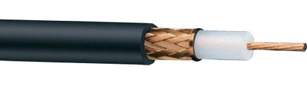

# 네트워크 연결과 구성요소

## 2.1 네트워크 연결 구분

- 규모와 관리 범위에 따라 3가지
  - LAN (Local Area Network)
    - 사용자 내부 네트워크
  - MAN (Metro Area Network)
    - 한 도시 정도를 연결하고 관리하는 네트워크
  - WAN (Wide Area Network)
    - 멀리 떨어진 LAN을 연결해주는 네트워크
- 예전에는 사용하는 기술이 모두 달라 사용하는 프로토콜이나 전송 기술에 따라 쉽게 구분
- 지금은 이더넷으로 기술들이 통합되면서 전송 기술 구분하는 것은 무의미
- 관리 범위 기준으로만 구분한다.

### 2.1.1 LAN

- 홈 네트워크용과 사무실용 네트워크처럼 소규모 네트워크
- 스위치와 같이 비교적 간단한 장비로 연결됨
- 복잡하거나 대규모인 네트워크라도 직접 구축한 네트워크 범위라면 LAN이라고 부른다
  - 대규모 공장 or 대학 등

### 2.1.2 WAN

- 먼 거리 네트워크 연결하기 위해 사용
- 멀리 떨어진 LAN을 서로연결하거나 인터넷에 접속하기 위한 네트워크가 WAN
- 직접 구축할 수 없는 범위의 네트워크
  - 통신사업자(KT, U+, SKB)로부터 회선 임대해 사용

## 2.2 네트워크 회선

- 원격지 네트워크에 연결하기 위해서는 WAN을 사용
- 옛날에는 다양한 종류의 기술이 사용되었지만 지금은 LAN과 동일하게 이더넷이 주로 사용

### 2.2.1 인터넷 회선

- 인터넷 접속을 위해 통신 사업자와 연결하는 회선
  - 단순히 케이블만 연결한다고 인터넷 가능 X
  - 통신 사업자가 판매하는 인터넷과 연결된 회선을 사용해야만 인터넷 접속이 가능
- 인터넷 전용 회선과는 전송 기술이 다르다.
  - 가입자와 통신사업자 간에 직접 연결되는 구조 X
  - 전송 선로 공유 기술 사용
    - ex) 아파트 광랜
    - 아파트에서 통신사업자까지 연결한 회선을 아파트 가입자가 공유하는 구조
    - 전송 선로를 공유하므로 일반 인터넷 회선의 속도는 전송 가능한 최대 속도
      - 인터넷 전용 회선과 달리 그 속도를 보장하지 않음
- 종류와 속도
  - 광랜(이더넷) : 기가~100Mbps
  - FTTH : 기가 ~ 100Mbps
  - 동축 케이블 인터넷 : 수백 ~ 수십 Mbps
  - xDSL(ADSL, VDSL 등) : 수십 ~ 수 Mbps
- 항상 모든사람이 최대 속도로 인터넷을 접속하는 것은 아니므로 공유 구간은 사용자 최대 속도를 보장하지 않도록 구축하는 것이 일반적

### 2.2.2 전용 회선

- 가입자와 통신 사업자 간에 대역폭을 보장해주는 서비스
- 가입자와 통신사업자 간에 전용 케이블로 연결
  - 통신사업자 내부에서 TDM 같은 기술로 마치 직접 연결한 것처럼 통신 품질 보장
    - TDM : 시분할 다중화 : TIme Division Multiplexing
  - 본사 - 지사 연결에 주로 사용됨
- 저속 : 음성 전송 기술 기반
  - 64Kbps 단위로 구분되어 사용
  - 보통 높은 속도가 필요하지 않거나, 높은 신뢰성이 필요할 때 사용
    - 현재 이더넷 기반의 광 전송 기술이 신뢰할 정도의 수준으로 발전해 사용 빈도가 줄고 있다.
    - 하지만 결재 승인과 같은 전문(clear text) 전송을 위한 VAN사나 대외 연결에는 저속 회선 사용하는 경우가 많다.
  - 이 기술을 사용하려면 원격자 전송 기술로 변환할 수 있는 라우터 필요
- 고속 : 메트로 이더넷
  - 대부분 광케이블 기반의 이더넷 사용
  - 가입자와 통신사업자 간의 접속 기술은 이더넷 사용
    - 통신 사업자 내부에서는 이런 개별 가입자를 묶어 통신할 수 있는 다른 고속 통신 기술 사용
    - 다른 기술 사용하는 이유는
      - 통신 사업자는 여러 가입자를 구분하고 가입자 트래픽을 고속으로 전송하는 것이 중요하기 때문

### 2.2.3 인터넷 전용 회선

- 인터넷 연결 회선에 대한 통신 대역폭을 보장해주는 상품
- 가입자와 통신사업자가 연결되고 이 연결이 다시 인터넷과 연결되는 구조
- 다른 가입자와 경쟁하지 않고 통신 사업자와 가입자 간의 연결 품질 보장

### 2.2.4 VPN

- Virtual Private Network
- 물리적으로 전용선이 아니지만 가상으로 직접 연결한 것 같은 효과가 나도록 만들어준다.
- 통신사업자 VPN
  - 전용선은 연결 거리가 늘어날 수록 비용 증가
  - 먼 거리와 연결하더라도 비용을 줄이기 위해 통신자업자가 직접 가입자를 구분할 수 있는 VPN 기술을 사용해 비용을 낮추고 있다. (MPLS VPN)
  - 
  - 여러 가입자가 하나의 MPLS 망에 접속되지만 가입자를 구분하는 기술을 적용해 전용선처럼 사용 가능
    - 하나의 망에 접속하므로 공용 회선을 이용하게 되어 비용이 낮아짐
  - 본사 - 지사 또는 지사 - 지사 간의 연결은 대부분 MPLS VPN 기술 사용
- 가입자 VPN
  - 일반 사용자가 VPN 사용
  - 일반 인터넷망을 이용해 사용자가 직접 가상 전용 네트워크 구성 가능

### 2.2.5 DWDM

- Dense WaveLength Division Multiplex : 파장 분할 다중화

  - 이 전송 기술은 먼 거리를 통신할 때 케이블 포설 비용이 많이 들고 관리가 어려운 문제를 극복하기 위해 개발

- 하나의 광 케이블에 다른 파장의 빛을 통해 여러 채널을 만드는 동시에 많은 데이터를 전송할 수 있다.

- 최근에는 일반 가정에서 사용하는 기가 인터넷에서도 사용

  - 인터넷 사용자가 광회선을 공유하더라도 가입자마다 별도 채널을 이용해 구분하므로 인터넷 접속 속도 유지 가능

    

## 2.3 네트워크 구성 요소

### 2.3.1 네트워크 인터페이스 카드 (NIC)

- 랜 카드
- 컴퓨터를 네트워크 연결하기 위한 하드웨어 장치
  - 기본적으로 pc에서는 온보드 형태로 기본 장착되어 있음
- 주요 역할
  - 직렬화
    - 전기적 신호를 데이터 신호 형태로, 혹은 반대로 변환해준다.
  - MAC 주소
    - MAC 주소를 가지고 있다.
    - 받은 패킷의 도착지 주소가 자신의 MAC 주소가 아니면 폐기하고 맞으면 시스템 내부에서 처리할 수 있도록 전달
  - 흐름 제어 (flow control)
    - 이미 통신 중인 데이터 처리 때문에 새로운 데이터를 받지 못하는 경우가 있을 수 있음
    - 위 상황과 같은 데이터 유실 방지를 위해 데이터를 받지 못할 때는 상대방에게 통신 중지 요청

### 2.3.2 케이블과 커넥터

- 이더넷 네트워크 표준
  - 기가 비트 이더넷, 10기가비트 이더넷이 현재 대중화된 이더넷 표준
  - 일반 pc는 기가 비트, 데이터 센터의 서버는 10기가 비트 이더넷 주로 사용
- 구조
  - 물리적으로 케이블 본체, 커넥터, 트랜시버와 같은 요소로 나뉜다.
  - 본체로 케이블이 구분되고, 본체의 종류에 따라 커넥터와 트랜시버의 종류도 달라진다.
- 케이블 - 트위스티드 페어 케이블
  - 쉴드를 장착한 STP / FTP 케이블
  - 쉴드가 없는 UTP 케이블
  - RJ-45 커넥터 이용하고 케이블 본체와 함꼐 연결되어 분리할 수 없다.
  - 
- 동축 케이블
  - 케이블 TV와 연결할 때 사용하는 두꺼운 검정 케이블
  - 최근 10G 이상의 고속 연결을 위해 트랜시버를 통합한 DAC 케이블을 많이 사용하는데 동축 케이블 종류 중 하나.
  - 
- 광 케이블
  - 다른 케이블보다 신뢰도가 높고 먼 거리 까지 통신할 수 있다.

- 커넥터
  - 케이블의 끝 부분으로 네트워크 장비나 네트워크 카드에 연결되는 부분
- 트랜시버
  - 다양한 외부 신호를 컴퓨터 내부의 전기 신호로 바꾸어준다.
  - 케이블이 변경되면 네트워크 장비나 네트워크 카드도 함께 변경해야하는 문제를 해결하고 서로 다른 다양한 네트워크 표준을 혼용해 사용할 수 있도록 트랜시버 사용

### 2.3.3 허브

- 케이블과 동일한 1계층에서 동작
- 거리가 멀어질수록 줄어드는 전기 신호 재생성해주고 여러 대의 장비를 연결한 목적으로 사용
- 단순히 들어온 신호를 모든 포트로 내보냄
  - 네트워크에 접속된 모든 단말이 경쟁해, 전체 네트워크 성능이 줄어드는 문제
  - 패킷이 무한 순환해 네트워크 전체를 마비시키는 루프와 같은 다양한 장애의 원인
    - 따라서 현재 거의 사용 X

### 2.3.4 스위치

- 허브와 동일하게 여러 장비를 연결하고 통신을 중재하는 2계층 장비
- 허브와 스위치는 내부 동작 방식은 다르지만 여러 장비를 연결하고 케이블을 한 곳으로 모아주는 역할은 같음
  - 따라서 허브라는 용어를 공통적으로 사용
- 허브의 역할 + 통신을 중재하는 역할
  - 스위칭 허브라고도 불림
- 스위치는 허브와는 달리 MAC 주소를 이해할 수 있어서 목적지 MAC 주소의 위치를 파악하고 목적지가 연결된 포트로만 전기 신호를 보냄
- 

### 2.3.5 라우터

- 네트워크 크기가 커지고 먼 지역에 위치한 네트워크와 통신해야하는 요구 사항이 늘어나면서 라우터가 필요해짐
- 3계층에서 동작하면서 먼 거리로 통신할 수 있는 프로토콜로 변환
- 원격지로 쓸 데 없는 패킷이 전송되지 않도록 브로드캐스트와 멀티캐스트를 컨트롤
  - 불분명한 주소로 통신을 시도할 경우 이를 버린다.
  - 정확한 방향으로 패킷이 전송되도록 경로를 지정하고 최적의 경로로 패킷을 포워딩한다.
  - ![SECURITY: [네트워크 기초] 라우터 초보 입문](02_네트워크_연결과_구성요소.assets/2.PNG)
- 라우터와 유사한 역할을 하는 L3 스위치와 공유기

### 2.3.6 로드 밸런서

- OSI7 계층 중 4 계층에서 동작

- 4계층 포트 주소를 확인하는 동시에 IP 주소를 변경할 수 있다.

- 웹에서 많이 사용

  - 웹 서버를 증설하고 싶을 때 로드 밸런서를 웹 서버 앞에 두고 웹 서버를 여러 대로 늘려준다.
  - 대표 IP는 로드밸런서가 갖고 로드 밸런서가 각 웹 서버로 패킷의 목적지 IP 주소를 변경해 보내준다.
  - 여러 대의 웹 서버가 동시에 동작해 서비스 성능을 높여주는 동시에 일부 웹 서버에 문제가 발생하더라도 빠른 시간 안에 서비스가 북구되도록 도와준다.

  

### 2.3.7 보안장비 (방화벽/IPS)

- 보안장비는 네트워크 장비와 달리 정보를 잘 제어하고 공격을 방어하는 데 초점
- 방화벽
  - 4 계층에서 동작해 방화벽을 통과하는 패킷의 3, 4 계층 정보를 확인하고 패킷을 정책과 비교해 버리거나 포워딩한다.

### 2.3.8 기타(모뎀/공유기 등)

- 공유기
  - 2계층 스위치, 3계층 라우터, 4계층 NAT와 같은 간단한 방화벽 기능을 한 곳에 모아놓은 장비
  - 스위치 부분, 무선 부분, 라우터 부분 회로로 나뉜다.
- 모뎀
  - 짧은 거리를 통신하는 기술과 먼 거리를 통신할 수 있는 기술이 달라 이 기술들을 변환해 주는 장비
  - 공유기의 LAN 포트와 WAN 포트는 모두 일반 이더넷
    - 100m 이상 먼 거리로 데이터를 보내지 못하므로 먼 거리 통신이 가능한 기술로 변환해주는 모뎀이 별도로 필요

### 한줄평

- 어렴풋이 알고 있던 장비들이 수행하는 기능을 공부할 수 있었다
  - 모뎀 - 공유기 등등...
  - UTP와 rj45를 오랜만에 봐서 반가웠다.