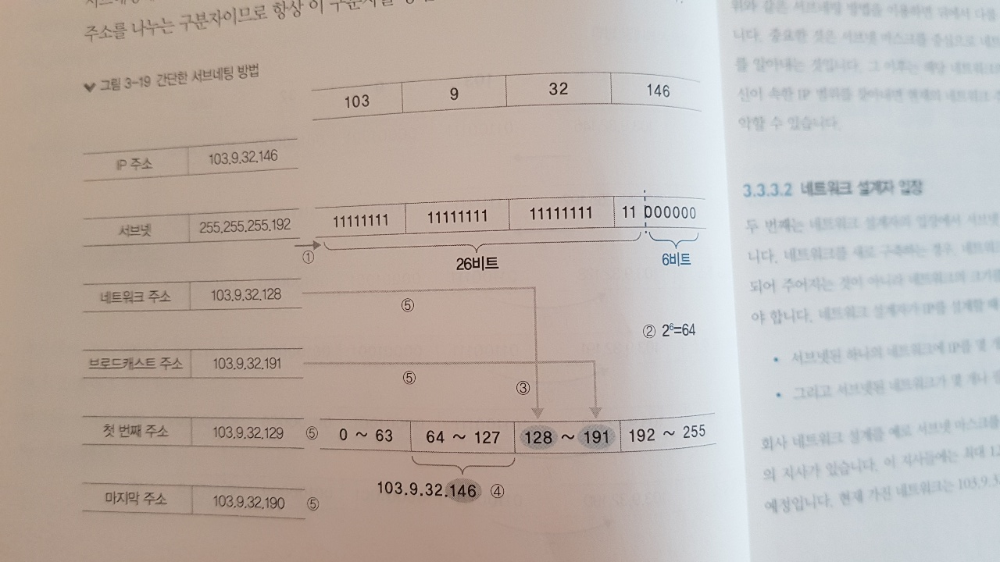

# 네트워크 통신하기

## 3.1 유니캐스트, 멀티캐스트, 브로드캐스트, 애니캐스트

- 유니캐스트
  - 1:1 통신
  - 출발지와 목적지가 1:1로 통신
  - 대부분의 통신 방법
- 브로드캐스트
  - 1:모든 통신
  - 동일 네트워크에 존재하는 모든 호스트가 목적지
  - 유니캐스트로 통신하기 전, 상대방의 정확한 위치를 알기 위해 사용
- 멀티캐스트
  - 1:그룹(멀티캐스트 구독 호스트) 통신
  - 하나의 출발지에서 다수의 특정 목적지로 데이터 전송
  - 사내 방송과 같이 단방향으로 다수에게 동시에 같은 내용 전달
- 애니캐스트
  - 1:1 통신 (목적지는 동일 그룹 내의 1개의 호스트)
  - 다수의 동일 그룹 중 가장 가까운 호스트에서 응답
  - IPv4에서는 일부 기능 구현, IPv6은 모두 구현 가능
  - 애니캐스트 주소가 같은 호스트 들 중에서 가장 가깝거나 가장 효율적으로 서비스할 수 있는 호스트와 통신
    - 가장 가까운 DNS 서버 찾을 때
    - 가장 가까운 게이트웨이를 찾을 때
  - 후보군이 여러 개

## 3.2 MAC 주소

- Media Access Control
- 2계층에서 통신을 위해 네티워크 인터페이스에 할당된 고유 식별자 (물리적인 주소)

### 3.2.1 MAC 주소 체계

- 48비트의 16진수 12자리로 표현
  - 앞의 24비트
    - 제조사 코드
      - 네트워크 제조업체에 주소 풀을 할당하는 것
    - OUI 값 (IEEE가 제조사에 할당하는 부분)
  - 뒤의 24비트
    - UAA
    - 각 제조사에서 자체적으로 네트워크 구성 요소에 할당하는 부분
- 생산되자 마자 부여되는 주소값
  - 그렇지만 메모리에 탑재된 것이기 때문에 변경가능
    - 윈도우 Driver 상세 정보에서 MAC 주소 변경을 제공하면 쉽게 변경가능
- 중복 가능하다
  - 고유 값이기 때문에 중복이 안될 거 같지만 중복 가능
    - 실수나 의도적으로
    - 동일 네트워크에서만 중복되지 않으면 동작하는데 문제가 없다
  - 라우터로 다른 네트워크로 넘기게 되면 출발지와 목적지 MAC 주소가 변경된다.
    - 네트워크를 넘어가면 기존 출발지, 도착지 MAC 주소 유지 X

## 3.2.2 MAC 주소 동작

- NIC는 자신의 MAC 주소를 가지고 있다.
  - 전기 신호가 들어오면 2계층에서 데이터 형태(패킷)로 변환하여 내용을 구분한 후 도착지 MAC 주소 확인
  - 도차직 MAC 주소가 자신의 MAC 주소와 다르면 패킷을 폐기
  - 같거나, 그룹 주소(브로드, 멀티캐스트)인 경우 처리해야할 주소로 인지해 패킷을 상위 계층으로 넘김
- 브로드캐스트 주소는 NIC에서 자체적으로 처리 X
  - OS나 애플리케이션에서 처리해야 하므로 시스템에 부하가 작용
    - COU 사용량 늘어남
- 무차별 모드 (Promiscuous Mode)
  - MAC 주소가 달라도 메모리에 올려 처리하는 모드
  - 다른 목적지를 가진 패킷을 분석하거나 수집해야하는 경우 사용
  - 네트워크 패킷 분석 애플리케이션 와이어샤크가 대표적인 예

## 3.3 IP 주소

- 사용자가 변경 가능한 논리 주소
- 주소에 레벨이 존재. 그룹을 의미하는 네트워크 주소와 호스트 주소로 나뉜다.

### 3.3.1 IP 주소 체계

- 흔히 사용하는 주소 32비트 IPv4 주소
  - IPv6 주소는 128비트
- 4개의 옥텟(Octer)이라 불리는 8비트 단위로 나누고 . 으로 구분
- IP 주소는 MAC 주소(16진수)와 다르게 10진수로 표기, 따라서 0~255 사용
- 네트워크 주소와 호스트 주소 두 부분으로 나뉨
  - 네트워크 주소
    - 호스트들을 모은 네트워크를 지칭하는 주소
    - 네트워크 주소가 동일한 네트워크를 로컬 네트워크라 함
  - 호스트 주소
    - 하나의 네트워크 내에 존재하는 호스트를 구분하기 위한 주소
  - 정확히 절반으로 나뉘는 MAC 주소와 다르게 이 둘을 나누는 경계점이 구분되어 있지 않음
  - IP 주소 체계는 호스트 IP 개수에 따라 네트워크 크기를 다르게 할당할 수 있는 클래스 개념 도입
    - A 클래스 : 1600만 개, 첫 번째 옥탯에 구분자
    - B 클래스 : 6.5만 개, 두  번째 옥탯
    - C 클래스 : 250개, 세 번재 옥탯
    - 구분자를 서브넷 마스크라 한다.
  - 
  - 다른 고정된 네트워크 주소 체계에 비해 주소를 절약할 수 있는 장점
  - 고정되어 있다면?
    - 큰 네트워크를 필요로 하는 조직은 네트워크를 여러개 확보 해야하고
    - 작은 네트워크가 필요한 조직의 입장에서는 너무 많은 IP를 가져가므로 낭비
- 맨 앞의 숫자는 네트워크 주소로, 맨뒤의 숫자는 브로드 캐스트 주소로 사용
  - 따라서 A 클래스는 IP를 2^24 - 2개를 사용할 수 있다.

### 3.3.2 클래스폴과 클래스리스

- 위의 클래스 기반의 IP 주소 체계를 클래스폴이라고 부른다.

#### 클래스리스 네트워크의 등장

- 기존 클래스폴 기반의 주소 체계로 IP 주소 요구를 감당하기에 부족했다.
- 이론적으로 43억개 사용할 수 있지만 실제로 사용할 수 있는 훨씬 적었고, 네트워크 주소를 게층화하고 분할하기 위해 낭비되는 IP가 매 우 많았다.
- IP주소 부족과 낭비문제를 해결하기 위해 3가지 보존, 전환 전략을 만들어 냄
  - 단기 대책 : 클래스리스, CIDR (classless Inter-domain-routing) 기반의 주소 체계
  - 중기 대책 :  NAT와 사설 IP 주소
  - 장기 대책 : 차세대 IP인 IPv6
- 인터넷 초창기에 여러 회사에서 미래를 위해 A 클래스 할당 받았지만 수천, 수만개만 사용
  - 나머지 수천만개의 IP는 사용을 못함
    - 다른 기관에서는 이런 IP를 분할해 사용 불가(클래스 폴 기반이기 때문)
  - 이를 해결하기 위해 클래스 개념 자체를 버리는 클래스리스 기반 주소 체계 등장
- 클래스 리스 네트워크에서는 네트워크와 호스트 주소를 나누는 구분자를 사용 (서브넷 마스트)
  - 2진수 숫자 1은 네트워크 주소
  - 2진수 숫자 0은 호스트 주소
  - 

### 3.3.3 서브네팅

- 원래 부여된 클래스의 기준을 무시하고 새로운 네트워크-호스트 구분 기준을 사용자가 정해 원래 클래스폴 단위의 네트워크보다 더 쪼개 사용하는 것
  - 
- 실무에서 고민해야하는 것
  - 네트워크 디자인 단계에서 네트워크 설계자가 네트워크를 효율적으로 어떻게 분할할 것인지
    - 네트워크 설계 시 네트워크 내에 필요한 단말을 고려한 네트워크 범위 설계
  - 이미 분할된 네트워크에서 사용자가 자신의 네트워크와 원격지 네트워크 구분하는 경우
    - 네트워크에서 사용할 수 있는 IP 범위 파악
    - 기본 게이트웨이와 서브넷 마스트 설정이 제대로 되어 있는지 확인

#### 사용자 입장

- 사용자는 이미 설계되어 있는 네트워크에서 사용할 수 있는 IP 주소 범위를 파악해야한다.
- 주어진 네트워크 범위 밖의 IP를 할당하거나 서브넷마스크를 잘못 입력하면 로컬 네트워크의 특정 범위에 속해있는 단말과 통신에 문제가 생기거나 네트워크 전체에 통신하지 못하는 경우 발생
- 자신이 속한 네트워크의 유효 범위를 파악하는 방법
  - 서브넷 마스크 2진수로 변환
  - 서브넷이 가질 수 있는 최대 IP 개수 파악
  - 64의 배수로 나열하여 기준이 되는 네트워크 주소를 파악
    - 0~63 / 64~127 / 128~191 / 192~255
  - 103.9.32.146에서 호스트 주소 146이 속한 네트워크를 선택한다
    - 128~191
  - 필요한 주소를 정리한다
    - 네트워크 주소 : 103.9.32.128 (첫번재 숫자)
    - 브로드캐스트 주소 : 103.9.32.191 (마지막 숫자)
    - 유효 IP 범위 : 103.9.32.129~103.9.32.190
  - 

#### 설계자 입장

- 고민거리

  - 서브넷된 하나의 네트워크에 IP를 몇개나 할당해야하는가? (pc가 몇대 있는가?)

  - 그리고 서브넷 된 네트워크 몇개나 필요한가?

- 설계방법

  - 조건
    - 회사에 12곳 지사
    - 지사에는 최대 12개의 IP가 필요할 예정
    - 현재 가진 네트워크는 103.9.32.0/24 네트워크
  - 서브넷된 하나의 네트워크에 12개 IP를 할당
  - 네트워크는 2진수의 배수로 커지므로 (4,8,16,32,64,128,256) 16개짜리의 네트워크에 할당 (가장 효율적)
    - 16개 짜리 네트워크는 네트워크 주소와 브로드캐스트 주소로 사용할 2개의 IP를 제외해야한다.
    - 따라서 14개의 IP를 실제로 사용 가능
  - 16개 짜리 네트워크를 12개 확보
  - 

- 네트워크를 설계할 때 가능하면 사설 IP 대역을 사용해 충분한 IP 대역을 사용하는 것이 좋다

  - 공인 IP는 인터넷에서 유일하게 사용되므로 사용할 수 있는 IP수가 제한되어 있고 할당받은 IP를 사용하지 않으면 IP 할당 기관이 회수
  - 사설 IP는 회사 내부에서만 사용하므로 제한 없이 큰 네트워크 사용
  - 공인 IP를 사용해 여유없이 네트워크를 할당하면 크기가 다른 네트워크가 많아진다.
    - 관리하기도 어렵고 일반 사용자도 IP 쉽게 구분하기 어렵다
    - 최대한 같은 크기의 네트워크를 할당하고 10진수로 표현해도 쉽게 이해할 수 있는 C클래스 단위인 24비트로 쪼개 할당하는 것 이 바람직하다
  - 

  - 왼쪽 네트워크가 단순하고 성능이 좋지만 IP주소가 낭비되기는 한다.

### 3.3.4 공인 IP와 사설 IP

- 인터넷에 접속하라면 IP 주소가 있어야하고 이 IP는 전 세계에서 유일해야하는 식별자
  - 이를 공인 IP
- 개인적으로 네트워크를 구성한다면 공인 IP 주소를 할당받지 않고 네트워크 구축 가능
  - 사설 IP 주소
- 인터넷에 접속하지 않거나 NAT 기술을 사용할 경우 (공유기나 회사 방화벽 사용하는 경우) 사설 IP 주소를 사용할 수 있다.
- 사설 IP를 이용하면 인터넷에 직접 접속하지 못하지만 IP를 변환해주는 NAT 장비에서 공인 IP로 변경한 후에는 인터넷 접속 가능, 가정에서 많이 사용하는 공유기는 NAT 장비 역할을 하는 대표적인 예이다.
- 회사 내부에서 사설 네트워크를 구축할 때 NAT를 사용하여 인터넷에 연결하더라도 다른 사용자에게 할당된 IP를 사설 네트워크 주소로 사용하면 안된다. 다른 인터넷 연결에는 문제가 없지만, 내부 네트워크에 할당된 IP를공식으로 사용하는 네트워크로 접속할 수 없다. 인터넷 어느 구간에서도 사용되지 않는 RFC에 명시된 사설 IP 대역 사용하는 것을 추천
  - 위 같은 경우 외부 IP에 접속해야하지만 서버가 같은 네트워크에 존재하는 것으로 인식하고 브로드캐스트 해버리기 대문에 정상적인 통신이 불가능하다. 
    - 연결해야할 외부 서버가 20.0.0.0/24 네트워크이고 회사 내부 사설 IP가  20.0.0.0/24이면 연결이 안됨

## 3.4 TCP와 UDP

- 4계층의 담당
  - 목적지를 찾아가는 주소가 아니라, 애플리케이션에서 사용하는 프로세스를 정확히 찾아가고 데이터를 분할한 패킷을 잘 쪼개 보내고 잘 조립하는 것이 목적
  - 시퀀스 번호와 ACK 번호를 사용
  - 4계층의 상위 프로토콜 지시자 : 포트번호
    - 2~3 계층의 상위 프로토콜 지시자는 (프로토콜 번호 / 이더 타입) 출발지와 도착지를 구분해 사용하지 않고 한 개만 사용하지만 4계층 프로토콜 지시자인 포트 번호는 출발지와 목적지를 구분해 처리해야한다.
    - 웰 노운 포트
      - HTTP TCP 80
      - HTTPS TCP 443
      - SMPT TCP 25
      - 인터넷 주소 할당기구인 IANA에 등록되고 1023번 이하의 포트 번호를 사용
    - 다양한 애플리케이션에 포트 번호를 할당하기 위해 Registered Port 범위를 사용
      - 1024~49151의 범위
      - IANA에 등록되어 관리 
      - 그러나 공식 번호와 비공식 번호가 혼재되어 있고 사설 포틉 번호로 사용되기도 한다.
    - 동적, 사설, 임시 포트 번호
      - 49152~65535
    - 서비스 요청 시와 응답 시에는 출발지 IP와 목적지 IP가 반대가 되듯, 출발지와 도착지 포트 번호도 요청 패킷과 응답 패킷이 반대가 된다.

### 3.4.2 TCP

- TCP 프로토콜은 신뢰할 수 없는 공용망에서도 정보 유실 없는 통신을 보장하기 위해 세션을 안전하게 연결하고 데이터를 분할하고 분할된 패킷이 잘 전송되었는지 확인하는 기능이 있다.
  - 패킷에 번호를 부여하고 잘 전송되었는지에 대해  응답(Acknowledge Number한다.
  - 전송크기(Window size) 까지 고려해 통신

#### 패킷 순서, 응답 번호

 

- 출발지에서 시퀀스 번호를 0으로 보낸다 (SEQ = 0)
- 수신 측에서는 0번 패킷을 잘 받았다는 표시로 응답 번호(ACK)에 1을 적어 응답한다.
  - 이 때 수신 측에서는 자신이 처음 보내는 패킷이므로 자신의 패킷에 시퀀스 번호 0을 부여한다.
- 이 패킷을 받은 송신 측은 시퀀스 번호를 1로 (수신 측이 ACK 번호로 1번 패킷을 달라고 요청했으므로), ACK 번호는 상대방의 0번 시퀀스를 잘 받았다는 의미로 시퀀스 번호를 1로 부여해 다시 통신

#### 윈도 사이즈와 슬라이딩 윈도

- TCP는 ACK번호를 확인하고 다음 패킷을 전송
  - 별도 패킷을 받는 것 자체가 통신 시간을 늘린다.
  - 송수신자가 먼 거리에 떨어져 있으면 왕복 지연시간(RTT : Round Tip Time)이 늘어나므로 응답을 기다리는 시간이 더 길어난다.
  - 그래서 패킷을 한번에 여러개 보내고 응답을 하나만 받는다.
    - 가능한 최대한 많은 패킷을 한꺼번에 보내는 것이 효율적
    - 그러나 네트워크 상태가 안좋으면 패킷 유실 가능성이 커지므로 적절한 송신량을 결정해야한다.
  - 한 번에 데이터를 받을 수 있는 데이터 크기를 윈도 사이즈라고 한다.
  - 네트워크 상황에 따라 이 윈도 사이즈를 조절하는 것을 슬라이딩 윈도라고 한다.
- TCP 헤더에서 윈도 사이즈로 표현할 수 있는 최대 크기는 2^16이다.
  - 실제로 64K만큼 윈도 사이즈 가질 수 있지만 현대 네트워크에서는 너무 작은 숫자
  - TCP 헤더는 변경이 불가능하므로  헤더 사이즈를 늘리지 않고 뒤의 숫자를 무시하는 방법으로 윈도 사이즈를 증가 시켜 통신
- TCP는 데이터 유실 발생하는 경우
  - 윈도 사이즈를 절반으로 떨어 뜨리고
  - 정상적인 통신이 되는 경우, 하나씩 늘린다.
  - 작아진 윈도 사이즈로 데이터 통신 속도가 느려지는 경우 발생
    - 회선 속도 증가시키거나, 경합을 임시로 피하게 할 수 있는 버퍼가 큰 네트워크 장비 사용
    - TCP 최적화 솔루션 사용

#### 3방향 핸드셰이크

- 정확한 통신을 위해, 통신 전에 통신에 필요한 리소스를 미리 확보하는 작업이 중요
  - TCP에서는 3번의 패킷을 주고 받으면서 통신을 서로 준비하므로 3방향 핸드셰이크라고 부른다
- 진행 상황에 따라 상태 정보를 부르는 이름이 다르다.
  - LISTEN
    - 서버에서는 서비스를 제공하기 위해 클라이언트의 접속을 받아들일 수 있는 상태로 대기
  - SYN-SENT
    - 클라이언트에서 통신을 시도할 때 Syn 패킷을 보내는 상태
  - SYN-RECEIVE
    - 클라이언트의 SYN을 받은 서버의 상태
    - 이후 Syn, Ack로 응답
  - ESTABLISHED
    - 위 응답을 받은 클라이언트의 상태
    - 이후 서버에 응답을 보냄
    - 서버도 이 응답을 받으면 위 상태로 변경됨
    - 결국 서버와 클라이언트 간의 연결이 성공적으로 완료
- 기존 통신과 새로운 통신을 구분해야한다.
  - 헤더에 플래그라는 값을 넣어 통신한다.
- UDP
  - 신뢰 통신을 위한 내용이 없다 (시퀀스 번호, ACK 번호, 플래그, 윈도사이즈)
  - 음성 데이터나 실시간 스트리밍 같이 시간과 민감한 프로토콜이나 애플리케이션 사용하는 경우
  - 사내 방송에 사용되는 멀티캐스트처럼 단방향으로 다수의 단말과 통신해 응답을 받기 어려운 환경에서 주로 사용
  - UDP는 중간에 데이터가 일부 유실되더라도 그냥 유실된 상태로 데이터를 처리해버림
  - 3핸드 셰이크 과정이 없다
    - 그러나 첫 데이터는 리소스 확보를 위해 인터럽트를 거는 용도로 사용되고 유실된다.
    - 대부분 이런 상황을 인지하고 동작하거나 연결 확립은 TCP 프로토콜을 사용하고 실제 데이터만 UDP 이용하는 경우도 많다.

## 3.5 ARP

- 2계층과 3계층 주소 간에는 아무 관계도 없다.
- 실제 통신은 IP 주소 기반으로 일어나고, MAC 주소는 상대방의 주소를 자동으로 알아내 통신하게 된다.
- 상대방의 MAC 주소를 알아내기 위해 사용되는 프로토콜이 ARP(Address Resolution Protocol)이다.

### 3.5.1 ARP란?

- TCP/IP 프로토콜 스택을 위해서만 동작하는 것은 아님
  - TCP-이더넷 프로토콜과 같이 3계층 논리 주소와 2계층 물리 주소 사이에 관계가 없는 프로토콜에서 두 주소를 연결함
- 호스트에서 아무 통신이 없다가 처음  통신을 시도하면 패킷을 바로 캡슐화할 수 없다
  - 출발지와 목적지 IP 주소는 미리 알고 있어 캡슐화하는 데 문제가 없지만
  - 상대방의 MAC 주소를 알 수 없어 2계층 캡슐화를 수행할 수 없다.
  - ARP 브로드캐스트를 이용해 네트워크 전체에 상대방의 MAC 주소를 질의해야한다.
  - ARP 브로드캐스트를 받은 목적지는 ARP 프로토콜을 이용해 자신의 MAC 주소를 응답한다.
  - 이후, 출발지 목적지 둘 다 상대방에 대한 MAC 주소를 학습하고 이후 패킷이 정상적으로 인캡슐레이션되어 상대방에게 전달될 수 있다.
- 네트워크 장비에서 ARP 작업은 하드웨어 가속으로 처리되지 않고 CPU에서 직접 수행하므로 짧은 시간에 많은 ARP 요청이 들어오면 네트워크 장비에서는 큰 부하로 작용한다.
  - 그래서 해커들은 네트워크 장비를 무력화하는데 다량의 ARP를 이용한 공격을 많이 수행
  - 이러한 공격을 막기위해 네트워크 장비는 ARP 테이블 저장 기간을 일반 PC보다 길게 설정하고 많은 ARP 요청이 들어오면 이를 필터링하거나 천천히 처리하는 방식으로 네트워크 장비를 보호

### 3.5.2 ARP 동작

- 목적지 MAC 주소를 모르기 때문에 정상적으로 패킷을 만들 수 없다.

  

- ARP 패킷을 네트워크에 브로드 캐스트할 때 2계층 MAC 주소는 출발지를 자신의 MAC으로 도착지는 브로드캐스트(FF-FF-FF-FF-FF-FF)로 채운다

- ARP 프로토콜 필드의 전송자 MAC과 IP 주소에는 자신의 주소로, 대상자 IP 주소는 10.1.1.2를, MAC 주소는 00-00-00-00-00-00 으로 채워 네트워크에 뿌린다.

- 브로드캐스트이므로 같은 네트워크 안에 있는 모든 단말에 보내지고 모든 단말은 ARP 프로토콜 내용을 확인하는데 ARP 프로토콜 필드의 대상자 IP가 자신이 맞는지 확인해 자신이 아니면 패킷을 버린다.

  - 자신의 IP이면 ARP 요청을 처리하고 그에 대한 응답을 보냄
  - 이 때 송신자와 대상자의 위치가 바뀐다.
  - 서버 B는 서버 A의 MAC 주소를 알고 있어 모든 ARP 필드를 채워 응답할 수 있다.

- ARP 요청을 처음 보낼 때는 브로드캐스트인 반면, 응답을 보낼 때는 출발지와 도착지 MAC 주소가 명시되어 있는 유니캐스트이다.
- 서버 A는 서버 B의 ARP 응답을 받아 ARP 캐시 테이블을 갱신한다.
  - 갱신 된 후로는 MAC 주소를 알고 있으므로 도착지 MAC 주소필드를 완성해 패킷을 보낼 수 있습니다.

### 3.5.3 GARP

- Gratuitous ARP

- 대상자 IP 필드에 자신의 IP 주소를 채워 ARP 요청을 보낸다

  - 자신의 IP와 MAC 주소를 알릴 목적으로 사용된다
  - 따라서 목적지 MAC 주소는 브로드캐스트 MAC 주소를 사용한다.

- 패킷

  - 송진자 MAC = 자신의 MAC 주소
  - 송신자 IP = 자신의 IP 주소
  - 대상자 MAC 주소 = 00:00:00:00:00:00 사용
  - 대상자 IP 주소 = 자신의 IP 주소
  - 브로드캐스트

- 동일 네트워크에 자신의 ip 주소와 MAC 주소를 알려주는 이유

  - IP 주소 충돌 감지

    - 자신에게 할당한 IP가 네트워크에 이미 사용되고 있는지 확인

  - 상대방(동일 서브넷 상의 다른)의 ARP 테이블 갱신

    - 가상 MAC 주소를 사용하지 않는 데이터베이스 HA 솔루션에서 주로 사용

    - 데이터베이스 HA는 주로 두 데이터베이스 서버가 하나의 가상 IP 주소로 서비스

    - 한대는 동작, 한대는 대기하는 액티브-스탠바이로 동작

    - 액티브 상태인 서버가 가상 IP 주소 요청에 응답해 서비스하지만 MAC 주소는 가상 주소가 아닌 실제 MAC 주소를 사용

    - 스탠바이 장비가 액티브 상태로 바뀌면 GARP 패킷을 네트워크에 보내 액티브 장비가 변경되었음을 알려준다.

      

  - HA(고가용성) 용도의 클러스터링, VRRP, HSRP

    - 가상 MAC을 사용

    - FHRP (First Hop Redundancy Protocol)

    - 네트워크에 있는 스위치 MAC 테이블 갱신이 목적

    - 가상 MAC 주소를 사용하는 경우 단말은 ARP 정보를 가상 MAC 주소로 학습하므로 단말의 ARP 테이블 갱신할 필요 없다

      - 그러나 클러스터링 중간에 있는 스위치의 MAC 테이블은 마스터가 변경되었을 때 가상 MAC 주소의 위치를 적절히 찾아가도록 업데이트 해야하므로 마스터 변경 되었을 때 갱신이 필요하다
      - 슬레이브가 마스터로 역할이 변경되면 GARP 전송

      

### 3.5.4 RARP

- 리버스 ARP
- IP 주소가 정해져 있지 않은 단말이 IP할당을 요청할 때 사용
  - MAC 주소는 알지만 아직 IP 할당되지 않아 IP를 할당해주는 서버에 어떤 IP 주소를 써야하는 지 물어볼 때 사용
- 현재는 제한된 기능으로 인해 BOOTP, DHCP로 대체되어 사용되지 않음

## 3.6 서브넷과 게이트웨이

- 원격지 네트워크와의 통신에 사용하는 장비를 게이트웨이
- 3계층장비(라우터와 L3 스위치)가 이역할을 할 수 있음

### 3.6.1 서브넷과 게이트웨이 용도

- 원격 네트워크 통신은 네트워크를 넘어 전달되지 못하는 브로드 캐스트의 성질 때문에 네트워크 장비의 도움이 필요하다.
  - 이 장비를 게이트웨이라고 하고 게이트웨이에 대한 정보를 PC나 네트워크 장비에 설정하는 항목이 기본 게이트웨이 이다. (default gateway)

- 출발지에서는 목적지가 자신이 속한 네트워크의 범위인지 확인하는 작업이 필요
  - 서브넷 마스크을 사용
  - 자신의 IP 주소와 서브넷 마스크를 and 연산해 나오는 값 = 자신이 속한 네트워크
  - 이 연산값인 로컬 네트워크 주소에 목적지가 속해 있으면 로컬 통신, 아니면 원격지 통신

### 3.6.2 2계층 통신 vs 3계층 통신

- 정확한 표현은 로컬 네트워크 통신과 원격지 네트워크 통신
- 로컬네트워크에서 직접 통신할 경우 라우터와 같은 3계층 네트워크 장비의 도움 없이 통신 가능
  - 즉 단말 간을 연결해주는 네트워크 장비에서 2계층까지만 정보를 확인해 통신하고 ARP 요청을 보낼 때 직접 브로드 캐스트를 이용하므로 이를 L2 통신이라고 부른다.

- 원격지 네트워크와 통신할 경우 라우터와 같은 3계층 장비의 도움이 없으면 통신이 안된다.
  - 그래서 3계층 정보까지 확인해야하므로 L3 통신이라고 한다.
  - 외부 네트워크와 통신이 필요할 때는 ARP 요청을 기본 게이트웨이의 IP 주소로 요청
  - 게이트웨이에서 ARP 응답을 받은 단말은 도착지 MAC 주소에 응답받은 기본 게이트 웨이의 MAC 주소를 적어놓고 통신을 시작
  - 도착지 IP 주소는 통신의 실제 도착지이고, 도착지 MAC 주소는 디폴트 게이트웨이의 MAC 주소가 사용된다.

--- 4-way 연결 종료 찾아보기