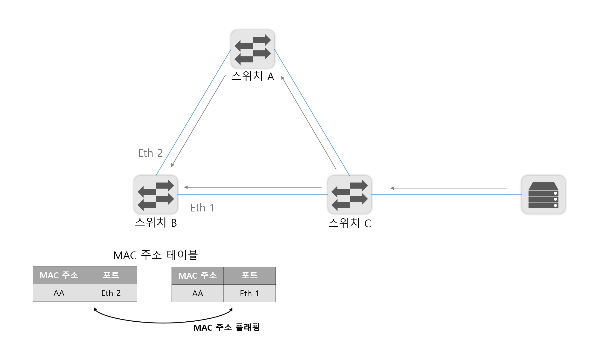
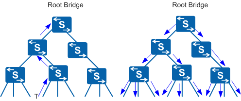
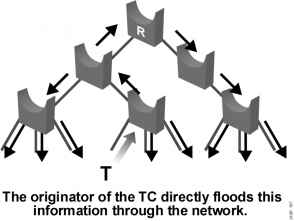

# 스위치: 2계층 장비

- 스위치는 2계층 주소인 MAC 주소를 기반으로 동작
- 네트워크 중간에서 패킷을 받아 필요한 곳에만 보내주는 네트워크 중재자 역할
- 스위치는 아무 설정 없이 네트워크에 연결해도 MAC 주소를 기반으로 패킷을 전달하는 기본 동작 수행
  - 한 대의 장비에서 논리적으로 네트워크를 분리할 수 있는 VLAN 기능과 네트워크의 루프를 방지하는 스패닝 트리 프로토콜과 같은 기능을 갖고 있다.

## 4.1 스위치 장비 동작

- 네트워크에서 통신을 중재하는 역할
  - 스위치가 없던 오래된 이더넷 네트워크에서는 패킷을 전송할 때 서로 경합해 네트워크 성능 저하가 컸다.
  - 이런 경쟁을 없애고 패킷을 동시에 여러 장비가 서로 간섭 없이 통신하도록 도와주는 장비가 스윛
  - 여러 단말이 한꺼번에 통신할 수 있어  통신을 하기위해 기다리거나, 충돌 때문에 대기하는 문제가 해결하되고 네트워크 전체의 통신 효율성이 향상된다.
- 핵심 역할
  - 누가 어느 위치에 있는지 파악하고 실제 통신이 시작되면 자신이 알고 있는 위치로 패킷을 정확히 전송하는 것
    - 2계층 주소를 이해하고, 단말의 주소인 MAC 주소와 단말이 위치하는 인터페이스 정보를 매핑한 MAC 주소 테이블을 갖고 있어서 가능

### 4.1.1 플러딩

- 스위치는 부팅하면 네트워크 관련 정보가 아무것도 없다
  - 네트워크 통신을 중재하는 자신의 역할을 하지 못하고 허브처럼 동작한다.
    - 허브는 패킷이 들어온 포트를 제외하고 모든 포트로 패킷을 전달한다.
  - 스위치가 허브와 같이 모든 포트로 패킷을 흘리는 동작 방식을 **플러딩**이라고 한다.
- 스위치는 패킷이 들어오면 도착지 MAC 주소를 확인하고 자신이 갖고 있는 MAC 주소 테이블에서 해당 MAC 주소가 있는지 확인
  - 없으면 모든 포트에 같은 내용의 패킷을 전송
  - LAN에서 동작하므로 자신이 정보를 갖고 있지 않더라도 어딘가에 장비가 있을 수 있다고 가정하고 위 작업을 수행
- 이런 동작이 많아지면 스위치가 제 역할 수행 X
  - 패킷이 스위치에 들어오면 패킷 정보의 MAC 주소를 보고 이를 학습해 MAC 주소 테이블을 만든 후 이를 통해 패킷을 전송한다.

### 4.1.2 어드레스 러닝

- 원하는 포트로 포워딩하는 스위치의 동작을 정상적으로 수행하려면 MAC 주소 테이블을 만들고 유지해야한다.
  - 이런 MAC 주소 테이블을 만들고 유지하는 과정을 어드레스 러닝
- 패킷의 출발지 MAC 주소 정보를 이용한다.
  - 패킷이 특정 포트에 들어오면 스위치에는 해당 패킷의 출발지 MAC 주소와 포트번호를 MAC 주소 테이블에 기록
  - 1번 포트에서 들어온 패킷의 출발지 MAC 주소가 AAAA라면 1번 포트에 AAAA MAC 주소를 가진 장비가 연결되어 있다고 추론할 수 있어 이런 방법으로 주소 정보를 습득
  - 어드레스 러닝은 출발지의 MAC 주소 정보를 사용하므로 브로드캐스트나 멀티캐스트에 대한 MAC 주소를 학습할 수 없다. 두 가지 모두 목적지 MAC 주소 필드에서만 사용하기 때문에

### 4.1.3 포워딩/필터링

- 패킷이 스위치에 들어온 경우 도착지 MAC 주소를 확인하고 자신이 가진 MAC 테이블과 비교해 맞는 정보가 있으면 매칭되는 해당 포트로 패킷을 포워딩한다.
  - 이 때 다른 포트로는 해당 패킷을 보내지 않으므로 이 동작을 필터링이라고 한다.
- 스위치는 포워딩과 필러링을 통해 목적지로만 패킷이 전달되도록 동작
  - 여러 포트에서 동시에 수행 가능
  - 다른 포트에 영향을 미치지 않으므로 다른 포트에서는 독립적으로 동작 가능
- 브로드캐스트와 멀티캐스트는 모두 출발지가 사용되지 않으므로 포워딩 / 필터링을 하지 않고 모두 플러딩한다.

## 4.2 VLAN

### 4.2.1 VLAN이란?

- VLAN은 물리적 배치와 상관없이 LAN을 논리적으로 분할, 구성하는 기술이다.
  - 기업과 같이 여러 부서가 함께 근무하면서 각 부서별로 네트워크를 분할 할 때
  - 최근 다수의 단말이 네트워크에 연결되므로 네트워크 분할이 중요
  - 과도한 브로드캐스트로 인한 단말들의 성능 저하, 보안 향상을 휘한 차단 용도, 서비스 성격에 따른 정책 적용과 같은 이유로 네트워크가 분리되어야한다.
- 한 대의 스위치를 여러 개의 VLAN으로 분할 가능, 별도의 스위치처럼 동작한다.
  - VLAN으로 나누면 하나의 장비를 서로 다른 네트워크를 갖도록 논리적으로 분할한 것
  - 유니캐스트, 브로드캐스트도 VLAN 간 통신할 수 없다.
  - VLAN 간의 통신이 필요하다면 서로 다른 네트워크 간의 통신이므로 3계층 장비가 필요하다.

### 4.2.2 VLAN의 종류와 특징

- 포트 기반, MAC 주소 기반으로 나뉜다.
- 포트 기반 VLAN
  - 스위치를 논리적으로 분할해 사용하는 것이 목적
  - 일반적인 VLAN
  - 어떤 단말이 접속하든지 특정 포트에 VLAN을 할당하면 할당된 VLAN에 속하게 된다.
- MAC 기반 VLAN
  - 사용자들의 자리 이동이 많아지면서 개발됨
  - 스위치에 연결되는 단말의 MAC 주소를 기반으로 VLAN을 할당하는 기술
  - 단말이 연결되면 단말의 MAC 주소를 인식한 스위치가 해당 포트를 지정된 VLAN으로 변경
  - 단말에 따라 VLAN 정보가 바뀔 수 있어 다이나믹 VLAN이라고 부른다

### 4.2.3 VLAN(Trunk / Access) 동작 방식

- 포트 기반 VLAN에서는 스위치의 각 포트에 가각 사용할 VLAN을 설정하는데 한 대의 스위치에 연결되더라도 서로 다른 VLAN이 설정된 포트 간에는 통신할 수 없다.

- 3 계층 장비를 사용해야한다.

- 각 VLAN끼리 통신하려면 VLAN개수만큼 포트를 연결해야한다.

  - VLAN 별로 포트를 연결하면 장비 간의 연결만으로도 많은 포트가 낭비됨

  - 이를 해결하기 위한 것이 VLAN 태그 기능

  - 

    

- VLAN 태그 기능은 하나의 포트에 여러 개의 VLAN을 함께 전송할 수 있게 해준다.

  - 이 포트를 태그 포트 혹은 트렁크 포트라고 부른다.
  - 여러 개의 VLAN을 동시에 전송해야하는 태그 포트는 통신할 때 이더넷 프레임 중간에 VLAN ID 필드를 끼워 넣어 이 정보를 이용한다.

  - 태그 포트로 패킷을 보낼 때는 VLAN ID를 붙이고 수신 측에서는 VLAN ID를 제거하면서 VLAN ID의 VLAN으로 패킷을 보낼 수 있게 된다.

- 여거 개의 포트를 하나로 묶어 사용할 수 있으므로 포트 낭비 없이 더 유연하게 디자인 가능

  - MAC 주소 테이블에도 변화가 생김
  - 다른 VLAN 끼리 통신하지 못하도록 MAC 테이블에 VLAN을 지정하는 필드가 추가된 것
  - 하나의 스위치에서 VLAN을 이용해 네트워크를 분리하면 VLAN 별로 MAC 주소 테이블이 존재하는 것처럼 동작

  

- 일반적인 포트를 언태그 포트 또는 엑세스(Access) 포트라고 한다

  

## 4.3 STP

- 네트워크에서 하나의 장비 고장으로 전체 네트워크가 마비되는 것을 방지해야함
  - 이중화, 다중화된 네트워크 디자인
  - SPoE(Single Point of Failure : 단일 장애점)
  - 2대 이상의 스위치로 디자인하면 패킷이 네트워크를 따라 계속 전송되므로 네트워크를 마비시킬 수 있음
    - 네트워크 루프

### 4.3.1 루프란

- 대부분 브로드캐스트 스톰

#### 브로드캐스트 스톰

- 루프 구조로 네트워크가 연결된 상태에서 단말에서 브로드캐스트 발생시키면 스위치는 패킷이 유입된 포트를 제외하고 모든 포트로 플러딩
  - 루프 구조기 때문에 이 패킷이 계속 플러딩된다.
  - 이를 브로드캐스트 스톰
  - 3계층 헤더에는 TTL (Time to Live)이라는 패킷 수명을 갖고 이지만 스위치가 확인하는 2게층 헤더에는 존재하지 않는다.
    - 즉 패킷 하나가 전체 네트워크 대역폭을 차지할 수 있다.
- 상황이 발생되면?
  - 네트워크 접속된 단말의 속도가 느려진다 (많은 브로드 캐스트 처리해야해서 CPU사용량 상승)
  - 네트워크 접속 속도 느려짐 (통신 불가능 수준)
  - 네트워크에 설치된 스위치에 모든 LED들이 동시에 빠른 속도로 깜빡임

#### 스위치 MAC 러닝 중복 문제

- 유니캐스트도 문제
  - 같은 패킷이 루프를 돌아 도착지 쪽에서 중복 수신되는 혼란발생
  - 뿐만 아니라 중간에 있는 스위치에서도 MAC 러닝 문제 발생
    - 스위치는 출발지 MAC 주소를 학습하는데
    - 직접 전달되는 패킷과 스위치를 돌아 들어간 패킷 간의 포트가 달라 MAC 주소를 정상적으로 학습할 수 없다.
    - 스위치 MAC 테이블에서는 하나의 MAC주소에 대해 하나의 포트만 학습할 수 있으므로 MAC 주소가 여러 포트에서 학습되면
    - MAC 테이블이 반복 갱신되어 정상적으로 동작하지 않는다
      - 이런 현상을 MAC 어드레스 플래핑(Flapping)이라고 부른다.
      - 

- MAC 어드레스 플래핑이 발생하면?
  - 학습된 주소가 계속 변경되므로 스위치가 정상적으로 동작하지 못하고 패킷을 플러딩
  - 이런 현상을 예방하기 위해 스위치 설정에 따라 경고 메시지를 관리자에게 알려주거나
  - 수시로 일어나는 플래핑 현상을 학습하지 않도록 자동으로 조치

#### 루프 발생 해결

- 루프 구성 포트 중 하나의 포트만 사용하지 못하도록 셧다운 되어 있어도 루프 예방 가능
- 하지만 수동으로 루프를 찾아 강제로 사용하지 못하는 것은 SPoF를 예방하기 위해서는 바람직하지 못하다.
  - 복잡한 케이블 연결을 이용해 루프를 찾아내는 것은  어렵다
  - 네트워크 장애가 발생하면 해당 포트를 다시 사용하도록 하는 것은 어렵다 (수동으로는)
- 루프를 자동 감지해 포트를 차단하고 장애 때문에 우회로가 없을 때 차단된 포트를 스위치 스스로 다시 풀어주는 스패닝 트리 프로토콜 개발

### 4.3.2 STP란?

- 스패닝 트리 프로토콜 (Spanning Tree)은 루프를 확인하고 적절히 포트를 사용하지 못하게 만들어 루프를 예방하는 매커니즘
- STP를 이용해 예방하기 위해서는
  - 전체 스위치가 어떻게 연결되는 지 알아야한다.
    - 이를 알려면 스위치 간에 정보를 전달하는 방법이 필요
    - BPDU (Bridge Protocol Data Unit)이라는 프로토콜을 통해 스위치 간에 정보를 전달하고 이렇게 수집된 정보를 이용해 전체 네트워크 트리를 만들어 루프 구간 확인
- BPDU
  - 스위치가 갖고 있는 ID와 같은 고유값이 들어간다.
  - 이런 정보들을 스위치 간에 교환되면서 루프 파악이 가능
  - 확인된 루프 지점을 데이터 트래픽을 통과하지 못하도록 차단해 루프 예방

#### 스위치 포트의 상태 및 변경 과정

- STP가 동작 중인 스위치에는 루프를 막기 위해 스위치 포트에 신규 스위치가 연결되면 바로 트래픽이 흐르지 않도록 차단
  - 해당 포트로 트래픽이 흘러도 되는 지 확인하기 위해
  - BPDU를 기다려 학습하고 구조를 파악한 후, 트래픽을 흘리거나 루프 구조인 경우 차단 상태 유지
- Blcoking
  - 패킷 데이터를 차단한 상태로 상대방이 보내는 BPDU 기다림
  - 총 20초인 Max Age 기간 동안 상대방 스위치에서 BPDU를 받지 못했거나 후순위 BPDU를 받았을 때 포트는 리스닝 상태로 변경
  - BPDU 기본 교환 주기는 2초, 10번의 BPDU를 기다린다.
- Listening
  - 리스닝 상태는 해당 포트가 전송 상태로 변경되는 것을 결정하고 준비하는 단계
  - 자신의 BPDU 정보를 상대방에게 전송하기 시작
  - 15초 대기
- Learning
  - 러닝 상태는 이미 해당 포트를 포워딩하기로 결정하고 실제로 패킷 포워딩이 일어날 때 스위치가 곧바록 동작하도록 MAC 주소를 러닝하는 단계
  - 15초 대기
- Forwarding
  - 패킷을 포워딩하는 단계, 정상적인 통신이 가능
- 스위치에 신규로 장비를 붙이면 통신하는데 50여 초가 소모
  - 루프를 예방하기 위해 스위치는 매우 방어적으로 동작
  - 새로 연결된 단말이 스위치일 가능성이 있어 BPDU를 일정 시간 기다려 스위치 여부를 파악
    - 스위치 뿐만 아니라 일반 단말을 연결하더라도 동일한 시간이 필요
- STP가 활성화된 경우, 스위치 포트는 곧바로 포워딩 상태가 되지 않는다
  - 다양한 장애가 발생하거나 스위치 이상으로 생각되는 경우가 많다
  - 특히 부팅 시간이 매우 빠른 OS가 DHCP 네트워크에 접속할 때 부팅 단계에서 IP를 요청하지만
    - 스위치가 포트가 포워딩 상태가 되지 않아 IP를 정상적으로 할당받지 못하는 경우도 있음

#### 동작 방식

- 네트워크 상에서 뿌리가 되는 가장 높은 스위치를 선출하고 그 스위치를 통해 모든 BPDU가 교환되도록 하는데 그 스위치를 루트 스위치라한다.
- 모든 스위치는 처음에 자신을 루트 스위치로 인식해 동작
  - BPDU를 통해 2초마다 자신이 루트 스위치임을 광고
  - 새로운 스위치가 들어오면 서로  교환된 BPDU에 드렁 있는 브릿지 ID 값을 비교
  - ID값이 더 적은 스위치를 루트 스위치로 선정하고 루트 스위치로 선정된 스위치 BPDU를 다른 스위치 쪽으로 보낸다
- 순서
  - 하나의 루트 스위치 선정
    - 전체 네트워크에 하나의 루트 스위치 선정
    - 자신을 전체 네트워크의 대표 스위치로 적은 BPDU를 옆 스위치로 전달
  - 루트가 아닌 스위치 중 하나의 루트 포트를 선정
    - 루트 브릿지로 가는, 경로가 가장 짧은 포트를 루프 포트라고 한다
    - 루프 브릿지에서 보낸 BPDU를 받는 포트
  - 하나의 새그먼트에 하나의 지정 포트를 선정
    - 스위치와 스위치가 연결되는 포트는 하나의 지정(Designated) 포트를 선정
    - 스위치 간의 연결에서 이미 루프 포트로 선정된 경우 반대쪽이 지정 포트로 선정되어 양쪽 모두 포워딩 상태
    - 스위치 간의 연결에서 아무도 루프 포트가 아닌 경우, 한쪽은 지정 포트로 선정되고 다른 한쪽은 대체 포트 (Alternate)가 되어 차단 상태가 된다
    - BPDU가 전달되는 포트

### 4.3.3 향상된 STP (RSTP, MST)

- STP는 루프를 예방하기 위해 같은 네트워크에 속한 모든 스위치까지 BPDU가 전달되는 시간을 고려한다.
  - 블로킹 포트가 포워딩 상태로 변경될 때 까지 30~50초가 소요
  - TCP 기반 애플리케이션이 네트워크가 끊겼을 때 30초를 기다리지 못한다
    - STP 기반 네트워크에 장애가 생기면 통신이 끊길 수 있다.
  - 스위치에 여러 개의 VLAN이 있다면
    - 각 VLAN 별로 STP 계산하면 부하가 발생함

#### RSTP

- STP는 정상적인 경로에 문제가 발생할 경우 백업 경로를 활성화하는데 30~50초 걸림
  - 이를 개선한 것이 RSTP (Rapid)
- 2~3초로 절체 시간이 짧아 일반적인 TCP 기반 애플리케이션이 세션 유지할 수 있게 해준다
- 기본 구성과 동작 방식은 STP와 같다
  - BPDU 메시지 형식이 다양해져 여러 가지 상태 메시지를 교환 할 수 있다
    - STP는 일반 토폴로지 변경과 관련된 두 가지 메시지 (TCN, TCA BPDU)만 있지만
    - RSTP는 8개의 비트를 모두 활용해 다양한 정보를 주위 스위치와 주고 받을 수 있다.
- 기존 STP에서는 토폴로지가 변경되면 말단 스위치에서 루트 브릿지 까지 변경 보고를 보내고 
  - 루트 브릿지가 그에 대한 연산을 다시 완료하고
  - 변경된 토폴로지 정보를 말단 스위치까지 보내야만 했다.
  - 추가로, 이런 정보가 네트워크에 있는 모든 스위치까지 전파되는 예비 시간까지 고려해야하므로 많은 시간이 걸린다.
  - 
- RSTP에서는 토폴로지 변경이 일어난 스위치 자신이 모든 네트워크에 토폴로지 변경을 직접 전파 가능
  - 

- 다양한 BPDU 메시지, 대체 포트 개념, 토폴로지 변경 전달 방식의 변화로 일반 STP보다 빠른 시간 내에 토폴로지 변경을 감지 복구 가능
  - 실제로 2~3초 안에 장애 복구 가능
  - 애플리케이션 세션이 끊기지 않아 보다 안정적으로 네트워크를 운영하는데 도움이 된다.

#### MST

- 일단 STP는 CST(Common Spanning Tree)라 한다.
  - VLAN 개수와 상관 없이 스패닝 트리 한 개만 동작하게 된다.
  - VLAN이 많더라도 스패닝 트리는 한 개만 동작하면 되므로 스위치의 관리 부하가 적다
  - 하지만, CST는 루프가 생기는 토폴로지에서 한 개의 포트와 회선만 활성화되므로 자원을 효율적으로 활용할 수 없다.
  - VLAN 마다 최적의 경로가 다를 수 있는데, 포트 하나만 사용할 수 있다 보니 멀리 돌아 통신해야할 경우도 생긴다.

- 위 문제를 해결하기 위해 PVST(per Vlan Spanning Tree)가 개발되었고 VLAN 마다 다른 스패닝 트리 프로세스마다 동작하므로 VLAN마다 별도의 경로와 트리를 만들 수 있게 되었다.

  - 최적의 경로를 디자인하고 VLAN 마다 별도의 블록 포트를 지정해 네트워크 로드를 셰어링하도록 구성 가능

- 하지만 STP 자체가 스위치에 많은 부담을 주는 프로토콜 (2초마다 교환)

  - PVST는 모든 VLAN 마다 별도의 ST를 유지해야 하므로 더 많은 부담이 되었다.
  - 이런 CST와 PVST의 단점을 보완하기 위해 MST(Multiple)가 개발되었다.

- MST의 아이디어

  - 여러 개의 VLAN을 그룹으로 묶고 그 그룹마다 별도의 스패닝 트리 동작
  - PVST보다 훨씬 적은 STP 프로세스가 돌게되고 PVST의 장점인 로드 셰어링 기능도 함께 사용

  - MST에서는 리전 개념이 도입되어 여러 개의 VLAN을 하나의 리전으로 묶는다
    - 리전 하나가 스패닝 트리 하나가 된다.

