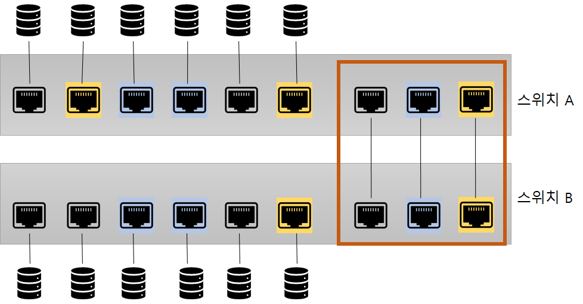
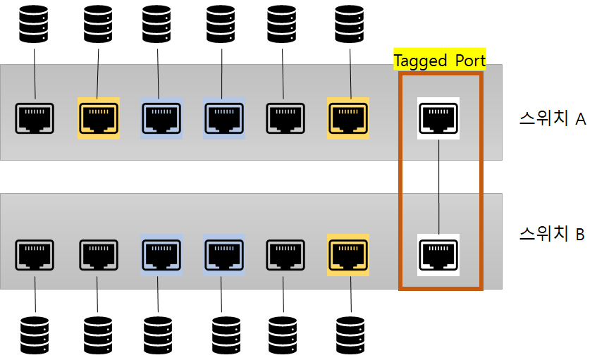
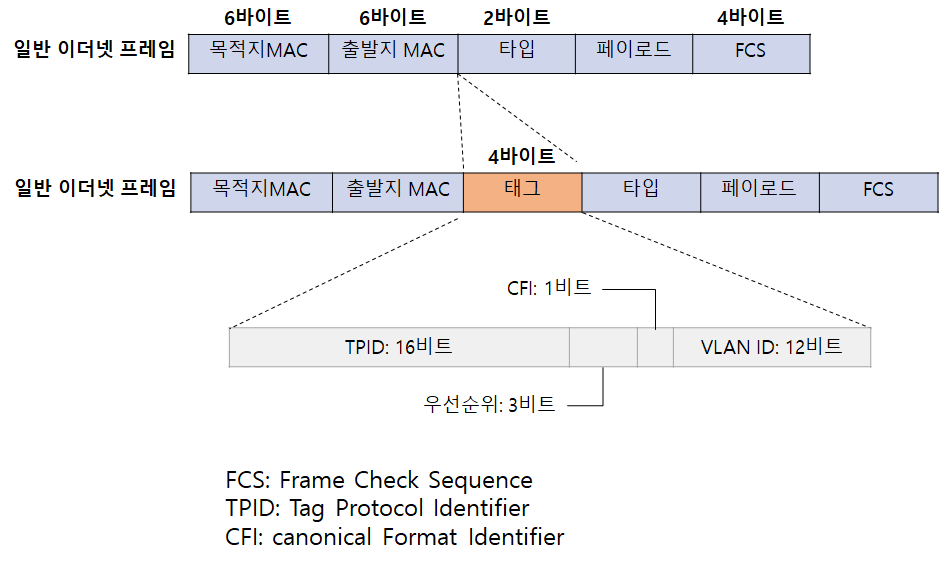

# 스위치: 2계층 장비

- 스위치는 2계층 주소인 MAC 주소를 기반으로 동작
- 네트워크 중간에서 패킷을 받아 필요한 곳에만 보내주는 네트워크 중재자 역할
- 스위치는 아무 설정 없이 네트워크에 연결해도 MAC 주소를 기반으로 패킷을 전달하는 기본 동작 수행
  - 한 대의 장비에서 논리적으로 네트워크를 분리할 수 있는 VLAN 기능과 네트워크의 루프를 방지하는 스패닝 트리 프로토콜과 같은 기능을 갖고 있다.

## 4.1 스위치 장비 동작

- 네트워크에서 통신을 중재하는 역할
  - 스위치가 없던 오래된 이더넷 네트워크에서는 패킷을 전송할 때 서로 경합해 네트워크 성능 저하가 컸다.
  - 이런 경쟁을 없애고 패킷을 동시에 여러 장비가 서로 간섭 없이 통신하도록 도와주는 장비가 스윛
  - 여러 단말이 한꺼번에 통신할 수 있어  통신을 하기위해 기다리거나, 충돌 때문에 대기하는 문제가 해결하되고 네트워크 전체의 통신 효율성이 향상된다.
- 핵심 역할
  - 누가 어느 위치에 있는지 파악하고 실제 통신이 시작되면 자신이 알고 있는 위치로 패킷을 정확히 전송하는 것
    - 2계층 주소를 이해하고, 단말의 주소인 MAC 주소와 단말이 위치하는 인터페이스 정보를 매핑한 MAC 주소 테이블을 갖고 있어서 가능

### 4.1.1 플러딩

- 스위치는 부팅하면 네트워크 관련 정보가 아무것도 없다
  - 네트워크 통신을 중재하는 자신의 역할을 하지 못하고 허브처럼 동작한다.
    - 허브는 패킷이 들어온 포트를 제외하고 모든 포트로 패킷을 전달한다.
  - 스위치가 허브와 같이 모든 포트로 패킷을 흘리는 동작 방식을 **플러딩**이라고 한다.
- 스위치는 패킷이 들어오면 도착지 MAC 주소를 확인하고 자신이 갖고 있는 MAC 주소 테이블에서 해당 MAC 주소가 있는지 확인
  - 없으면 모든 포트에 같은 내용의 패킷을 전송
  - LAN에서 동작하므로 자신이 정보를 갖고 있지 않더라도 어딘가에 장비가 있을 수 있다고 가정하고 위 작업을 수행
- 이런 동작이 많아지면 스위치가 제 역할 수행 X
  - 패킷이 스위치에 들어오면 패킷 정보의 MAC 주소를 보고 이를 학습해 MAC 주소 테이블을 만든 후 이를 통해 패킷을 전송한다.

### 4.1.2 어드레스 러닝

- 원하는 포트로 포워딩하는 스위치의 동작을 정상적으로 수행하려면 MAC 주소 테이블을 만들고 유지해야한다.
  - 이런 MAC 주소 테이블을 만들고 유지하는 과정을 어드레스 러닝
- 패킷의 출발지 MAC 주소 정보를 이용한다.
  - 패킷이 특정 포트에 들어오면 스위치에는 해당 패킷의 출발지 MAC 주소와 포트번호를 MAC 주소 테이블에 기록
  - 1번 포트에서 들어온 패킷의 출발지 MAC 주소가 AAAA라면 1번 포트에 AAAA MAC 주소를 가진 장비가 연결되어 있다고 추론할 수 있어 이런 방법으로 주소 정보를 습득
  - 어드레스 러닝은 출발지의 MAC 주소 정보를 사용하므로 브로드캐스트나 멀티캐스트에 대한 MAC 주소를 학습할 수 없다. 두 가지 모두 목적지 MAC 주소 필드에서만 사용하기 때문에

### 4.1.3 포워딩/필터링

- 패킷이 스위치에 들어온 경우 도착지 MAC 주소를 확인하고 자신이 가진 MAC 테이블과 비교해 맞는 정보가 있으면 매칭되는 해당 포트로 패킷을 포워딩한다.
  - 이 때 다른 포트로는 해당 패킷을 보내지 않으므로 이 동작을 필터링이라고 한다.
- 스위치는 포워딩과 필러링을 통해 목적지로만 패킷이 전달되도록 동작
  - 여러 포트에서 동시에 수행 가능
  - 다른 포트에 영향을 미치지 않으므로 다른 포트에서는 독립적으로 동작 가능
- 브로드캐스트와 멀티캐스트는 모두 출발지가 사용되지 않으므로 포워딩 / 필터링을 하지 않고 모두 플러딩한다.

## 4.2 VLAN

### 4.2.1 VLAN이란?

- VLAN은 물리적 배치와 상관없이 LAN을 논리적으로 분할, 구성하는 기술이다.
  - 기업과 같이 여러 부서가 함께 근무하면서 각 부서별로 네트워크를 분할 할 때
  - 최근 다수의 단말이 네트워크에 연결되므로 네트워크 분할이 중요
  - 과도한 브로드캐스트로 인한 단말들의 성능 저하, 보안 향상을 휘한 차단 용도, 서비스 성격에 따른 정책 적용과 같은 이유로 네트워크가 분리되어야한다.
- 한 대의 스위치를 여러 개의 VLAN으로 분할 가능, 별도의 스위치처럼 동작한다.
  - VLAN으로 나누면 하나의 장비를 서로 다른 네트워크를 갖도록 논리적으로 분할한 것
  - 유니캐스트, 브로드캐스트도 VLAN 간 통신할 수 없다.
  - VLAN 간의 통신이 필요하다면 서로 다른 네트워크 간의 통신이므로 3계층 장비가 필요하다.

### 4.2.2 VLAN의 종류와 특징

- 포트 기반, MAC 주소 기반으로 나뉜다.
- 포트 기반 VLAN
  - 스위치를 논리적으로 분할해 사용하는 것이 목적
  - 일반적인 VLAN
  - 어떤 단말이 접속하든지 특정 포트에 VLAN을 할당하면 할당된 VLAN에 속하게 된다.
- MAC 기반 VLAN
  - 사용자들의 자리 이동이 많아지면서 개발됨
  - 스위치에 연결되는 단말의 MAC 주소를 기반으로 VLAN을 할당하는 기술
  - 단말이 연결되면 단말의 MAC 주소를 인식한 스위치가 해당 포트를 지정된 VLAN으로 변경
  - 단말에 따라 VLAN 정보가 바뀔 수 있어 다이나믹 VLAN이라고 부른다

### 4.2.3 VLAN(Trunk / Access) 동작 방식

- 포트 기반 VLAN에서는 스위치의 각 포트에 가각 사용할 VLAN을 설정하는데 한 대의 스위치에 연결되더라도 서로 다른 VLAN이 설정된 포트 간에는 통신할 수 없다.

- 3 계층 장비를 사용해야한다.

- 각 VLAN끼리 통신하려면 VLAN개수만큼 포트를 연결해야한다.

  - VLAN 별로 포트를 연결하면 장비 간의 연결만으로도 많은 포트가 낭비됨

  - 이를 해결하기 위한 것이 VLAN 태그 기능

  - 

    

- VLAN 태그 기능은 하나의 포트에 여러 개의 VLAN을 함께 전송할 수 있게 해준다.

  - 이 포트를 태그 포트 혹은 트렁크 포트라고 부른다.
  - 여러 개의 VLAN을 동시에 전송해야하는 태그 포트는 통신할 때 이더넷 프레임 중간에 VLAN ID 필드를 끼워 넣어 이 정보를 이용한다.

  - 태그 포트로 패킷을 보낼 때는 VLAN ID를 붙이고 수신 측에서는 VLAN ID를 제거하면서 VLAN ID의 VLAN으로 패킷을 보낼 수 있게 된다.

- 여거 개의 포트를 하나로 묶어 사용할 수 있으므로 포트 낭비 없이 더 유연하게 디자인 가능

  - MAC 주소 테이블에도 변화가 생김
  - 다른 VLAN 끼리 통신하지 못하도록 MAC 테이블에 VLAN을 지정하는 필드가 추가된 것
  - 하나의 스위치에서 VLAN을 이용해 네트워크를 분리하면 VLAN 별로 MAC 주소 테이블이 존재하는 것처럼 동작

  

- 일반적인 포트를 언태그 포트 또는 엑세스(Access) 포트라고 한다

  

## 4.3 STP

