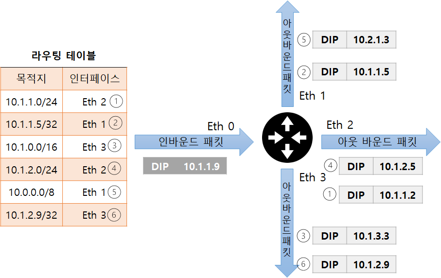
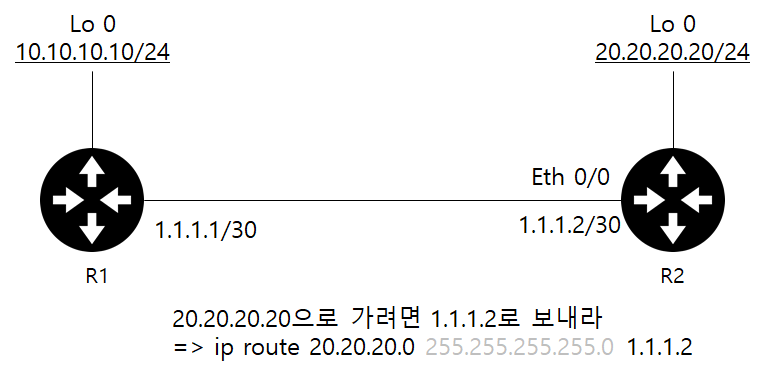

# 라우터/L3 스위치 : 3계층 장비

- 라우터는 3계층에서 동작하는 여러 네트워크 장비의 대표격
  - 경로를 지정해주는 역할
  - 패킷의 목적지 IP 주소를 확인하고 자신이 가진 경로 저보를 이용해 패킷을 최적이 경로로 포워딩
  - 원격지 네트워크와 연결할 때 필수 네트워크 장비

## 5.1 라우터의 동작 방식과 역할

### 5.1.1 경로지정

- 가장 중요한 역할 경로 지정
  - 경로 정보를 모아 라우팅 테이블을 만들고 패킷이 라우터로 들어오면 패킷의 도착지 IP 주소를 확인해 경로를 지정하고 패킷을 포워딩한다.
  - IP 주소는 네트워크 주소와 호스트 주소로 나뉜 계층 구조로 기반으로 설게되어
    - 로컬 네트워크와 원격지 네트워크를 구분
    - 네트워크 주소를 기반으로 경로를 찾아감

### 5.1.2 브로드캐스트 컨트롤

- 주소를 모르면 플러딩하는 스위치와 다르다
- 라우터는 3계층에서 동작하고, 분명한 도착지 정보가 있을때만 통신을 허락
  - 경로 습득 설정을 하지 않으면 패킷을 포워딩할 수 없다.
  - 멀티캐스트 정보를 습득하지 않고 브로드캐스트 패킷을 전달하지 않는다
    - 이 기능을 이용해 브로드캐스트가 다른 네트워크로 전파되는 것을 막을 수 있다.
      - 이 기능을 브로드캐스트 컨트롤/ 멀티캐스트 컨트롤이라고 한다

### 5.1.3 프로토콜 변환

- 라우터의 또 다른 역할
  - 서로 다른 프로토콜로 구성된 네트워크를 연결하는 것
- 현대 네트워크는 이더넷으로 수렴해서 이 역할은 많이 줄었지만
  - 과거 혹은 현재 일부에는 LAN, WAN 프로토콜이 전혀 다른 완전히 구분된 공간
  - LAN 기술이 WAN 기술로 변환되어야 인터넷과 같이 원격지 네트워크와의 통신이 가능
- 라우터에 패킷이 들어오면 2계층까지의 헤더 정보를 벗겨내고
  - 3계층 주소를 확인한 후 2계층 헤더 정보를 새로 만들어 외부로 내보낸다.
    - 그래서 라우터에 들어올 때 패킷 2계층 헤더 정보와 나올 때 헤더 정보가 다른 것
    - 이 기능을 이용하면 전혀 다른 기술 간 변환이 가능

## 5.2 경로 지정 - 라우팅 / 스위칭

### 5.2.1 라우팅 동작과 라우팅 테이블

- 현대 인터넷에서는 단말부터 목적지까지의 경로를 모두 책임지는 것이 아니라, 

  - 인접한 라우터까지만 경로를 지정하면 인접 라우터에서 최적의 경로 다시 파악

  - 라우터로 패킷을 포워딩

  - 홉 바이 홉 라우팅(hop by hop) : 네트워크를 한 단계 씩 뛰어넘는다는 의미

    - 인접한 라우터를 넥스트 홉이라 부른다.

  - 라우터는 패킷이 목적지로 가는 전체 경로를 파악하지 않고 최적의 넥스트 홉을 선택해 보내준다.

    

- 넥스트 홉 지정하는 방법 3가지

  - 다음 라우터의 IP를 지정하는 방법 (넥스트 홉 IP 주소)

  - 라우터의 나가는 인터페이스를 지정하는 방법

  - 라우터의 나가는 인터페이스와 다음 라우터의 IP를 동시에 지정하는 방법

    ----------

  - 일반적으로 상대방 라우터의 인터페이스 IP 주소를 지정하는 방법 사용

  - 특수한 경우에만 나가는 인터페이스를 지정하는 방법을 쓸 수 있다

    - 넥스트 홉 IP를 모르더라도 MAC 주소 정보를 알아낼 수 있을 때만 사용
    - WAN 구간 전용선에서 PPP(Point-to-Point), HLDC(High Level Datalink Control)와 같은 프로토콜 사용해 상대방의 MAC 주소를 알 필요 없거나
    - 상대방 라우터에서 프록시 ARP가 동작해 정확한 IP주소를 모르더라도 상대방의 MAC 주소를 알 수 있을 때와 같이 한정된 조건에서만 사용 가능
    - 인터페이스 설정 시 물리 인터페이스 지정하는 것이 일반적
      - IP 주소와 인터페이스 동시에 사용할 때는 VLAN 인터페이스와 같은 논리적인 인터페이스 사용할 수 있다.

    

- 라우터가 패킷을 어디로 포워딩할 지 경로를 선택할 때는 출발지 고려하지 않는다.
  - 목적지 주소와 라우팅 테이블을 비교해 어느 경로로 포워딩할 지 결정
  - 테이블 만들 때는 목적지 정보만 수집하고, 패킷이 들어오면 목적지 주소를 확인해 패킷을 넥스트 홉으로 포워딩
  - 테이블 데이터
    - 목적지 주소
    - 넥스트 홉 IP 주소, 나가는 로컬 인터페이스(선택 가능)

### 5.2.2 라우팅

- 경로 정보를 얻는 3가지 방법
  - 다이렉트 커넥티드
  - 스태틱 라우팅
  - 다이나믹 라우팅

- 5.3절 에서 살펴보기

### 5.2.3 스위칭

- 스위칭

  - 패킷이 들어와 라우팅 테이블을 찹ㅁ조하고 최적의 경로를 찾아 라우터 외부로 포워딩하는 작업

  - 2계층 스위치와는 다른 용어

    

  - 여러 가지 고려해야함

    - 들어온 패킷의 목적지가 라우팅 테이블에 있는 정보와 완벽히 일치할 때도 있지만, 아닌 경우도 있기 때문
    - 예를 들어 10.1.1.9가 들어오면 테이블에서 매칭되는 목적지는
      - 10.0.0.0/8
        - 10.0.0.0~10.255.255.255
      - 10.1.0.0/16
        - 10.1.0.0~10.1.255.255
      - 10.1.1.0/24
        - 10.1.1.0~10.1.1.255
      - 나머지는 매칭되지 않는다.
    - 선택된 3가지 정보 중 목적지와 가장 가까운 정보는 10.1.1.0/24이다
    - 그래서 Eh2 경로로 패킷을 한다. (Longest Prefix Match)

- 위 작업은 많은 부하가 걸린다.

  - 정확한 정보를 매치하는 이즈젝트 매치 (Exact Match)는 단순한 서치 작업으로 찾고 패킷을 처리 가능
  - 롱기스트 매치처럼 부정확한 정보 중 가장 비슷한 경로를 찾는 작업은 더 많은 리소스를 소모. 
  - 라우터에서 패킷이 들어올 때 마다 이 작업을 수행하면 많은 리소스 소모
  - 대부분 라우터는 오래 걸리는 이런 반복 작업을 줄여주는 기술을 채용하고 있다.
    - 한번 스위칭 작업을 수행한 정보는 캐시에 저장하고
      - 뒤에 들어온 패킷은 라우팅 테이블을 확인하는 것이 아니라 캐시를 먼저 확인
      - 이러한 기술이 유용한 것은
        - 여러 개의 패킷이 연속적으로 보내기 위해, 동일한 출발지 IP, 동일한 목적지 IP, 포트 번호로 여러 패킷이 연속적으로 보내기 때문

### 5.2.4 라우팅, 스위칭 우선 순위

- 라우팅 테이블은 가장 좋은 경로 정보만 모아놓은 핵심 정보

  - 일반적인 경로 정보를 모아놓은 토폴로지 테이블에서 좋은 경로 정보의 우선순위는 경로 정보를 받은 방법과 거리를 기준으로 정함

- 목적지 네트워크 정보가 동일한 서브넷 사용하는 경우 정보를 얻은 소스에 따라 가중치를 정하게 된다

  - 가중치 값은 라우팅 정보의 분류와 마찬가지로 크게 3가지
    - 내가 갖고 있는 네트워크(다이렉트 커넥티드)
    - 내가 경로를 직접 지정한 네트워크(스태틱 라우팅)
    - 경로를 전달받은 네트워크(다이나믹 라우팅)
      - 어떤 라우팅 프로토콜에서 얻었느냐에 따라 우선순위가 다름

- 경로 정보를 얻은 소스가 같아 가중치 값이 동일한 경우 코스트 값으로 우선 순위

  - 코스트 값 까지 동일한 경우 ECMP(Equal-Cost Multi-Path) 기능으로 동일한 코스트 값을 가진 경로 값 정보를 모두 활용해 트래픽 분산
  - 코스트 값은 일종의 거리를 나타내는 값으로 라우팅 프로토콜마다 기준이 다르다

- 스위칭할 때는 롱기스트 프리픽스 매치 기법으로 우선순위를 정한다.

- 전체 우선순위

  | 우선순위 |      구분       | 적용 방법 |
  | :------: | :-------------: | :-------: |
  |    1     |  롱기스트 매치  |  스위칭   |
  |    2     |  AD(관리 거리)  |  라우팅   |
  |    3     |     코스트      |  라우팅   |
  |    4     | 부하 분산(ECMP) |  라우팅   |

- 만약 라우팅 테이블에서 순위를 더 끌어올릴 수 없다면 롱기스트 매치로 목적지 주소와 더 많이 일치하는 라우팅 정보를 입력해서 해결 가능하다.

## 5.3 라우팅 설정 방법

### 5.3.1 다이렉트 커넥티드

- 라우터나 PC에 IP주소, 서브넷 마스크를 입력하면 다이렉트 커넥티드 라우팅 테이블이 생성

  

- 라우팅 테이블을 확인해 목적지가 다이렉트 커넥티드라면 라우터는 L2 통신 (ARP 요청을 직접 보내는)으로 목적지에 도달

  - 목적지가 외부 네트워크인데, 다이렉트 커넥티드 라우팅 테이블 정보만 있으면 외부 네트워크와 통신이 불가능
  - 외부 네트워크로 통신하려면 다이렉트 커넥티드 외에 스태틱 라우팅이나 다이나믹 라우팅에서 얻은 원격지 네트워크에 대한 라우팅 정보가 필요하다.

  - 반대로, 다이렉트 커넥티드 정보를 잘못 입력하면 외부 네트워크와 통신할 수 없다.
    - 외부 네트워크로 나가는 첫 번째 길목이 다이렉트 커넥티드 이기 때문

### 5.3.2 스태틱 라우팅

- 원격지 네트워크와 통신하려면 라우터에 직접 연결되지 않은 네트워크 정보를 입력해야한다.

- 네트워크 정보를 쉽게 추가하고 경로를 직접 제어할 수 있는 가장 강력한 방법은 스태틱 라우팅

  - 라우팅 우선순위가 다이렉트 커넥티드 다음으로 높다

- 설정 문법

  - `ip route NETWORK NETMASK NEXTHOP` [네트워크 장비 : 시스코]

  - `route and -net NETWORK /Prefix gw NEXTHOP` [서버 운영 체제 : 리눅스]

  - 목적지(네트워크/호스트 - 서브넷/서브넷 마스크)로 가려면 패킷을 넥스트 홉으로 보내야 한다.

    

  - R1의 라우팅 테이블을 확인해도 20.20.20.20/24 네트워크로 보낼 수 없다.

    - 패킷을 보내고 싶어도 라우팅 정보가 없어 패킷이 버려진다.

    - 경로 정보를 알려주어야한다.

    - 그게 ip~~~~1.1.1.2 이다.

    - 입력 후 라우팅 테이블

      

- 디폴트 라우팅
  - 스태틱 라우팅을 통해 모든 패킷을 인터넷 사업자 쪽으로 보낼 수는 있다.
    - 그러나 매우 많은 스태틱 라우팅이 필요하다.
  - `ip route 0.0.0.0 0.0.0.0 1.1.1.1`
    - 목적지 주소의 서브넷 마스크가 모두 0 인 스태틱 라우팅을 디폴트 라우팅이라고 한다.
    - 서브넷 마스크를 이용해 네트워크 주소를 뽑아내는 데 2진수 and 연산을 사용
    - 서브넷 마스크 1은 체크, 0은 IP 주소와 상관없이 연산 결과가 모두 0 이므로 체크하지 않는다는 의미
      - 모든 네트워크 정보를 체크하지 않는다는 의미를 확장하면 모든 네트워크라는 의미
  - 인터넷으로 향하는 경로나 자신에게 경로 정보가 없는 경우, 마지막 대체 경로로 디폴트 라우팅을 사용
    - 디폴트 라우팅과 디폴트 게이트웨이는 같은 의미
    - 서버에서 디폴트 게이트웨이를 설정하면 서버의 라우팅 테이블에 디폴트 라우팅이 생성된다.

### 5.3.3 다이나믹 라우팅

- 네트워크가 몇 개 없는 간단한 네트워크 구조에서는 스태틱 라우팅으로 망을 유지하는 것이 가능하지만
  - 일반적으로 IT 환경을 구축할 때는 SPoF(Single Point of Failure : 단일 장애점)을 없애기 위해 2개 이상의 경로 유지하는데
  - 대체 경로에 대한 고민이 필요하다.
  - 스태틱 라우팅만으로 구성하면 한 홉이 넘어간 네트워크 상태가 변경될 경우 신속히 대응할 수 없다
    - 중간 경로에 네트워크 회선이 끊기거나 라우터에 장애가 발생하면
    - 관리자가 이를 파악해 경로 정보를 수동으로 수정해주어야하기 때문
- 대체 경로를 그냥 테이블에 넣게되면?
  - 최적의 경로 뿐만 아니라 대체 경로까지 추가로 설정해야하므로 네트워크가 커지면 고려해야할 경로가 많아진다.
  - 스태틱 라우팅으로 구성하고 관리하기 어렵다
    - 네트워크 정보를 수동으로 하나하나 입력하면서 관리해야하는데, 중간에 경로가 빠지면 이를 알아내고 조치하는데 어려움이 따른다
- 다이나믹 라우팅 프로토콜을 사용하면 관리자의 직접적인 개입 없이 라우터끼리 정보를 교환해 경로 정보를 최신으로 유지가능
  - 라우터끼리 경로 정보를 수집하고 전달하므로 관리자가 라우팅 정보를 직접 입력할 필요가 없다.
  - 라우터끼리 자신들만의 프로토콜로 정보를 교환하기 때문
- 프로토콜
  - 
  - 최근에는 OSPF와 BGP 많이 사용

#### 역할에 따른 분류

- AS
  - 인터넷에 존재하는 자율 시스템
  - 인터넷 사업자가 한 개 이상의 AS를 운영
- IGP
  - AS 내에서 사용하는 프로토콜
- EGP
  - AS 간 통신에 사용하는 프로토콜

- AS 내부 연결은 효율성이 중요하지만 다른 AS 연결에서는 효율성보다는 조직 간 정책이 더 중요

  

#### 동작 원리에 따른 분류

- 디스턴스 벡터

  - 인접한 라우터에서 경로 정보를 습득하는 라우팅 프로토콜
  - 인접라우터가 아닌 라우터의 정보는 직접 전달 받는 것이 아니라 인접 라우터를 통해 간접적으로 한 단계 건너 받는다.
    - 인접 라우터가 이미 계산한 결과물인 라우팅 테이블을 전달받고 계산하므로 라우팅 정보 처리에 많은 리소스가 필요없다는 장점
      - 간단한 네트워크 구축하는데 많이 사용
    - 멀리 떨어진 라우터의 경로 정보를 얻는 데 많은 라우터를 거쳐야 하므로 모든 라우터 정보가 동기화하는데 많은 시간이 걸린다.
      - 네트워크 변경 시 정확한 정보를 파아갛는데 오랜 시간이 걸릴 수도 있다.

- 링크 스테이트

  - 라우터에 연결된 링크 상태를 서로 교환하고 각 네트워크 맵을 그리는 라우팅 프로토콜

  - 라우터들에 연결된 링크 상태를 교환하는 라우팅 프로토콜

  - 링크 상태를 교환하므로 이미 최적의 경로를 연산한 결과물인 라우팅 테이블과 달리 직접적인 상태 정보를 받아볼 수 있다.

    - 이런 링크 상태를 교환해, 토폴로지 데이터베이스를 만들고 이 정보를 다시 SPF(Shortest Path First) 알고리즘을 이용해 최단 경로 트리를 만든다.

    - 최단 경로 트리를 이용해 최적의 경로를 선정한 후, 라우팅 테이블에 그 정보를 추가한다.

  - 이미 최적의 경로를 연산한 정보를 받는 것이 아니라 전체 네트워크의 링크 상태 정보를 받아 각차 처리하므로

    - 전체 네트워크 맵을 그리고, 경로 변화를 파악하는 데 매우 유리
    - 이런 작업이 부하로 작용할 수 있어,
      - 네트워크 규모가 커지면 네트워크 경로를 파악하는 데 CPU와 메모리 자원을 많이 소모한다.
    - 따라서 네트워크 변화를 더 빨리 감지하고 리소스를 최적화 하기 위해 네트워크를 AREA 단위로 분리하고 (OSPE)
      - 분리된 에어리어 내에서만 링크 상태 정보를 교환한다.
      - 에어리어 내부에서는 전체  링크 정보가 공유되지만,
      - 외부의 라우터는 링크 상태가 직접 보내지는 것이 아니라, 가공된 라우팅 테이블 형태로 정보를 전달한다.

  - AREA 단위로 네트워크를 구분하고 확장하는 OSPE는 AREA0으로 불리는 Backbone AREA를 통해 모든 AREA가 연결된다.

    - AREA 간이나, OSPE 외부 네트워크와의 연결을 위해 특별한 라우터 이용해야한다.
      - ABR(Area Border Router)은 Backbone AREA와 다른 AREA를 연결 시켜주는 경계 라우터이다.
      - ASBR(Autonomous System Border Router)는 OSPF가 아닌 다른 외부 정보를 OSPF와 연결 시켜주는 외곽 라우터이다.