# 통신을 도와주는 네트워크 주요기술

## 7.1 NAT / PAT

- NAT(Network Address Translation 네트워크 주소 변환)
  - 사용자 모르게 실생활에서 많이 사용하는 기술
  - 네트워크 주소를 변환하는 기술
  - 기본적으로 하나의 네트워크 주소에 다른 하나의 네트워크 주소로 변환하는 1:1 변환
    - 하지만  IP 주소가 고갈되는 문제를 해결하기 위해 1:1 변환이 아닌 여러 개의 IP를 하나의 IP로 변환
  - NAT는 IP 주소를 다른 IP 주소로 변환해 라우팅을 원활히 해주는 기술
  - NAT 기술과 방법이 존재하지만 NAT가 가장 많이 사용되는 경우는 사설 IP 주소에서 공인 IP 주소로 전환하는 경우

### 1 NAT/PAT의 용도와 필요성

- IPv4 주소 고갈문제의 솔루션으로 NAT가 사용
  - NAT를 이용한 중기 전략이 IPv4 주소 보존에 큰 기여
  - 외부에 공개해야 하는 서비스에 대해서는 공인 IP를 사용하고
    -  외부에 공개할 필요가 없는 일반 사용자의 PC나 기타 종단 장비에 대해서는 사설 IP를 사용
    - 꼭 필요한 곳에만 효율적으로 IP를 사용
- 보안을 강화하는 데 NAT 기술을 사용합니다.
  - IP 주소는 네트워크에서 유일해야 하고 이 정보가 식별자로 사용되어 외부와 통신
    -  외부와 통신할 때 내부 IP를 다른 IP로 변환해 통신하면 외부에 사내 IP 주소 체계를 은폐 가능
    - 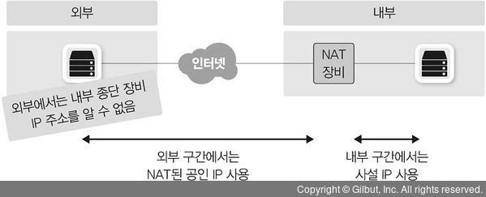
    - NAT는 주소 변환 후 역변환이 정상적으로 다시 수행되어야만 통신이 가능
      - 이 성질을 이용해 복잡한 룰 설정 없이 방향성을 통제 가능. 
      - 내부 네트워크에서 외부 네트워크로 나가는 방향 통신은 허용
      - 하지만 외부에서 시작해 내부로 들어오는 통신은 방어 가능.
      - NAT/PAT의 이런 성질을 이용해 보안을 쉽게 강화
- IP 주소 체계가 같은 두 개의 네트워크 간 통신을 가능하게 해준다.
  - 공인 IP는 인터넷에서 유일한 주소로 IP 주소가 중복되면 안 되지만 
    - 사설 IP는 외부와 통신할 때 공인 IP로 변환되어 통신하므로 서로 다른 회사에서 중복해 사용
  - 회사 내부에서 사설 IP를 독립적으로 사용한다면 상관없지만 사설 IP를 이용해 다른 회사와 직접 연결해야 하거나 회사 간 합병으로 서로 통신해야 한다면 사설 IP 주소가 충돌
    - 대외계라고 부르는 회사 간 통신에서 이런 상황이 많이 발생
      - 카드사나 은행 간 연결이 대표적인 대외계 네트워크
    - IP 대역이 같은 네트워크와 통신할 가능성이 높은 대외계 네트워크를 연결하기 위해 출발지와 도착지를 한꺼번에 변환하는 “더블 나트(Double NAT)” 기술을 사용
      - 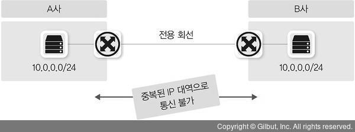
- 불필요한 설정 변경을 줄일 수 있다.
  - KISA를 통해 인터넷 독립기관으로 직접 등록하고 소유한 IP 주소를 직접 운영하는 경우가 아니라면 통신사업자나 IDC 쪽에서 IP를 할당받아 사용
    - 이 IP들은 자신이 소유한 것이 아니라 임시로 빌려 사용하는 것
    - 회선 사업자를 바꾸거나 IDC를 이전하면 그동안 빌려 써왔던 공인 IP를 더 이상 사용할 수 없고 신규 사업자가 빌려주는 IP로 변경
    -  만약 사용자가 NAT/PAT를 이용해 내부 네트워크를 구성하고 있었다면 서버와 PC의 IP 주소 변경 없이 회선과 IDC 사업자 이전이 가능
- 장점만 있는 것은 아니다
  - 네트워크 운영자 입장에서는 IP가 변환되면 장애가 발생했을 때 문제 해결이 힘들다.
  - 애플리케이션 개발자는 NAT 환경이 대중화되면서 애플리케이션을 개발할 때 더 많은 고려사항이 생김

### 2 NAT 동작 방식

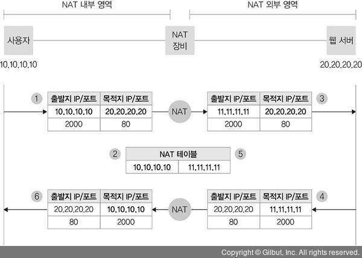

### 3 PAT 동작 방식

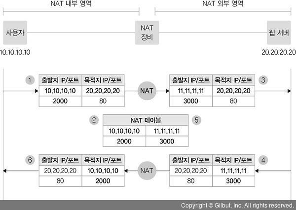

- PAT 동작 방식은 NAT와 거의 동일하게 이루어지지만
  -  IP 주소뿐만 아니라 서비스 포트까지 함께 변경해 NAT 테이블을 관리하므로 
  - 하나의 IP만으로도 다양한 포트 번호를 사용해 사용자를 구분가능
  - 하지만 이 서비스 포트의 개수는 제한되어 있어 재사용된다. 
    - 만약 서비스 포트가 동시에 모두 사용 중이거나 재사용할 수 없을 때는 PAT이 정상적으로 동작 X
- PAT는 다수의 IP가 있는 출발지에서 목적지로 갈 때 
  - NAT 테이블이 생성되고 응답에 대해 NAT 테이블을 참조할 수 있지만 
  - PAT IP가 목적지일 때는 해당 IP가 어느 IP에 바인딩되는지 확인할 수 있는 NAT 테이블이 없으므로 사용할 X 
  - 즉, PAT는 뒤에서 다룰 SNAT와 DNAT 중 SNAT에 대해서만 적용되고 DNAT에는 적용X
  - 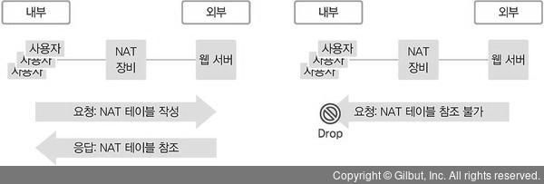

### 4 SNAT와 DNAT

- NAT를 사용해 네트워크 주소를 변환할 때 어떤 IP 주소를 변환하는지에 따라 두 가지로 구분
  -  SNAT(Source NAT) - 출발지 주소를 변경하는 NAT
  - DNAT(Destination NAT) - 도착지 주소를 변경하는 NAT
  - 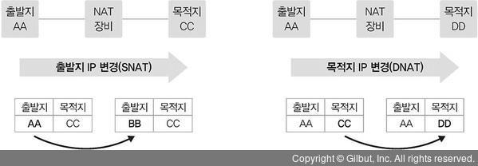
- SNAT와 DNAT의 기준은 NAT가 수행되기 이전의 트래픽이 출발하는 시작 지점
  - 즉, 요청 시 SNAT를 해 목적지로 전송하면 해당 트래픽에 대한 응답을 받을 때는 출발지와 목적지가 반대가 되므로 DNAT가 되는데 
  - 이때 트래픽을 요청하는 시작 지점만 고려해 SNAT 설정을 해야 한다. 
  - NAT 장비를 처음 통과할 때 NAT 테이블이 생성되므로 응답 패킷이 NAT 장비에 들어오면 별도의 NAT 설정이 없더라도 NAT 테이블을 사용해 반대로 패킷을 변환가능. 
  - 이 과정을 역 NAT라고 하며 NAT가 정상적으로 수행되려면 역 NAT 과정이 함께 수행되어야 한다.
- Source NAT
  - SNAT는 사설에서 공인으로 통신할 때 많이 사용
    - 공인 IP 주소의 목적지에서 출발지로 다시 응답을 받으려면 출발지 IP 주소 경로가 필요
    - 공인 대역에서는 사설 대역으로의 경로를 알 수 없으므로 공인 IP의 목적지로 서비스를 요청할 때 출발지에서는 사설 IP를 별도의 공인 IP로 NAT해 서비스를 요청
    - 해당 요청을 받은 목적지에서 출발지 IP를 공인 IP로 확인해 다시 응답할 수 있는 경로를 찾을 수 있다.
  - 보안상 SNAT를 사용
    - 회사에서 다른 대외사와 통신 시 내부 IP 주소가 아니라 별도의 다른 IP로 전환해 전송함으로써 대외에 내부의 실제 IP 주소를 숨길 수 있다.
  - 대외사와 통신해야 하는 사내 IP가 대외사의 사내 IP 대역과 중복될 때
    - SNAT를 통해 중복되지 않는 다른 IP로 변경해 통신하는 데 사용
  - 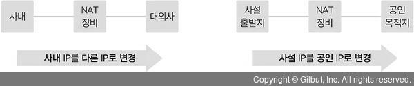
- DNAT
  - DNAT는 로드 밸런서에서 많이 사용
    - 사용자는 서비스 요청을 위해 로드 밸런서에 설정된 서비스 VIP(Virtual IP)로 서비스를 요청
    - 로드 밸런서에서는 서비스 VIP를 로드 밸런싱될 서버의 실제 IP로 DNAT해 내보낸다.
  -  사내가 아닌 대외망과의 네트워크 구성에도 DNAT를 사용
    - 사내 IP 주소는 중앙에서 일괄적으로 관리되므로 IP가 중복되는 경우가 없지만 사내가 아닌 대외망과의 연동에서는 IP가 중복될 수 있다.
    - 설사 IP가 중복되지 않더라도 IP 주소가 제각각이므로 신규 대외사와의 연동마다 라우팅을 개별적으로 설정
    - 이 경우 대외망에 NAT 장비를 이용해 대외사의 IP를 특정 IP 대역으로 NAT한다.
  - 

### 5 동적 NAT와 정적 NAT

- 정적 NAT

  - 출발지와 목적지의 IP를 미리 매핑해 고정해놓은 NAT
  - 출발지와 목적지 매핑 관계가 특정 IP로 사전에 정의된 것이므로 1:1 NAT라 부르기도 한다
  - IP가 항상 고정되어 매핑된 상태이므로 서비스 방향에 따라 고려할 필요가 없다.
    - 방향성 없이 서비스 흐름을 고려하지 않고 NAT를 설정 가능

- 동적 NAT

  - 출발지나 목적지 어느 경우든 사전에 정해지지 않고 NAT를 수행할 때 IP를 동적으로 변경하는 것
  - 다수의 IP 풀에서 정해지므로 최소한 출발지나 목적지 중 한 곳이 다수의 IP로 구성된 IP 풀이나 레인지(Range)로 설정
  - NAT가 필요할 때 IP 풀에서 어떤 IP로 매핑될 것인지 판단해 NAT를 수행하는 시점에 NAT 테이블을 만들어 관리
    - NAT 테이블은 설정된 시간 동안 유지되고 일정 시간 동안 통신이 없으면 다시 사라지므로(NAT 테이블 타임아웃) 
    - 동적 NAT의 설정은 서비스 흐름을 고려해 적용

- 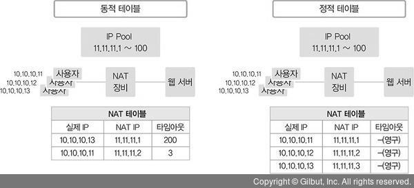

- |                     | 동적 NAT                                         | 정적 NAT                              |
  | ------------------- | ------------------------------------------------ | ------------------------------------- |
  | NAT 설정            | 1:N, N:1, N:M                                    | 1:1                                   |
  | NAT 테이블          | NAT 수행 시 생성                                 | 사전 생성                             |
  | NAT 테이블 타임아웃 | 동작                                             | 없음                                  |
  | NAT 수행 정보       | 실시간으로만 확인하거나 별도 변경 로그 저장 필요 | 별도 필요 없음 (설정 = NAT 내역) |

## 7.2 DNS

### 1 DNS 소개

- 숫자로 구성된 IP 주소보다 의미 있는 문자열로 구성된 도메인 주소가 우리가 인식하고 기억하기 더 쉽다.
  - IP 주소 대신 도메인 주소를 이용하면 하나의 IP 주소를 이용해 여러 개의 웹 서비스를 운영 가능
  -  서비스 중인 IP 주소가 변경되더라도 도메인 주소 그대로 유지해 접속 방법 변경 없이 서비스를 그대로 유지 가능. 
  - 또한, 도메인을 이용하면 지리적으로 여러 위치에서 서비스할 수도 있습니다. 따라서 특별한 경우를 제외하면 대부분의 웹사이트는 도메인 주소 기반으로 운영
- 서비스를 도메인 주소를 사용하더라도 실제로 패킷을 만들어 통신하려면 3계층 IP 주소를 알아야 하고 
  - 이를 위해 문자열로 된 도메인 주소를 실제 통신에 필요한 IP 주소로 변환하는 DNS(Domain Name Server) 정보를 네트워크 설정 정보에 입력해야한다.
  - 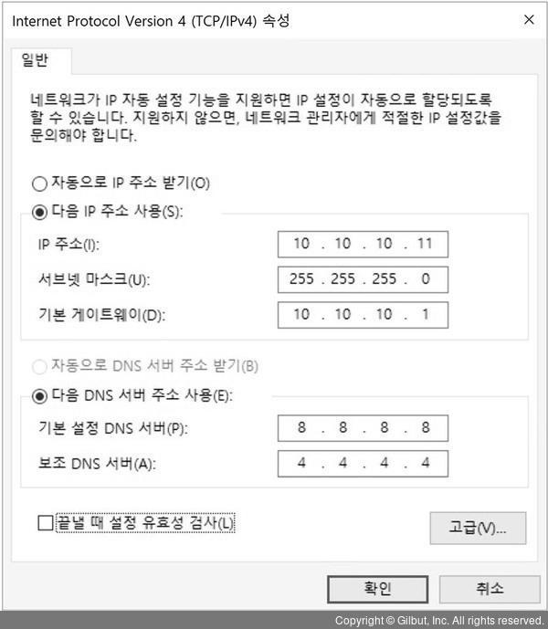
- 사용자가 도메인 주소를 사용하여 서비스를 요청
  -  네트워크 설정에 입력한 DNS로 해당 도메인에 대한 IP 주소 질의를 보내고 
  - 그 결과값으로 요청한 도메인의 서비스 IP 주소를 받게 된다.
  - 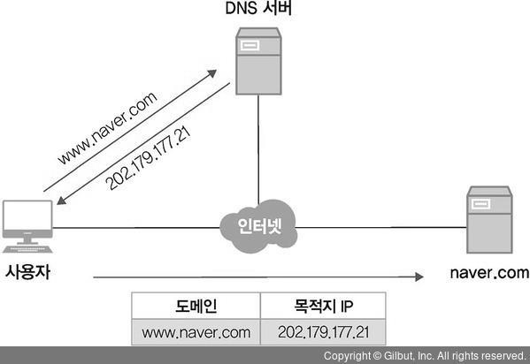

### 2. DNS 구조와 명명 규칙

- 도메인은 계층 구조

  - 역트리 구조로 최상위 루트부터 Top-Level 도메인, Second-Level 도메인, Third-Level 도메인과 같이 하위 레벨로 원하는 주소를 단계적으로 찾아간다.
  - 각 계층의 경계를 “.”으로 표시하고 뒤에서 앞으로 해석
  - 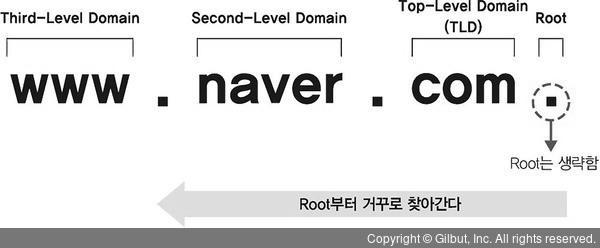
  -  최대 128계층까지 구성
    - 계층별 길이는 최대 63바이트까지 사용할 수 있고 
    - 도메인 계층을 구분하는 구분자 “.”를 포함한 전체 도메인 네임의 길이는 최대 255바이트까지 사용 가능.
    -  문자는 알파벳, 숫자, “-”만 사용할 수 있고 대소문자 구분이 없습니다.

- 루트 도메인

  - 도메인을 구성하는 최상위 영역
  - DNS 서버는 사용자가 쿼리한 도메인에 대한 값을 직접 갖고 있거나 캐시에 저장된 정보를 이용해 응답
    - DNS 서버에 해당 도메인의 정보가 없으면 루트 도메인을 관리하는 루트 DNS에 쿼리하게 된다.
  - 루트 DNS는 전 세계에 13개가 있고 DNS 서버를 설치하면 루트 DNS의 IP 주소를 기록한 힌트(Hint) 파일을 가지고 있어 루트 DNS 관련 정보를 별도로 설정할 필요 X

-  Top-Level Domain(TLD)

  - 분류

    • Generic(gTLD)

    - com, edu, gov, int, mil, net, org

    • country-code(ccTLD)

    • sponsored(sTLD)

    • infrastructure

    • generic-restricted(grTLD)

    • test(tTLD)

### 3 DNS 동작방식

- 도메인을 IP 주소로 변환하려면 DNS 서버에 도메인 쿼리하는 과정을 거쳐야한다. 
  - 하지만 DNS 서버없이 로컬에 도메인과 IP 주소를 직접 설정해 사용 가능. 
  - 로컬에서 도메인과 IP 주소를 관리하는 파일을 hosts 파일
  -  hosts 파일에 도메인과 IP 주소를 설정해두면 해당 도메인 리스트는 항상 DNS 캐시에 저장
- 도메인을 쿼리하면 DNS 서버에 쿼리를 하기 전 로컬에 있는 DNS 캐시 정보를 먼저 확인
  - 동일한 도메인을 매번 질의하지 않고 캐시를 통해 성능을 향상시키기 위해서이다.
  - 이런 DNS 캐시 정보에는 기존 DNS 조회를 통해 확인한 동적 DNS 캐시와 함께 hosts 파일에 저장되어 있는 정적 DNS 캐시가 함께 저장되어 있음. 
  - DNS 캐시 정보에 필요한 도메인 정보가 없으면 DNS 서버로 쿼리를 수행하고 DNS 서버로부터 응답을 받으면 그 결과를 캐시에 먼저 저장
  -  전에 쿼리를 한 번 수행한 DNS 정보는 캐시부터 조회하므로 DNS 서버에 별도로 쿼리하지 않고 캐시 정보를 사용
- DNS 시스템 관점에서 도메인에 대한 결괏값을 클라이언트에 보내주는 과정
  - 전 세계 도메인 정보를 DNS 서버 하나에 저장할 수는 없다.
    -  데이터 자체도 방대하지만 인터넷에 엄청나게 많은 사용자가 등록하고 삭제하는 도메인 리스트를 실시간으로 업데이트할 수 없기 때문
    - 그래서 DNS는 분산된 데이터베이스로 서로 도와주도록 설계되었는데 자신이 가진 도메인 정보가 아니면 다른 DNS에 질의해 결과를 받을 수 있다.
    -  DNS 기능을 서버에 올리면 DNS 서버는 기본적으로 루트 DNS 관련 정보를 가지고 있다. 
    - 클라이언트의 쿼리가 자신에게 없는 정보라면 루트 DNS에 쿼리하고 루트 DNS에서는 쿼리한 도메인의 TLD 값을 확인해 해당 TLD 값을 관리하는 DNS가 어디인지 응답
  - 예를 들어 zigispace.net이라는 도메인을 클라이언트가 DNS 서버에 쿼리했다면
    -  DNS 서버는 루트 DNS에 다시 쿼리하고 
    - 루트 DNS는 .net에 대한 정보를 관리하는 DNS 주소 정보를 DNS 서버에 응답
    - 이 응답을 받은 DNS 서버는 .net을 관리하는 DNS 서버에 zigispace.net에 대해 쿼리
    -  .net을 관리하는 DNS 서버는 다시 zigispace.net을 관리하는 DNS 관련 정보를 처음 DNS 서버에 응답
    - DNS 서버는 마지막으로 zigispace.net을 관리하는 DNS에 쿼리하고 zigispace.net에 대한 최종 결괏값을 받게 됩니다. 처음 쿼리를 받은(클라이언트에 DNS 서버로 설정된) DNS 서버는 이 정보를 클라이언트에 응답합니다.
  - 전체 과정을 보면 클라이언트에서 처음 질의를 받은 DNS가 중심이 되어 책임지고 루트 DNS부터 상위 DNS에 차근차근 쿼리를 보내 결괏값을 알아낸 후 최종 결괏값만 클라이언트에 응답. 
    - 클라이언트는 한 번의 쿼리를 보내지만 이 요청을 받은 DNS 서버는 여러 단계로 쿼리를 상위 DNS 서버에 보내 정보를 획득
- 호스트가 DNS 서버에 질의했던 방식을 재귀적 쿼리(Recursive Query)라고 하고 DNS 서버가 루트 NS와 TLS NS, zigispace NS에 질의한 방식을 반복적 쿼리(Iterative Query)라고 한다.
  - 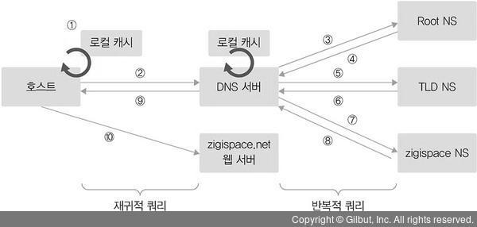

### 4 마스터와 슬레이브

- DNS 서버는 마스터(Master, Primary) 서버와 슬레이브(Slave, Secondary) 서버로 나눌 수 있다. 
  - 마스터 서버가 우선순위가 더 높지 않고 두 서버 모두 도메인 쿼리에 응답
  - 마스터와 슬레이브는 도메인에 대한 존(Zone) 파일을 직접 관리하는지 여부로 구분
    -  마스터 서버는 존 파일을 직접 생성해 도메인 관련 정보를 관리
    -  슬레이브 서버는 마스터에 만들어진 존 파일을 복제
    - 이 과정을 ‘영역 전송(Zone Transfer)’이라고 한다. 
    - 마스터 서버는 도메인 영역을 생성하고 레코드를 직접 관리하지만 슬레이브 서버는 마스터 서버에 설정된 도메인이 가진 레코드값을 정기적으로 복제한다.
    - 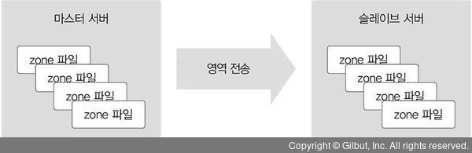
- 도메인 영역 전송을 위해 슬레이브 서버를 만들 때 도메인을 복제해올 마스터 서버 정보를 입력해야한다.
  - 마스터 역할을 하는 서버에서는 자신이 가진 도메인 정보를 인가받지 않은 다른 DNS 서버가 복제해가지 못하도록 슬레이브 서버를 지정해 복제를 제한 가능. 
  - 마스터에서 별다른 설정을 하지 않으면 무제한 복제가 가능하므로 보안을 위해 복제 가능한 슬레이브 서버 정보를 반드시 입력하는 것이 좋음
- DNS 마스터 서버와 슬레이브 서버는 이중화에서 일반적으로 사용하는 액티브-스탠바이(Active-Standby)나 액티브-액티브(Active-Active) 형태로 구성하지 않는다. 
  - 보통 이중화 방식은 액티브 장비의 문제가 발생하더라도 또 다른 액티브나 스탠바이 장비가 그대로 서비스한다.
  - 반면, DNS 서버는 마스터 서버에 문제가 발생하고 일정 시간이 지나면 슬레이브 서버도 도메인에 대한 질의에 정상적으로 응답X 
  - 이 시간을 만료 시간(Expiry Time)이라고 하고 SOA 레코드에 설정
    - 만료 시간 안에 슬레이브 서버가 마스터 서버에서 존 정보를 받아오지 못하면 슬레이브의 존 정보는 사용할 수 없게 된다. 
    - 따라서 만료 시간 안에 마스터 서버를 복구하거나 슬레이브 서버를 마스터로 전환해야만 서비스 장애를 막을 수 있다. 

### 5 DNS 주요 레코드

| 레코드 종류            | 내용                                         |
| ---------------------- | -------------------------------------------- |
| A(IPv4 호스트)         | 도메인 주소를 IP 주소(IPv4)로 매핑           |
| AAAA(IPv6 호스트)      | 도메인 주소를 IP 주소(IPv6)로 매핑           |
| CNAME(별칭)            | 도메인 주소에 대한 별칭                      |
| SOA(권한 시작)         | 본 영역 데이터에 대한 권한                   |
| NS(도메인의 네임 서버) | 본 영역에 대한 네임 서버                     |
| MX(메일 교환기)        | 도메인에 대한 메일 서버 정보(Mail eXchanger) |
| PTR(포인터)            | IP 주소를 도메인에 매핑(역방향)              |
| TXT(레코드)            | 도메인에 대한 일반 텍스트                    |

- CNAME
  - 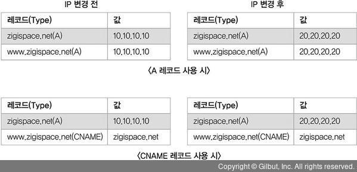
- SOA(Start Of Authority) 레코드
  - 도메인 영역에 대한 권한을 나타내는 레코드
  - 현재 네임 서버가 이 도메인 영역에 대한 관리 주체임을 의미하므로 
    - 해당 도메인에 대해서는 다른 네임 서버에 질의하지 않고 직접 응답
  - 도메인 영역 선언 시 SOA 레코드는 필수 항목이므로 반드시 만들어야 한다.
  - 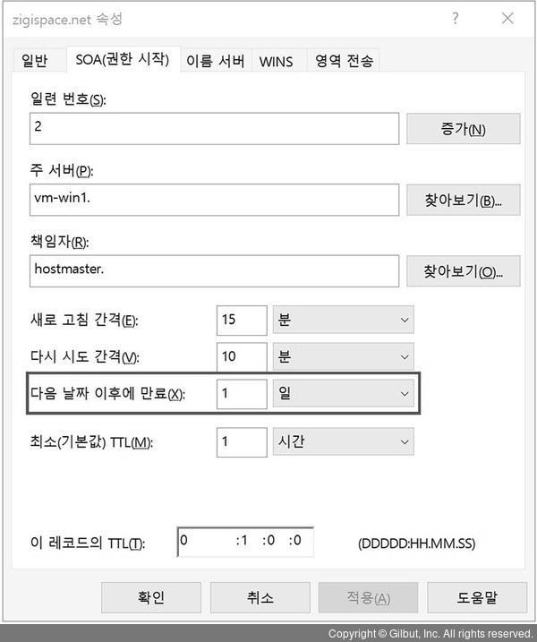

### 6 DNS에서 알아두면 좋은 내용

- 도메인 위임
  - 도메인은 그 도메인에 대한 정보를 관리할 수 있는 네임 서버를 지정하지만 
    - 도메인 내의 모든 레코드를 그 네임 서버가 직접 관리하지 않고 일부 영역에 대해서는 다른 곳에서 레코드를 관리하도록 위임하기도 한다.
    - 이 방식을 도메인 위임이라고 한다. 
    - 즉, 자신이 가진 도메인 관리 권한을 다른 곳으로 일부 위임해 위임한 곳에서 세부 레코드를 관리하도록 하는 것. 
    - CDN을 이용하거나 GSLB를 사용하는 것이 대표적인 경우. 도메인은 계층 구조여서 특정 계층의 레코드를 위임하면 해당 레코드의 하위 계층은 함께 위임 처리
    - 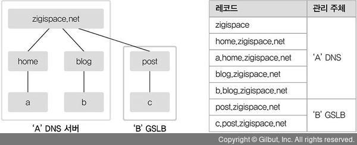
  - 즉, 도메인 위임 기능을 쓰면 특정 영역을 다른 네임 서버에서 관리할 수 있는 권한을 위임 된다. 
    - 특정 영역에 대한 관리 주체를 분리하는 용도로 사용할 수 있어 계열사에서 특정 도메인을 분리하거나 GSLB 등 다양한 용도로 사용할 수 있다.
- TTL
  - 도메인의 TTL(Time To Live) 값은 DNS에 질의해 응답받은 결괏값을 캐시에서 유지하는 시간을 의미
    -  로컬 캐시에 저장된 도메인 정보를 무작정 계속 갖고 있는 것이 아니라 DNS에 설정된 TTL 값에 따라 그 시간만 로컬 캐시에 저장
    - DNS 서버에서 TTL 값을 늘려 캐시를 많이 이용하면 DNS 재귀적 쿼리로 인한 응답 시간을 많이 줄일 수 있고 결과적으로 전체적인 네트워크 응답 시간이 단축
    - 하지만 DNS에서 해당 도메인 관련 정보가 변경되었을 때, TTL 값이 크면 새로 변경된 값으로 DNS 정보 갱신이 그만큼 지연되는 단점이 발생
    - 반대로 TTL 값이 너무 작으면 DNS의 정보 갱신이 빨라지므로 DNS 쿼리량이 늘어나 DNS 서버 부하가 증가할 수 있습니다.
  - 서비스의 성질과 도메인 정보의 갱신 빈도에 따라 TTL 값을 적절히 조절하는 것이 좋다. 
    - 변경이 빈번하지 않다면 TTL 값을 늘려 DNS 부하를 줄이는 것이 좋고 
    - IDC 이전이나 공인 IP, 서비스 변경이 예정되어 있다면 DNS의 TTL 값을 미리 극도로 줄여 변경을 신속히 적용하는 것이 좋다.
- 화이트 도메인
  - 정상적으로 발송하는 대량 이메일이 RBL 이력으로 간주되어 차단되는 것을 예방하기 위해 사전에 등록된 개인이나 사업자에 한해 국내 주요 포탈 사이트로의 이메일 전송을 보장해주는 제도입니다.
  - 한국인터넷진흥원(KISA)에서는 불법적인 방법으로 발송되는 스팸메일 차단활동을 하고 있다. 
    - 이를 위해 정상적인 도메인을 인증, 관리하는 제도가 ‘화이트 도메인’
    - 반대로 불법적인 스팸메일을 발송하는 사이트를 실시간 블랙리스트 정보로 관리해 메일 발송을 제한
      - 이 실시간 블랙리스트를 RBL(Realtime Blackhole List, Realtime Blocking List)이라고 한다.
  - 현재 보유 중인 도메인을 화이트 도메인으로 등록하려면 KISA RBL 사이트에서 화이트 도메인으로 등록해야 한다. 
    - 이를 위해 사전에 해당 도메인에 SPF 레코드(Sender Policy Framework)가 설정되어야 한다. 
    - SPF 레코드를 통해 사전에 메일 서버 정보를 공개하면 수신 측 메일 서버에서는 해당 도메인을 통해 발송된 메일이 실제 메일 서버에 등록된 정보와 일치하는지 확인할 수 있습니다. 
    - 메일 정보와 도메인의 SPF 정보가 일치하지 않을 때는 비정상적인 이메일 서버에서 전송된 것으로 간주해 해당 이메일을 수신하지 않고 스팸 처리할 수 있습니다.
  - SPF 레코드 길이는 최대 512바이트이므로 하나의 도메인에 화이트 도메인으로 등록할 수 있는 메일 서버 개수가 제한되는 것에 유의
- 한글 도메인
  - 도메인 주소는 영문뿐만 아니라 “http://한국인터넷진흥원.한국”처럼 한글로 주소를 만들 수 있다.
    -  사용자가 도메인을 한글로 등록하고 사용하기 위해 DNS에서는 해당 한글을 “퓨니코드”로 변경하고 이 퓨니코드로 DNS에 도메인을 생성해야한다.
  - 퓨니코드는 한글뿐만 아니라 영어가 아닌 자국어 도메인을 사용할 수 있도록 해주는 표준 코드
    - 퓨니코드는 유니코드 문자열을 인코딩하는 것이므로 유니코드가 지원하는 모든 언어로 도메인을 사용할 수 있습니다. 
    - 이처럼 자국어 도메인을 사용할 수 있는 것을 “다국어 도메인 네임(IDN)”이라고 합니다.
  - 한국인터넷 진흥원 온라인 퓨니코드 변환기 사용하면 된다.

### 7 8 DNS 설정 부분 생략

### 9 호스트 파일 설정

- 앞에서 설명한 것처럼 DNS를 이용해 도메인 주소를 IP 주소로 변환하는 방법 외에도 도메인과 IP 주소를 매핑해놓은 hosts 파일을 이용하여 도메인-IP 주소 쿼리를 사용가능. 
  - DNS 기능이 개발되기 전부터 사용하던 방식이고 일반적으로 현대 인터넷에서는 사용하지 않고 테스트 목적 등으로 특정 도메인에 대해 임의로 설정한 값으로 도메인을 접속할 때 이 hosts 파일을 사용 가능
  - (예: DNS 등록 전에 내부 테스트, DNS에 도메인과 레코드가 이미 등록되어 있지만 임시로 다른 질의 값을 사용해야 하는 경우 등).
- 앞에서 말했듯이 hosts 파일에 설정된 도메인 정보는 로컬 호스트의 DNS 캐시 정보로 남기 때문에 DNS에 의한 질의보다 우선순위가 높다. 
  - 테스트 목적 등으로 일시적으로 host 파일을 사용한 후 해당 도메인 정보를 삭제하지 않으면 원하는 접속이 정상적으로 안 될 수 있음
- hosts 파일을 임의로 조작해 정상적인 사이트가 아니라 사용자의 정보를 빼내기 위한 유해 사이트로 접근을 유도할 때도 있음
  - 원래 이런 사이트는 사용자가 접속하려는 사이트의 디자인과 동일하게 구성하고 도메인도 원래 도메인 그대로 사용해 접속한 것처럼 보여 매우 위험 
  - 그래서 보안 프로그램에서 “hosts 파일이 변경되었습니다.”라는 경고 팝업창이 가끔 뜨는데 hosts 파일이 임의로 변경될 때 이런 보안 위험을 경고하는 것입니다. 금융 사이트 이용 시 팝업창 뜨는 경우
  - 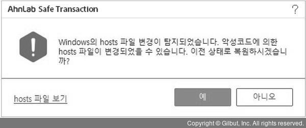

## 7.3 GSLB

- DNS만 이용한 로드밸런싱으로는 정상적인 서비스를 할 수 없다. 
  - DNS는 설정된 서비스 상태의 정상 여부를 확인하지 않고 도메인에 대한 질의에 대해 설정된 값을 무조건 응답
  -  DNS에 저장된 레코드와 매핑된 서비스가 모두 정상일 때는 문제가 없지만 특정 서비스(서버 2)에 문제가 있을 때 
  - DNS 서버는 이것을 감지하지 못해 사용자의 도메인 질의 요청에 비정상 상태인 서비스 IP 주소를 응답한 경우, 사용자는 해당 서비스에 접근X
  - 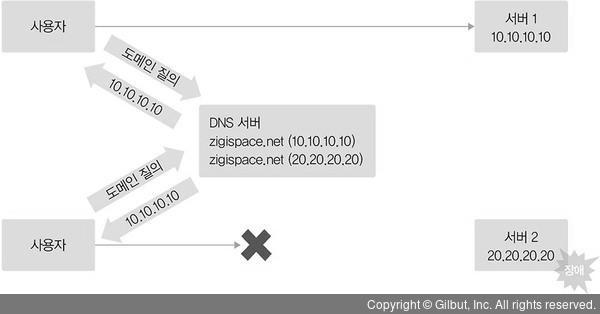
- GSLB(Global Server/Service Load Balancing)는 DNS의 이런 문제점을 해결해 도메인을 이용한 로드밸런싱 구현을 도와준다. 
  - GSLB는 DNS와 동일하게 도메인 질의에 응답해주는 역할과 
  - 동시에 로드 밸런서처럼 등록된 도메인에 연결된 서비스가 정상적인지 헬스 체크를 수행
  - 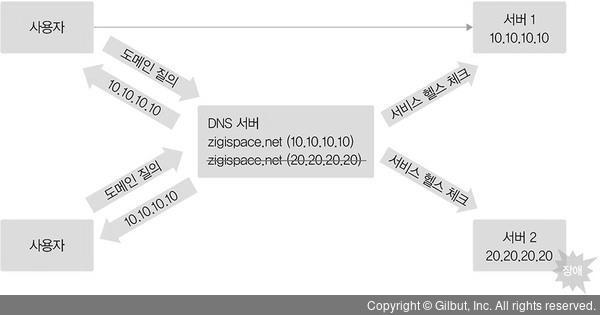
    - 등록된 두 개의 레코드 중 서버 2의 IP 주소를 가진 레코드를 도메인 질의에 대한 응답으로 사용하지 않도록 잠시 내리게 된다.
    - 두 사용자는 모두 서버 1의 IP 주소만 응답받음

### 1 GSLB 동작방식

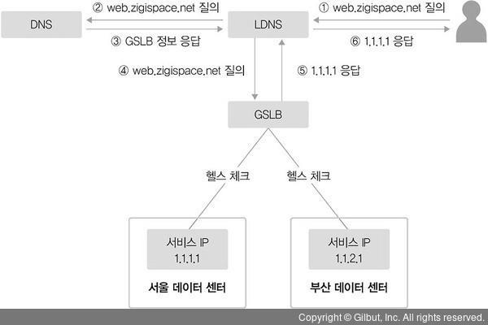

- GSLB는 zigispace.net이라는 FQDN에 대한 IP 주소 정보를 단순히 갖고 있다가 응답해주는 것이 아니라 헬스 체크를 통해 해당 IP가 정상적인 서비스가 가능한 상태인지 확인
  - 모두 정상적인 서비스가 가능한 상태라면 사전에 정의된 알고리즘을 통해 어느 데이터 센터의 IP 주소로 응답할지 결정
  - GSLB는 앞의 예제처럼 일반 DNS를 사용하는 것과 거의 동일하게 동작
  - 다만 GSLB에서 서비스 IP 정보에 대한 헬스 체크와 사전에 지정한 다양한 분산 방법을 이용한 부하 분산이 일반 DNS와 큰 차이점

### 2 GSLB 구성방식

-  도메인 자체를 GSLB로 사용
  - 해당 도메인에 속하는 모든 레코드 설정을 GSLB 장비에서 관리
  - 도메인에 대한 모든 레코드를 GSLB에서 설정
  - 도메인 구입 시 도메인에 대한 권한을 갖는 네임 서버를 지정하는데 이 네임 서버가 도메인을 관리
  - 도메인 자체를 GSLB로 사용하는 것은 도메인에 대한 네임 서버를 GSLB로 지정하고 GSLB에서 도메인에 대한 모든 레코드를 등록해 처리하는 방식
  - 즉, GSLB 자체가 도메인의 네임 서버 역할
  - 도메인의 레코드 중 헬스 체크 기능이 불필요한 경우뿐만 아니라 모든 레코드에 대한 질의가 GSLB를 통해 이루어지므로 GSLB에 부하를 주게 된다.
- 도메인 내의 특정 레코드만 GSLB를 사용
  - NS에서 도메인 설정 시 GSLB를 사용하려는 레코드에 대해서만 GSLB로 처리하도록 설정
  - 회사 대표 도메인에 속한 레코드 중 GSLB 적용이 불필요한 경우가 많아 도메인 내의 특정 레코드에 대해서만 GSLB로 처리를 이관하는 방식을 사용
  - 이관하는 방법
    - 별칭(Alias) 사용(CNAME 레코드 사용)
      - 실제 도메인과 다른 별도의 도메인 레코드로 GSLB에 등록
      - 일반적으로 외부 CDN을 사용하거나 회사 내부에 GSLB를 사용해야 할 도메인이 많은 경우 한꺼번에 관리하기 위해 사용
      - 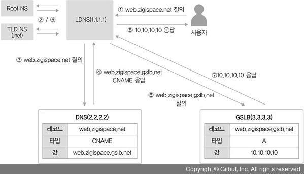
    - 위임(Delegation) 사용(NS 레코드 사용)
      - 실제 도메인과 동일한 도메인 레코드를 사용
      - 도메인 전체를 위임
      - 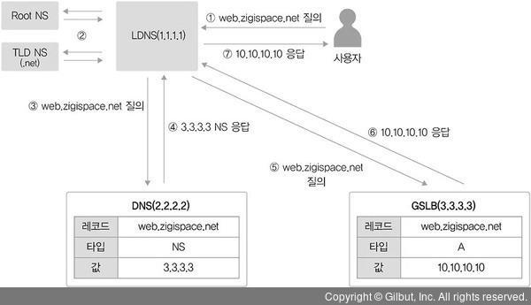
      - 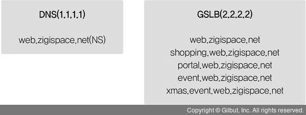

### 3 GSLB 분산 방식

- GSLB를 이용해 서비스를 분산하면 다음과 같은 주요 목적을 달성 가능
  - 서비스 제공의 가능 여부를 체크해 트래픽 분산
  - 지리적으로 멀리 떨어진 다른 데이터 센터에 트래픽 분산
  - 지역적으로 가까운 서비스에 접속해 더 빠른 서비스 제공이 가능하도록 분산
- GSLB에서 지원되는 분산 방식은 GSLB 장비를 생산하는 벤더와 모델에 따라 조금씩 다를 수 있지만 대부분 다음 두 가지 헬스 체크 모니터링 요소를 지원
  - 서비스 응답 시간/지연(RTT/Latency)
    - 서비스 요청에 대한 응답이 얼마나 빠른지 또는 지연이 얼마나 없는지를 확인하고 이것을 이용해 서비스를 분산 처리
  - IP에 대한 지리(Geography) 정보
    - 서비스 제공이 가능한 각 사이트의 IP 주소에 대한 Geo 값을 확인해 가까운 사이트로 서비스 분산을 처리

## 7.4 DHCP

- 호스트가 네트워크와 통신하려면 물리적 네트워크 구성은 물론 IP 주소, 서브넷 마스크, 게이트웨이와 같은 네트워크 정보와 앞 장에서 다룬 DNS 주소도 설정이 필요
  - 이런 네트워크 정보를 호스트에 적용하려면 사용자가 IP 정보를 직접 설정하거나 IP 정보를 할당해주는 서버를 이용해 자동으로 설정해야 한다.
  - 수동으로 IP와 네트워크 정보를 직접 설정하는 것을 ‘정적 할당’이라고 하고 자동으로 설정하는 것을 ‘동적 할당’이라고 합니다.

- 일반적으로 데이터 센터의 서버 팜과 같은 운영 망에서 사용되는 IP는 주로 정적 할당을 사용하지만 PC 사용자를 위해 운영되는 사무실 네트워크에서는 IP를 자동으로 할당받는 동적 할당 방식을 많이 사용
  - 보안이나 관리 목적으로 사무실의 사용자 PC를 정적 할당해 사용하는 경우가 많았지만 
  - 최근 동적 할당 방식을 이용하면서도 보안을 강화하고 쉽게 관리하도록 도와주는 서비스와 장비가 대중화되어 동적 할당 방식이 많이 사용
  - 핸드폰이나 PC를 사용할 때, IP를 별도로 설정하지 않아도 네트워크에 쉽게 접속되므로 특별한 경우를 제외하고 동적 할당 방식을 기본으로 사용
  - 가정에서 사용하는 공유기도 동적 할당 방식을 기본으로 사용합니다.

- 이렇게 IP를 동적으로 할당하는 데 사용되는 프로토콜이 바로 DHCP(Dynamic Host Configuration Protocol)
  - DHCP를 사용하면 사용자가 직접 입력해야 하는 IP 주소, 서브넷 마스크, 게이트웨이, DNS 정보를 자동으로 할당받아 사용
  - 별도의 IP 설정 작업이 필요없어 사용자와 관리자 모두 편리하게 네트워크에 접속할 수 있고 
  - 사용하지 않는 IP 정보는 회수되어 사용하는 경우에만 재할당되어 사용자 이동이 많고 한정된 IP 주소를 가진 경우 유용하게 사용
  - 또한, IP가 자동으로 관리되므로 사용자가 직접 입력하면서 발생할 수 있는 설정 정보 오류나 중복 IP 할당과 같은 문제를 예방

### 1 DHCP 프로토콜

- DHCP는 BOOTP(Bootstrap Protocol)라는 프로토콜을 기반
- DHCP와 BOOTP 프로토콜 사이에는 호환성
  - BOOTP와 DHCP에서 사용되는 서비스 포트가 같고 BOOTP 클라이언트가 DHCP 서버를 사용 가능
  - DHCP 클라이언트가 BOOTP 서버를 사용해 정보를 수신 가능
- DHCP는 서버와 클라이언트로 동작하며 클라이언트의 서비스 포트는 68(bootpc), 서버의 서비스 포트는 67(bootps)

### 2 DHCP 동작방식

- 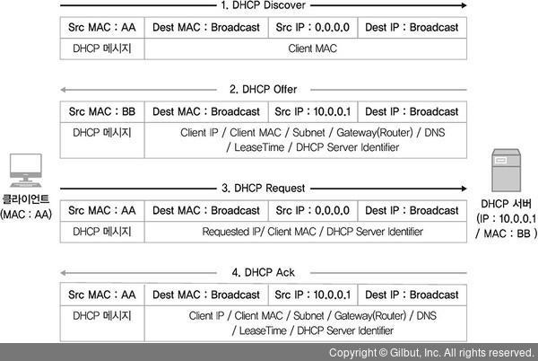

-  **DHCP** **Discover**

  - DHCP 클라이언트는 DHCP 서버를 찾기 위해 DHCP Discover 메시지를 브로드캐스트로 전송
  - DHCP 클라이언트의 IP가 아직 없으므로 
    - 출발지는 Zero IP 주소(0.0.0.0), 목적지는 브로드캐스트 주소(255.255.255.255)로 설정
    - 그리고 이때 사용되는 서비스 포트는 출발지가 UDP 68번(bootpc), 목적지는 UDP 67번(bootps)을 사용
    - IP를 할당받는 과정이므로 패킷을 정상적으로 주고받을 수 없어 TCP가 아닌 UDP를 사용

- **DHCP** **Offer**

  - DHCP Discover를 수신한 DHCP 서버는 클라이언트에 할당할 IP 주소와 서브넷, 게이트웨이, DNS 정보, Lease Time 등의 정보를 포함한 DHCP 메시지를 클라이언트로 전송
  -  DHCP 서버는 클라이언트에 할당할 수 있는 IP 리스트인 DHCP IP Pool 중에서 할당할 IP를 선택
    - 별도의 설정이 없으면 IP Pool에서 임의로 할당하지만 
    - 특정 클라이언트의 MAC 주소와 IP 주소를 사전에 정의해두면 설정된 IP를 할당하므로 DHCP를 사용하면서도 고정된 IP를 할당가능
    - 클라이언트에 IP를 할당할 때는 단순히 IP 주소뿐만 아니라 서브넷, 게이트웨이, DNS 정보와 IP 주소 임대 시간(Lease Time), DHCP 서버 자신의 IP 정보를 포함한 메시지를 DHCP 클라이언트에 전송

-  **DHCP** **Request**

  - DHCP 서버로부터 제안받은 IP 주소(Requested IP)와 DHCP 서버 정보(DHCP Server Identifier)를 포함한 DHCP 요청 메시지를 브로드캐스트로 전송
  - DHCP Request 메시지를 보낼 때도 유니캐스트가 아닌 브로드캐스트로 전송
    - 서버에서 받은 DHCP Offer 메시지 안에 IP 설정 정보가 모두 포함되어 있어 IP를 설정하고 유니캐스트로 패킷을 전달해도 되지만 
    - DHCP 서버 여러 대가 동작하는 환경을 위해 브로드캐스트를 사용
  - 클라이언트는 DHCP 서버로부터 DHCP Offer 메시지 여러 개를 동시에 수신받고 그 중 한 Offer 메시지에 대해 Request 메시지를 전송
  - Discover 메시지를 보내온 클라이언트가 자신이 제안한 IP 주소를 사용하는지 여부를 명시적으로 알 수 있어 
    - 자신이 보낸 DHCP Offer 메시지에 대한 DHCP Request인지 확인하고 그 패킷에 대해서만 응답

-  **DHCP** **Acknowledgement**

  - DHCP 클라이언트로부터 IP 주소를 사용하겠다는 요청을 받으면 DHCP 서버에 해당 IP를 어떤 클라이언트가 언제부터 사용하기 시작했는지 정보를 기록
  - DHCP Request 메시지를 정상적으로 수신했다는 응답을 전송
  - DHCP 서버는 DHCP Request를 보낸 클라이언트에 최종 확인을 위한 응답 메시지 패킷을 보내는데 이것을 DHCP Acknowledgement 메시지라고 하며 내용은 DHCP Offer의 내용과 동일
  - 이 패킷도 마찬가지로 브로드캐스트로 해당 네트워크 내에서 전체 전송
    - 이 패킷을 전송하면서 클라이언트는 DHCP 서버에서 할당받은 IP를 로컬에 설정하고 사용하기 시작

- DHCP를 통해 IP를 할당할 때는 IP 임대 시간이 존재

  - DHCP 서버는 클라이언트에 할당할 IP 정보와 함께 임대 시간을 지정해 전달
  - 임대시간이 만료되면 클라이언트에 할당된 IP를 다시 IP Pool로 회수

-  IP를 사용하는 도중에 이렇게 임대 시간이 모두 지나면?

  -  클라이언트가 사용하던 IP는 다시 수거되고 

  - 클라이언트는 다시 처음부터 DHCP Discover부터 시작해 IP를 재할당

  - 사용하던 IP 주소가 다른 클라이언트에 할당되면서 다른 IP가 할당

  - 물론 실제 동작 방식은 이처럼 매번 할당받은 IP 주소를 반환하고 다시 새로운 할당을 요청하는 과정을 반복X 

    - 현재 클라이언트가 IP를 사용 중인 경우, 갱신(Renewal) 과정을 거쳐 사용 중인 동안 IP 주소가 IP 풀에 다시 반환되지 않고 계속 사용 가능
    - 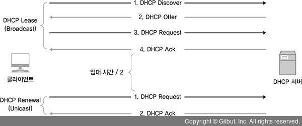

    - DHCP에서 IP를 할당받은 후 임대 시간의 50%가 지나면 DHCP 갱신 과정을 수행
      - 갱신 과정은 초기 임대 과정과 비교하면 절차가 짧을 뿐만 아니라 
      - 브로드캐스트가 아닌 유니캐스트로 진행되므로 불필요한 브로드캐스트가 발생X
    - 만약 임대 시간이 50%가 지난 시점에서 갱신이 실패하면 
      - 남은 시간의 50%가 지난 시점, 즉 초기 임대 시간의 75%가 지난 시점에서 갱신을 다시 시도
      - 만약 이때도 갱신을 실패하면 추가 갱신 없이 임대 시간이 모두 지난 후에 IP를 반납하고 다시 처음부터 IP를 할당

### 3 DHCP 서버 구성

• **IP** **주소 풀(****IP** **범위)**

- 클라이언트에 할당할 IP 주소 범위

• **예외** **IP** **주소 풀(예외** **IP** **범위)**

- 클라이언트에 할당할 IP 주소로 선언된 범위 중 예외적으로 할당하지 않을 대역

• **임대 시간**

- 클라이언트에 할당할 IP 주소의 기본 임대 시간

• **서브넷 마스크**(Subnet Mask)

- 클라이언트에 할당할 IP 주소에 대한 서브넷 마스크 정보

• **게이트웨이**(Router)

- 클라이언트에 할당할 게이트웨이 정보

• **DNS**(Domain Name Server)

- 클라이언트에 할당할 DNS 주소

### 4 DHCP 릴레이

- DHCP 서버에서 IP 주소를 할당받기 위해 DHCP 클라이언트와 DHCP 서버 간에 전송되는 패킷은 모두 브로드캐스트
  - 브로드캐스트는 동일 네트워크에서만 전송되므로 DHCP를 사용하려면 각 네트워크마다 DHCP 서버가 있어야 한다.
- 네트워크 대역이 하나로 운영되는 소규모 사업장에서 공유기와 같이 간단한 장비로 DHCP를 운영할 때는 고려할 사항이 많지 않지만 
  - 네트워크 영역이 여러 개인 환경에서 DHCP를 이용한다면 DHCP 서버 배치, 이중화와 관련된 다양한 사항을 고려해야 한다.
  - 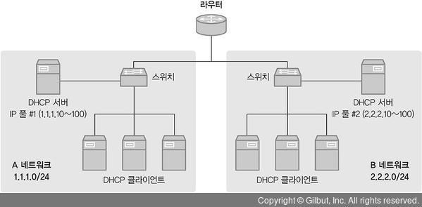
  - 각 네트워크 별로 DHCP 서버를 구성해야한다.
- 하지만 여러 네트워크를 가진 환경에서도 DHCP 릴레이 에이전트(Relay Agent) 기능을 사용하면 DHCP 서버 한 대로 여러 네트워크 대역에서 IP 풀을 관리가능
  - DHCP 릴레이 에이전트가 DHCP 클라이언트와 DHCP 서버가 서로 다른 대역에 있는 경우, DHCP 패킷을 중간에서 중계(Relay)하는 역할을 해주기 때문
  - 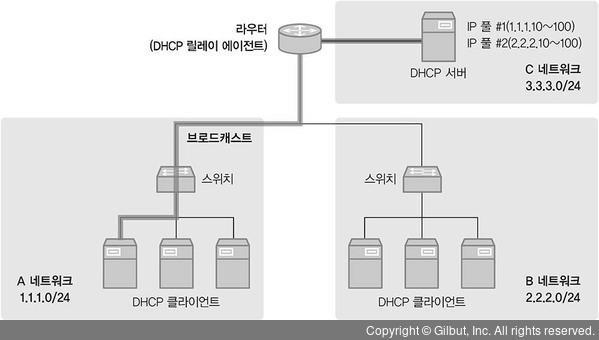
  - 이것이 가능한 것은 브로드캐스트로 전달되는 DHCP 패킷을 동일 네트워크 대역의 DHCP 릴레이 에이전트가 수신하면 
    - DHCP 서버로 갈 수 있도록 이것을 유니캐스트로 변환해주는 역할을 하기 때문

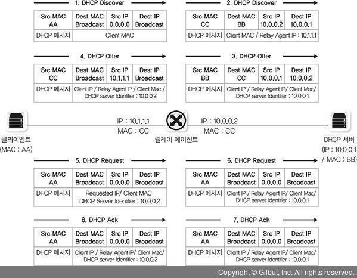

**1.** **DHCP** **Discover** **(클라이언트 → 릴레이 에이전트)**

DHCP 클라이언트는 DHCP 서버를 찾기 위해 브로드캐스트로 패킷을 전송

**2.** **DHCP** **Discover ** **(릴레이 에이전트 →** **DHCP** **서버)**

DHCP 릴레이 에이전트는 클라이언트가 보낸 DHCP Discover 메시지를 다른 네트워크에 있는 DHCP 서버로 전달하기 위해 출발지와 목적지를 릴레이 에이전트 IP 주소와 DHCP 서버 IP 주소로 재작성합니다. 목적지가 브로드캐스트에서 DHCP 서버 IP 주소로 변경되었기 때문에 릴레이 에이전트가 DHCP 서버로 DHCP Discover 메시지를 보낼 때는 유니캐스트가 됩니다. DHCP 메시지의 릴레이 에이전트 IP 항목에는 릴레이 에이전트 IP 주소를 포함합니다. 이때 출발지 주소와 DHCP 메시지에 사용되는 릴레이 에이전트 IP 주소는 같지 않습니다. 출발지 주소로 사용되는 IP 주소는 DHCP 서버로 가기 위한 방향의 인터페이스 IP 주소이며 DHCP 메시지에 사용되는 릴레이 에이전트 IP 주소는 DHCP 클라이언트가 속한 내부 인터페이스의 IP 주소입니다.

**3.** **DHCP** **Offer ** **(DHCP** **서버 → 릴레이 에이전트)**

DHCP Discover를 수신한 DHCP 서버는 클라이언트에 할당할 IP 주소와 서브넷, 게이트웨이, DNS 정보, 임대 시간(Lease Time) 등의 정보를 포함한 DHCP 메시지를 DHCP 릴레이 에이전트로 다시 전송합니다. 이때 DHCP Server Identifier는 DHCP 서버 자신이 됩니다. DHCP 서버에서 DHCP 릴레이 에이전트의 전송은 DHCP Discover 수신과 같은 유니캐스트입니다.

**4.** **DHCP** **Offer ** **(릴레이 에이전트 → 클라이언트)**

DHCP 릴레이 에이전트는 DHCP Offer 메시지를 DHCP 클라이언트에 브로드캐스트로 다시 전송하는데 DHCP 메시지 내의 다른 값은 모두 동일하게 전송되지만 DHCP Server Identifier는 실제 DHCP 서버의 IP 주소에서 릴레이 에이전트의 외부 인터페이스 IP 주소로 변경되어 전송합니다.

**5.** **DHCP** **Request** **(클라이언트 → 릴레이 에이전트)**

DHCP 클라이언트는 DHCP 서버로부터 제안받은 IP 주소(Requested IP)와 DHCP 서버 정보(DHCP Server Identifier)를 포함한 DHCP 요청 메시지를 브로드캐스트로 전송합니다.

**6.** **DHCP** **Request** **(릴레이 에이전트 →** **DHCP** **서버)**

DHCP 클라이언트에서 보낸 DHCP 요청 메시지를 유니캐스트로 다시 변환해 DHCP 서버로 전달합니다.

**7.** **DHCP** **ACK** **(DHCP** **서버 → 릴레이 에이전트)**

DHCP 요청을 받은 DHCP 서버는 해당 IP를 어떤 클라이언트가 언제부터 사용하기 시작했는지 정보를 기록하고 DHCP Request 메시지를 정상적으로 수신했다는 응답을 전송합니다. 마찬가지로 유니캐스트 형태로 전송합니다.

**8.** **DHCP** **ACK** **(릴레이 에이전트 → 클라이언트)**

DHCP 서버에서 받은 Ack 메시지를 클라이언트에 브로드캐스트로 다시 전달합니다.

- 이때 DHCP 클라이언트와 DHCP 릴레이 에이전트 간에는 브로드캐스트로 동작하고 
  - 다시 DHCP 릴레이 에이전트와 DHCP 서버 간에는 유니캐스트로 동작하게 된다.
  - 이것을 위해 DHCP 릴레이 에이전트는 DHCP 클라이언트와 같은 L2 네트워크 내에 존재해야 하며 
  - DHCP 서버에는 유니캐스트로 전달하기 위해 DHCP 서버의 IP 주소가 등록되어 있어야 한다.