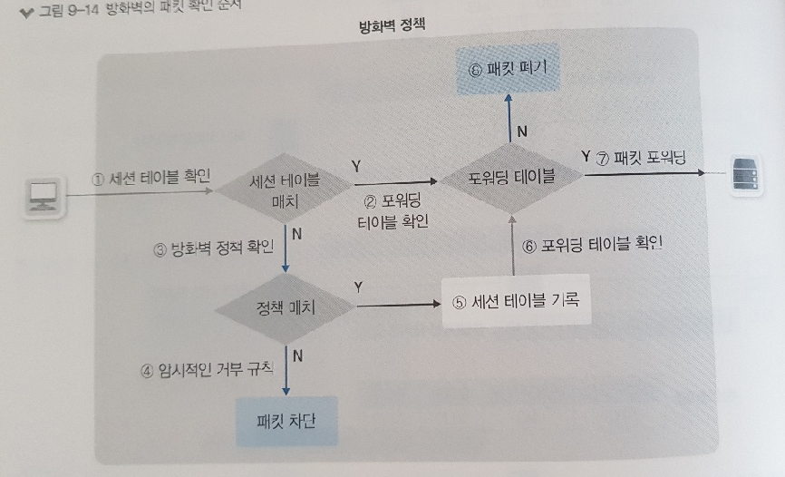
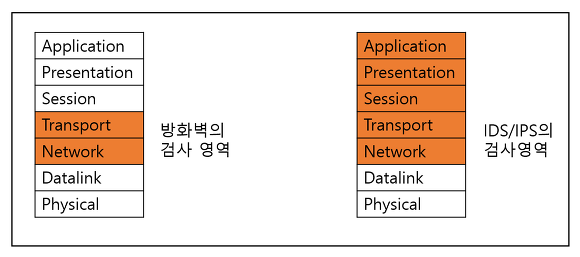
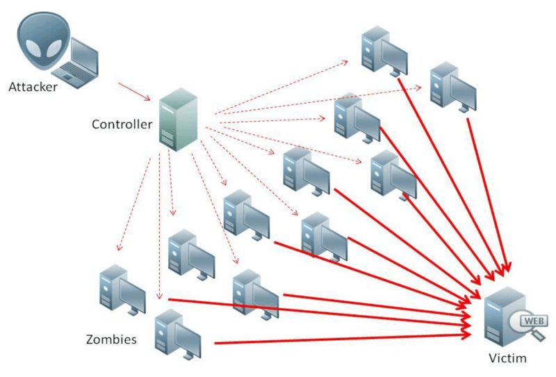
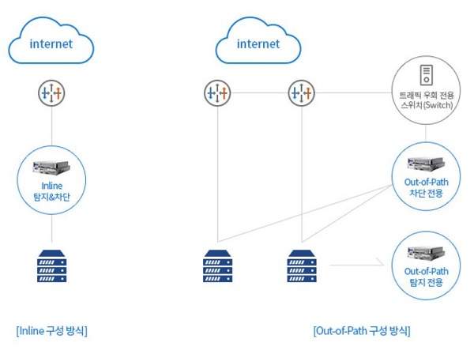
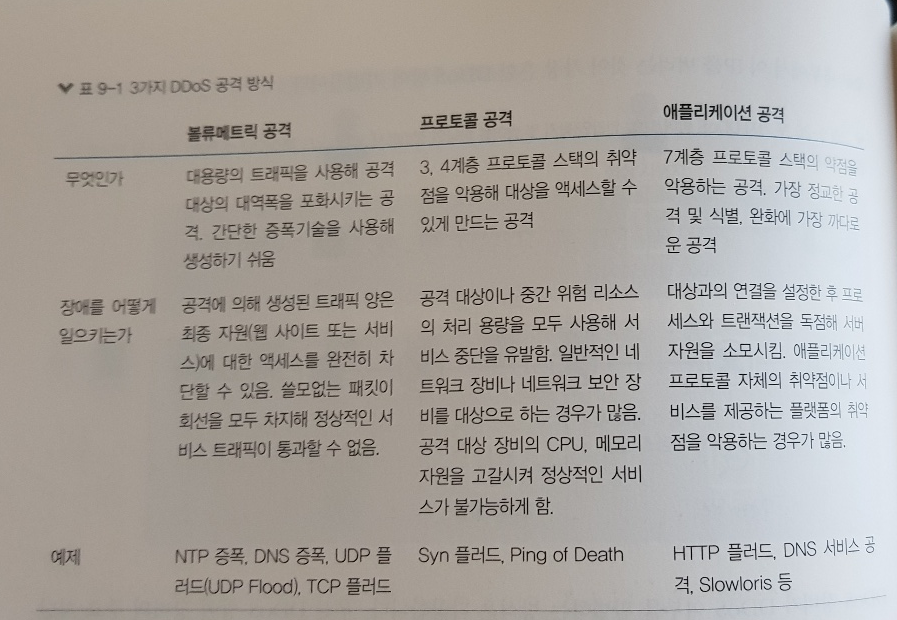
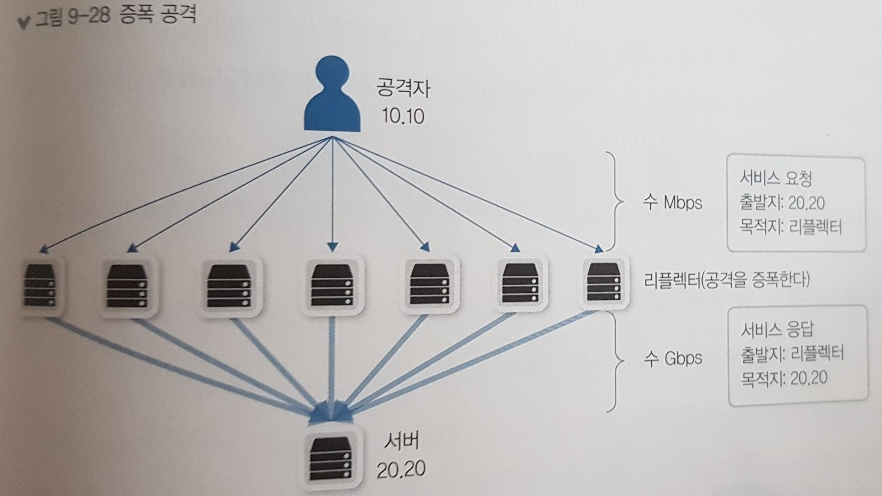
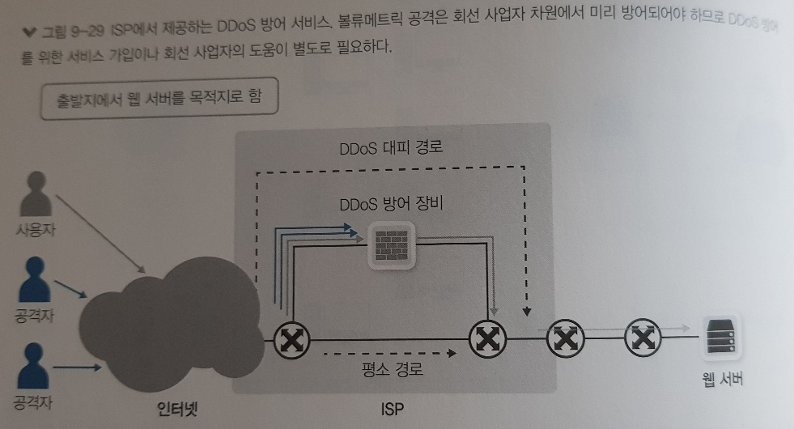
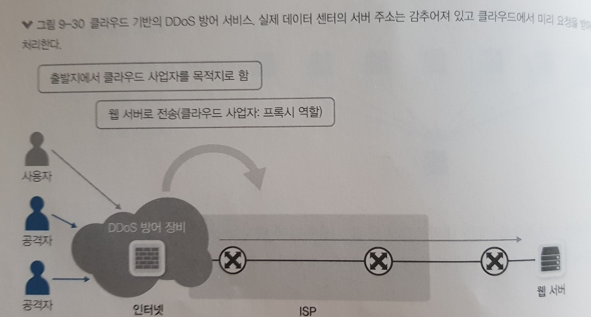
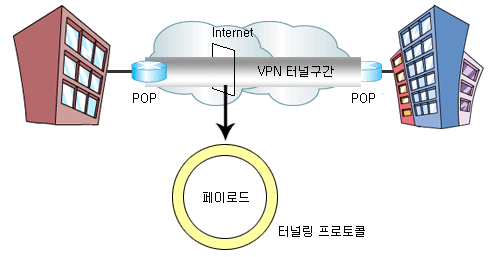

## 9.1 보안의 개념과 정의

- 보안의 필수요소
  - 기밀성
    - 인가되지 않은 사용자가 정보를 보지 못하게하는 모든 작업
    - ex) 암호화 작업
  - 무결성
    - 정확하고 완전한 정보 유지에 필요한 모든 작업
      - 정보를 고의로 훼손하거나 중간에 특정 이유로 변경이 가해졌을 때 그것을 파악해 잘못된 정보가 전달되거나 유지되지 못하게 하는 것
    - ex) MD5, SHA와 같은 해시 함수를 이용해 변경 여부 확인
  - 가용성
    - 정보가 필요할 때 접근을 허락하는 일련의 작업
      - 정보를 사용하지 못하는 상황이면 정보 보안에 실패하는 것
- 추가 요소
  - 진정성, 책임성, 부인 방지, 신뢰성 유지 등
- ###### 네트워크 보안
  
  - 수집된 정보를 침해하는 행동을 기술적으로 방어하거나 정보의 송수신 과정에서 생기는 사고를 막기 위한 작업
  - 목표
    - 정보를 가진 시스템을 공격해 유출하거나 사용하지 못하게 하거나 시스템을 동작하지 못하게 해 정보 서비스를 정상적으로 구동할 수 없게 만드는 행위를 네트워크에서 적절히 막는 것이 네트워크 보안의 1차 목표
    - 정보는 여러가지 서비스를 제공하기 위해 한 자리에만 있는 것이 아니라 네트워크를 통해 복제, 이동되므로 그 유출을 막는 것이 2차 목표
- 주요 개념
  - 외부 네트워크로부터 내부 네트워크를 보호하는 것
    - 트러스트 네트워크 : 외부로부터 보호받아야할 네트워크
    - 언트러스(UnTrust) 네트워크 : 신뢰할 수 없는 외부 네트워크
    - DMZ(DeMilitarized Zone) 네트워크 : 내부 네트워크이지만 신뢰할 수 없는 외부 사용자에게 개방해야하는 서비스 네트워크
    - 

- 보안 분야 (트래픽의 방향과 용도에 따른)
  - 인터넷 시큐어 게이트웨이 (internet secure Gateway)
    - 트러스트 (또는 DMZ) 네트워크에서 언트러스트 네트워크로의 통신을 통제
    - 인터넷에 수많은 서비스가 있으므로 그에 대한 정보와 요청 패킷을 적절히 인식하고 필터링하는 기능
  - 데이터 센터 시큐어 게이트웨이
    - 언트러스트 네트워크에서 트러스트(또는 DMZ)로의 통신을통제
    - 외부의 직접적인 공격을 막아야 하므로 인터넷 관련 정보보다 공격 관련 정보가 더 중요

- 네트워크 보안 정책 수립에 따른 분류
  - 화이트리스트
    - 방어에 문제가 없다고 명확히 판단되는 통신만 허용하는 방식
    - 일반적으로 IP와 통신 정보에 대해 명확히 아는 경우에 많이 사용 (인터넷 전체에 화이트리스트를 만들기 어렵기 때문)
  - 블랙리스트
    - 공격이라고 명확히 판단되거나 문제가 있었던 IP 리스트나 패킷 리스트를 기반으로 데이터베이스를 만들고 그 정보를 방어하는 형태
  - 최근 보안 위협이 증가하면서 화이트리스트 기반 정책이 많이 사용
    - 하지만 화이트리스트 기반 정책 수립하려면 통신 정보를 상세히 알아야하고 세부적인 통제가 필요
    - 많은 인력이 필요
    - 인력이 없을 경우 블랙리스트 기반 방어 정책을 수립하고 공격 데이터베이스를 최신으로 유지하는 것이 안정적인 보안 운영을 위해 바람직

## 9.2 보안 솔루션의 종류

- DDoS 방어 장비
  - DoS 공격: Denial of Service 공격의 약자, 다양한 방법으로 공격 목표에 서비스 부하를 가해 정상적인 서비스를 방해하는 공격기법
    - 적이 공격 출발지에서 공격하는 것이 일반적
    - 비교적 탐지 쉽고, 짧은 시간 안에 탐지만 할 수 있으면 IP 주소 기반으로 충분히 방어 가능
    - 이런 탐지를 회피하고 더 짧은 시간 안에 공격 성과를 내기 위해 다수의 봇을 이용해 분산공격으로 수행하는 DDoS 공격 기법 등장
  - 회선을 공급해주는 ISP나 네트워크 ISP와 연결되는 데이터 센터 네트워크의 가장 바깥쪽에 위치시켜 공격을 완화
- 방화벽
  - 4계층에서 동작하는 패킷 필터링 장비
  - 3, 4 계층 정보를 기반으로 정책을 세울 수 있고, 해당 정책과 매치되는 패킷이 방화벽을 통과하면 그 패킷을 허용하거나 거부할 수 있다.
- IDS, IPS
  - Intrusion Detection System, Intrusion Prevention System
  - 다양한 애플리케이션 공격을 방어하는 장비
  - 기존에는 두 장비를 구분했지만 최근에는 애플리케이션을 공격을 방어하는 장비를 IPS로 통칭
  - 사전에 공격 데이터베이스를 제조사나 위협 인텔리전스 서비스 업체로 부터 받는다.
    - 이후 두 장비에 안입된 패킷이 보유한 공격 데이터베이스에 해당하는 공격일 때, 차단하거나 모니터링 한 후 관리자에게 알람을 보내 공격 시도를 알린다.

- WAF
  - Web Application Firewall
  - 웹 서버를 보하하는 전용 보안 장비, HTTP, HTTPS 처럼 웹 서비스에서 동작하는 웹 프로토콜의 공격을 방어
  - IPS에서 방어할 수 없는 IPS 회피 공격을 방어 가능
    - IPS는 데이터를 조합하지 않고 처리하지만 WAF는 프록시 서버와 같이 패킷을 데이터 형태로 조합해 처리

- 샌드박스
  - APT 공격을 방어하는 대표적인 장비
    - APT : Advanced Target Attack, 악성코드 심어 외부에서 컨트롤

- NAC
- IP 제어
- 접근 통제
- VPN

## 9.3 방화벽

- 네트워크 중간에 위치해 해당 장비를 통과하는 트래픽을 사전에 주어직 정책 조건에 맞추어 허용하거나 차단하는 장비

- 초기 방화벽
  - 패킷의 인과 관계를 확인하지 못하고 장비에 등록된 정책만으로 단순히 패킷을 필터링
    - 스테이트리스 또는 패킷 필터 방화벽
  - 패킷이 장비에 인입되면 해당 패킷이 방화벽에 설정된 정책에 일치되는 것이 있는지 확인
    - 참고하는 조건 : 5-Tuple
      - 패킷의 3, 4 계층 헤더 중 소스 IP, 목적지 IP, 프로토콜 NO, 소스 포트, 목적지 포트
  - 인터넷 통신과 같이 불특정 다수 기반의 정책을 정의할 때는 룰셋이 복잡해지고 보안이 약해지는 문제
    - 5 튜플을 외의 3, 4 계층 헤더를 변조해 공격하면 적절한 방어 불가
  - 다른 세대 방화벽 엔진보다 부하가 적고, 간단히 동작하므로 완전히 없어지지는않았다.

- 현대적 방화벽의 등장 (SPI 엔진)

  - 세션 기반으로 동작하는 상태 기반엔진을 탑재
  - 패킷의 인과 관계와 방향성을 인지해 정책 적용 가능
    - 내부 네트워크에서 인터넷으로 통신할 때 유용하게 사용
    - 내부에서 외부 인터넷으로 통신을 시도해 받은 응답과 외부에서 내부로 직접 들어오려는 패킷을 구분 가능

- 동작 방식

  - 

  - 세션인지 기능이 있어 5-튜플조건만 확인하는 것이 아니라 3, 4  계층 세부적인 필드도 함께 확인
  - 세션을 추가로 인지하고 세션 테이블에 저장하므로 세션을 로깅하기 쉽다.

- ALG

  - FTP 통신 방식은 초기 접속 방향과 반대로 데이터 프로토콜이 동작하므로 방화벽을 정상적으로 통과 못한다
    - 패시브 모드가 있지만 제공하지 못하는 컴포넌트가 있을 수 있고 이미 개발된 애플리케이션 변경이 불가능한 경우도 있다.
  - 그래서 방화벽에서 FTP 액티브 모드를 통과시키기 위해 애플리케이션 프로토콜을 확인하고 필요에 따라 세션을 인지해 포트를 자동으로 열어준다. 이것이 ALG (애플리케이션 레이어 게이트웨이)
  - FTP 프로토콜이 방화벽을 지나갈 때 방화벽 동작 순서
    - FTP ALG 기능은 초기 FTP 요청 커맨드를 모니터링
    - 서버 쪽에서 사용할 데이터 세션에서 사용할 포트를 클라이언트로 알려줄 때 이 정보를 확인하고 적절한 세션 정보를 만든다.
    - 서버에서 클라이언트로 데이터 세션을 열 때, 세션 테이블에 이미 정보가 들어가 있어 정책을 확인하지 않고 패킷이 포워딩

- 방화벽의 한계
  - 공격 목표가 시스템이나 계정 탈취에서 서비스 중단쪽으로 바뀌고 DDoS 공격이 새로운 트랜드
  - 방화벽을 우회하는 다양한 공격이 개발되고 대규모 웜 공격으로 인터넷 서비스가 마비되면서 방화벽의 한계가 드러남
  - 취약점의 대부분은 애플리케이션 영역을 검사하지 못하는 방화벽으로서는 대응이 불가
  - 이런 것을 막기 위해 IPS라는 보안 장비가 등장

## 9.4 IPS ,IDS

- 애플리케이션 계층에서 이루어지는 다양한 공격을 탐지, 방어하기 위해 IDS와 IPS 개발
  - 

- IDS
  - Intrusion Detection System 침입 탐지 시스템
  - 해킹 할 때 탐지를 목적으로 개발 된 시스템
  - 공격에 직접 개입하거나 방어하는 것이 아니라 트래픽을 복제해 검토하고 침입 여부를 판별
- IPS
  - Intrusion Prevention System 침입 방지 시스템
  - 공격이 발견되면 직접 차단하는 능력을 갖춘 장비
  - 트래픽이 지나가는 인라인 상에 장비를 배치한다.
- 동작방식
  - 패턴 매칭 방식
    - 기존 공격이나 취약점을 통해 공격 방식에 대한 데이터베이스를 습득하고 최신 내용 유지하다가 공격을 파악하는 기술
      - 패턴 방식, 시그니쳐 방식, 데이터베이스 방식
    - 특별한 문자열을 모니터링하고 있다가 자신이 보유한 데이터베이스에 매칭되는 패킷이 들어오면 이 공격을 방어
  - 어노말리 공격 방어
    - 패턴 매칭 방식은 패턴 데이터 베이스가 확보되어야한다
      - 공격 변종을 적절한 타이밍에 막아내기 어렵다
    - 기존 블랙리스트 기반의 방어 방식인 패턴 기반 방어의 한계 때문에 IPS에서도 화이트리스트 기반의 방어 기법이 개발된 것이 어노말리이다.
    - 분명한 공격으로 파악되지 않더라도 특정 기준 이상의 행위를 이상하다고 판단하고 방어하게 된다.
    - 분류
      - 프로파일 어노말리
        - 평소 관리자가 정해놓은 기준이나 IPS 장비가 모니터링해 정해진 기준과 다른 행위가 일어나면 공격으로 판단
        - 평소 1MB 이하 트래픽이 발생하는 시스템에서 갑자기 수십MB 이상의 트래픽이 발생한 경우
        - 웜이 감염되면 다른 타킷으로 다량의 트래픽을 발생시켜 감영ㅁ시키는 행위를 반복하기 때문에 이런 형태의 공격을 방어하는 데 효과
      - 프로토콜 어노말리
        - 좀비 PC 등을 막아내기 위한 방법
        - 외부와 공격을 위한 통신할 때 (잘 알려진 서비스 포트를 사용하는데) 실제 해당 서비스 포트에서 동작하는 프로토콜이 아닌 프로토콜 사용하는 경우을 막아낸다.
- 한계와 극복
  - 네트워크상에서 빠른 속도로 애플리케이션 레벨까지 확인하기 위해 플로 엔진을 사용
    - 플로엔진은 패킷을 모아 데이터 형태로 변환해 검사하는 것이 아니라
    - 패킷이 흘러가는 상황을 모니터링해 공격을 탐지하므로 IPS 장비를 비교적 쉽게 우회 가능
  - IPS는 오탐이 많이 발생
    - 초기에 설치된 환경에 맞는 튜닝작업을 오래 해주어야한다.
    - 별도의 관제 인력이 장비를 모니터링 하고 환경에 맞는 최적화 작업을 지속적으로 수행해주어야한다
  - 최근 IPS의 기능을 향상시킨 NGIPS(Next Generation IPS) 개념의 장비 출시
    - 애플리케이션 인지하거나 다양한 시스템 연동 가능
    - APT 공격을 방어하기 위한 일부 기능이 탑재되어 있거나 다양한 외부 시스템 연동할 수 있다.

## 9.5 DDoS 방어 장비

- DoS
  - 정상적인 서비스를 불가능하도록 방해하는데 초점
- DDoS
  - 다수의 공격자를 만들어 내 DoS 공격을 하는 분산형 DoS
  - 
- 동작방식
  - 주요 차단 방법
    - 프로파일링 기법
    - 평소 데이터 흐름을 습득해 일반적인 대역폭, 세션량, 초기 접속량, 프로토콜 별 사용량 등을 저장
    - 습득한 데이터와 일치하지 않는 과도한 트래픽이 인입되면 알려주고 차단한다.
  - 다른 방법
    - 보안 데이터 베이스 기반으로 방어하는 것
    - IP 평판 데이터베이스를 공유해 DDoS 공격으로 사용된 IP기반으로 방어 여부를 결정하거나 특정 공격 패턴을 방어하는 방법
  - 
- DDoS 공격 타입
  - 

- 볼류메트릭 공격
  - 회선 사용량이나 그 이상의 트래픽을 과도하게 발생시켜 회선을 사용하지 못하게 하도록 방해하는 공격
    - 회선을 공급해주는 ISP 내부나 사용자 네트워크 최상단에 위치시켜 이 공격을 완화시켜해야한다.
    - DDoS 장비는 볼류매트릭 공격이나 프로토콜 공격을 방어하는데 사용
    - 혼자 방어할 수 없는 공격도 많으므로 회선을 공급하는 ISP와 공조해 방어할 필요가 있다.
  - 좀비 PC를 이용한 볼류메트릭 공격
    - 볼류메트릭 공격은 특정 시간에 특정 타킷을 공격하는 형태로 발생
    - 악성코드에 감염되어 해커가 컨트롤할 수 있는 좀비 PC를 많이 확보해야한다.
    - 증폭 공격 증가
      - 엄청나게 높은 대역폭의 공격의 대부분
      - 상대적으로 적은 대역폭으로 중간 리플렉터에 패킷을 보내면
        - 이 트래픽이 증폭되어 피해자 네트워크에 수십~수백배 공격 트래픽이 발생하는 공격법
      - 
    - 이런 공격을 혼자서 대부분 방어가 불가능하므로
      - ISP를 통한 방어나 Cloud DDoS 솔류션을 통해 서비스 네트워크로 트래픽이 직접 도달하지 못하도록 조치해야한다.
      - 
    - 클라우드 기반의 DDoS 방어 서비스도 고려해볼 필요 있다.
      - 별도의 보안 장비 없이도 DDoS 공격을 방어할 수 있는 장점
      - 실제 서비스 서버 앞에 미리 클라이언트의 요청을 받아 처리 한 후
        - 문제가 없는 요청만 서버 쪽으로 전달
      - 최대 장점
        - 실제 서비스 네트워크가 가려지므로 네트워크 차원이나 대규모 볼류메트릭 공격도 큰 투자 없이 방어 가능
      - 

## 9.6 VPN

- Virtual Private Network
- 물리적으로 전용선이 아닌 공중망을 이용해 논리적으로 직접 연결한 것처럼 망을 구성하는 기술
  - 논리적으로 직접 연결된 것처럼 만들어주는 통로 : 터널
  - VPN을 이용하면 터널을 이용해 직접 연결한 것처럼 동작
- VPN은 인터넷과 같은 공중망을 전용선과 같은 사설망처럼 사용하기 위해 도입하므로 강력한 보안을 제공
  - IPSEC, SSL과 같은 암호화 기법을 제공하는 프로토콜이 VPN에 주로 사용
- 연결 방식
  - 본사 - 지사 (네트워크 대 네트워크 연결)
    - IPSEC VPN 기술 사용
    - 본사와 지사 모두 IPSEC VPN 기능을 지원하는 네트워크 장비 필요
  - 개인 - 본사 
    - SSLVPN 기술 사용
    - PC나 모바일 단말과 같은 원격지는 별도의 네트워크 장비 필요 없다.

- 동작 방식
  - 터널링 기법 사용
    - 패킷을 터널링 프로토콜로 감싸 통신하는 기법
  - 일반적으로 VPN이라고 부르는 프로토콜은 터널링에 보안을 위한 다양한 기술이 포함되어 있다.
    - 패킷을 암호화하거나 인증하거나 무결성을 체크하는 보안 기능을 이용해 인터넷에 패킷이 노출되더라도 해커나 기관들이 감청하지 못하도록 보호 가능
    - 
  - 가장 많이 사용하는 보안 VPN 프로토콜
    - IPSEC, SSL
  - 구현 형태
    - Host to Host 통신 보호
      - 두 호스트 간에 직접 VPN 터널은 연동하는 기법
      - VPN 구성으로 잘 사용되지 않는다.
    - Network to Network 통신 보호
      - 본사-지사 같은 특정 네트워크를 가진 두 종단을 연결하는 경우
      - IPSEC 프로토콜 스택이 가장 많이 사용
    - Host가 Network로 접근할 때 보호
      - 모바일 사용자가 일반 인터넷망을 통해 사내망으로 연결하는 경우
      - IPSEC, SSL 프로토콜이 범용적으로 사용
- 워닝 사이트 우회, 특정 국가에서 결제해야하는 직구 상품덕분에 다양한 VPN 서비스 사용됨
  - 카페와 같은 공중 무선망을 사용할 때 해커의 공격을 암호화 기법으로 원천방어 할 수 있어 공중 네트워크를 사용하는 경우 이런 VPN을 보안에 활용하는 것이 좋다
  - 이런 클라우드 기반의 VPN은 언급했던 데이터가 암호화되고 보호되므로 외부에서 그 패킷을 확인할 수 없다는 점을 이용한 것
