## 11.1 이중화 기술 개요

### 11.1.1 SPoF

- 단일 장애점 (Single Point of Failure)
  - 시스템 구성 요소 중 동작하지 않으면 전체 시스템이 중단되는 요소
  - 예를 들면 허브 장치의 전원
- 서비스를 제공하기 위한 인프라의 주요 목표
  - 적시에 서비스를 출시하기 위해 인프라를 신속히 제공
    - 타임 투 마켓을 위한 인프라의 민첩성
  - 더 가용성 높은 서비스에 필요한 인프라를 안정적으로 제공하는 것
- 단일 접점의 장애가 전체 서비스에 영향을 미치지 않도록 SPoF를 만들지 않아야한다.
  - 최소화하는 것이 아니라 아예 만들지 않도록 설계해야한다.

### 11.1.2 이중화의 목적

- 안정적인 서비스 제공을 위한 네트워크를 포함한 모든 인프라에서 반드시 갖춰야 할 요소
  - 각 요소가 복수 개 이상으로 인프라를 구성해 특정 인프라에 문제가 발생하더라도 이중화된 다른 인프라를 통해 서비스가 지속되도록 한다.
- 서비스에 필요한 출발 지점 부터 끝지점 까지 모든 인프라에 이중화 구성을 고려해야한다.
- 상태에 따른 분류
  - 액티브 - 액티브
    - 각 구성 요소가 동시에 운영 중인 상태로 동작
  - 액티브 - 스탠바이
    - 하나는 운영 중, 하나는 대기상태
    - 운영 상태인 인프라에 장애 발생시 대기 상태 인프라가 운영 상태로 전환
- 서비스의 연속성 보장
  - 폴트 톨러런스 (Fault Tolerance(FT) : 장애 허용, 결함 감내)가 보장된다고 말하기도 한다.
- 처리 가능한 전체 용량 증가
  - 액티브 - 액티브 구성시에만
  - 장비간 네트워크 연결이나 회선의 대역폭 증가
  - 다만 특정 지점에 장애 발생 시 인프라 용량이 절반으로 떨어지기 때문에 정상적인 서비스 불가능
- 인프라의 이중화 구성할 때는 
  - 이중화된 인프라 중 일부에서 장애가 발생하더라도 정상적인 서비스에 문제가 없도록 용량을 산정해 설계
  - 예를 들면 액티브 액티브로 각 6G 트래픽 처리한다고 할 때 10G트래픽이 오면 평소엔 문제가 없지만 장애 발생시 6G 트래픽만 수용하기 때문에 문제가 생긴다.

## 11.2 LACP

- 1990 년대 중반까지는 각 벤더별로 장비 간 대역폭을 늘리기 위해 독자적인 방법으로 구현
  - 벤더 독자적인 방법으로는 다른 장비끼리 연결할 때 호환성 문제 발생
  - 이 문제를 해결하기 위해 상호호환 가능한 연결 계층 표준화를 시작
  - 표준화 = LACP (Link Aggregation Control Protocol)
- 링크 애그리게이션의 목적
  - 링크 사용률 향상
  - 향상된 장애 회복
- LACP 사용
  - 2개 이상의 물리 인터페이스로 구성된 논리 인터페이스를 이용해 모든 물리 인터페이스를 액티브 상태로 사용
    - 스위치와 스위치 또는 스위치와 서버 간 네트워크 대역폭이 물리 인터페이스 수량 만큼 확장
    - 논리 인터페이스를 구성하는 물리 인터페이스 중 일부에서 문제가 발생하더라도 나머지 물리 인터페이스로 서비스 유지
    - 액티브 - 액티브 상태 이므로 인터페이스 절체로 인한 지연 없이 서버시 제공
- 유의사항
  - LACP로 구성하는 논리 인터페이스의 대역폭을 서비스에 필요한 전체 트래픽 기준으로 서비스 트래픽을 산정하면 안된다.
    - 앞에서 말한 내용
  - LACP로 구성하는 물리 인터페이스들의 속도가 동일해야한다.

### 11.2.1 LACP 동작방식

- LACP를 통해 장비 간 논리 인터페이스를 구성하기 위해
  - LACPDU(LACP Data Unit)이라는 프레임을 사용한다.
  - LACPDU에는 LACP를 구성하기 위한 출발지 주소, 목적지 주소, 타입, 서브 타입, 버전 정보 등을 포함해 매 초마다 주고받는다.
    - 멀티캐스트 이용
    - 목적지 주소 : "01:80:c2:00:00:02" 부터 "01:80:c2:00:00:10" 까지
- LACP가 연결되려면 LACPDU를 주고 받는 장비가 한 장비여야 한다.
  - 즉 LACP를 구성하는 두 개 이상의 물리인터페이스가 서로 다른 장비에 연결되어 있으면 
  - LACP를 통한 링크 이중화 구성을 할 수 없다.
  - 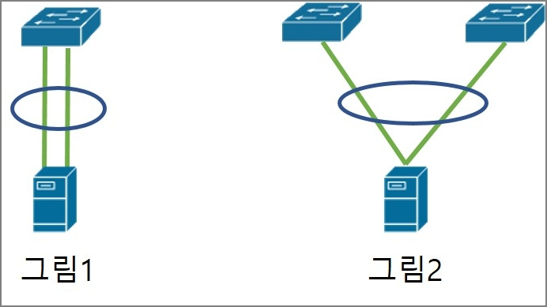
  - 그림 2 처럼 되면 연결이 안된다. (이렇게 연결하려면 11.4절 참고)
- LACP는 두 장비 간 LACPDU 패킷을 주고 받으면서 구성된다.
  - 한쪽 장비에서만 LACP를 설정하면?
  - 설정이 있는 장비에서만 LACPDU를 상대방 장비로 보낼 수 있다.
  - 반대편 장비는 LACPDU를 수신하지만 LACP 설정이 없어 LACPDU를 보내지 않고 수신한 LACPDU에 대한 응답을 보내지 않는다.
  - 정상적인 LACPDU를 오가지 않으므로 LACP 구성 실패

- LACP 설정 모드

  - | Active Mode  | LACPDU를 먼저 송신하고 상대방이 LACP로 구성된 경우, LACP를 구성 |
    | ------------ | ------------------------------------------------------------ |
    | Passive Mode | LACPDU를 먼저 송신하지않지만 LACPDU를 수신받으면 응답해 LACP를 구성 |

  - 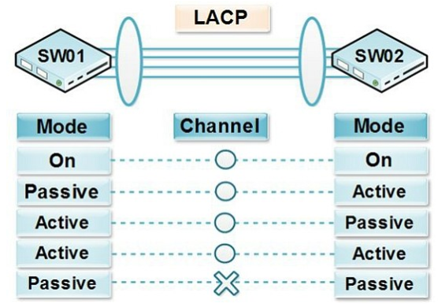
  - 패시브 - 패시브 일 경우 LACPDU를 아무도 먼저 보내지 않기 떄문에 정상적으로 LACP 연결 X

### 11.2.2 LACP와 PXE

- 서버의 인터페이스를 하나의 논리 포트로 묶는 본딩(bonding) / 티밍(teaming) 기술은 서버 운영 체제에서 설정하게 된다.
- PXE(Pre-boot eXecution Environment)를 이용할 때는 서버가 운영체제를 설치하기 전 단계이므로 본딩과 티밍 같은 논리 인터페이스를 설정할 수 없다.
  - LACP 설정은 본딩과 티밍에서 액티브-액티브로 사용하기 위한 옵션 설정이므로
  - 운영체제 설치 전에는 LACP를 사용할 수 없다.
  - 네트워크 장비에서는 서버로부터 LACPDU를 수신할 수 없으므로 해당 인터페이스는 정상적으로 활성화 X
- LACP로 구성하려는 서버를 PXE로 운영체제를 설치할 떄는 LACP 인터페이스가 아닌 일반 인터페이스로 구성해 운영체제를 설치하고 
  - 운영체제에서 LACP 설정을 다시 한 후 스위치 포트 설정을 다시 변경해야한다.
- 이것을 해결하기 위해 네트워크 장비에서 LACP를 설정할 때
  - 일정시간 동안 LACPDU를 수신하지 못하면 한 개의 인터페이스만 활성화하고
  - LACPDU를 다시 수신되기 시작하면 두 개 이너페이스를 모두 활성화할 수 있는 옵션 제공
- 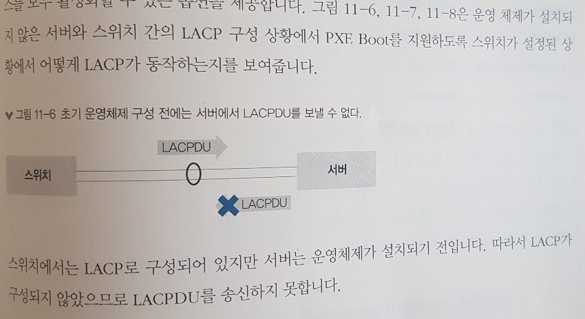
- 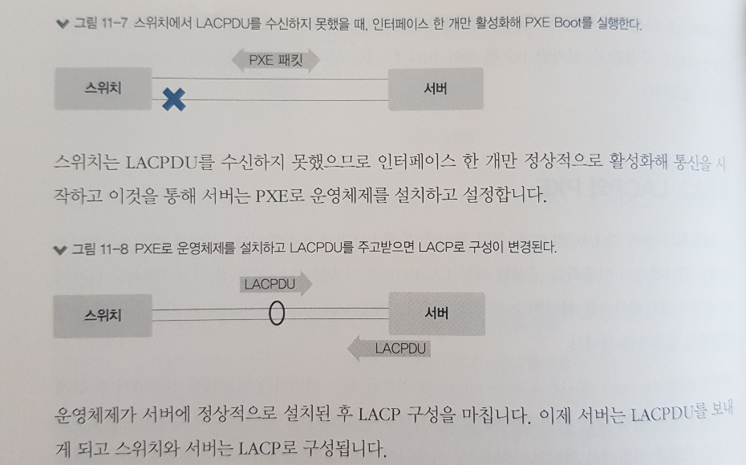

## 11.4 MC-LAG

- LACP 구성할 때는 LACPDU를 주고 받는 장비 상호 간 구성이 1:1이어야한다.
  - 정확히는 MAC 주소가 1:1
- 그래서 서버에서 본딩이나 티밍과 같은 이중화 구성을 할 때, 각 네트워크 카드별로 물리 MAC 주소를 따로 사용하지 않고 두 개의 물리 MAC 주소 중 하나를 Primary MAC 주소로 사용
  - 즉 여러 개의 물리 인터페이스를 쓰더라도 하나의 MAC 주소를 사용해 이 조건을 만족시킨다.
- 서버에서 인터페이스를 2개 이상을 구성하더라도 상단 스위치가 한 대로 구성된 경우,
  - 상단 스위치에 장애가 발생하면 서버는 통신이 불가능 (SPoF 구성이기 때문)
  - SPoF 구성을 피하기 위해 서버의 인터페이스를 서로 다른 스위치로 연결
  - 서로 다른 스위치로 이중화 구성을 하면 두 스위치 간 MAC 주소가 달라 LACP를 사용할 수 없다.
  - 서버에서도 본딩이나 티밍 모드를 액티브-스탠바이로 구성해 사용
- 서로 다른 스위치 간의 단일 MAC 주소를 사용해 액티브 - 액티브 형태의 이중화 구성 가능?
  - 가능하다 이게 바로 MC-LAG (Multi-Chassis Link Aggregation Group) 기술로 
  - 서로 다른 스위치 간의 실제 MAC 주소 대신 가상 MAC 주소를 만들어 논리 인터페이스로 LACP를 구성할 수 있다.

### 11.4.1 MC-LAG 동작 방식

- 구성 요소

  - 피어장비
    - MC-LAG를 구성하는 장비
  - MC-LAG 도메인
    - 두 피어 장비를 하나의 논리 장비로 구성하기 위한 영역 ID
    - 피어 장비는 이 영역 ID를 통해 상대방 장비가 Peer를 맺으려는 장비인지 판단
  - 피어 링크
    - MC-LAG을 구성하는 두 Peer 장비 간의 데이터 트래픽을 전송하는 인터 링크
  - 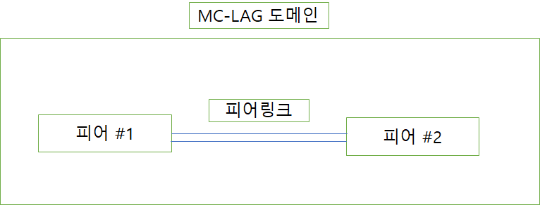

- MC-LAG을 구성하려면 피어들을 하나의 도메인으로 구성해야한다

  - 각 피어에는 동일한 도메인 ID 값 설정
  - 피어는 피어 간 데이터 트래픽을 전송하기 위한 피어 링크 구성
    - 피어링크는 다양한 네트워크가 통신할 수 있는 경로 이므로 보통 트렁크로 구성한다.
  - MC-LAG을 구성하려면 피어 자비 간의 MC-LAG 관련 제어 패킷을 주고 받아야한다
    - 일반 데이터 트래픽 경로용의 인터링크인 피어 링크 사용
      - 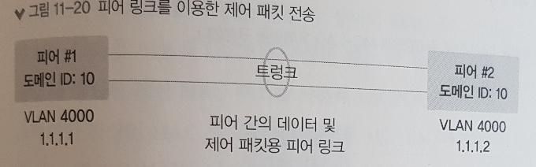
    - 별도의 제어 패킷을 위한 경로를 구성
      - 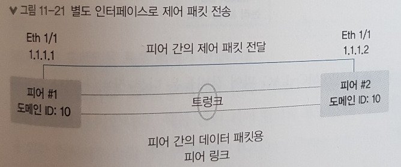
  - 정리
    - 피어에 동일한 도메인 ID 설정
    - 피어 간 데이터 트래픽 전송을 위한 피어링크 설정
    - 피어 간의 제어 패킷 전송을 위해 피어 끼리 통신 가능한 IP 설정
  - 설정을 마치면 
    - MC-LAG을 구성하는 두 피어 장비는 MC-LAG을 맺기 위한 제어 패킷을 주고 받는다.
    - 제어패킷을 통해 MC-LAG을 구성하기 위한 협상이 정상적으로 완료되면 두 대의 장비는 하나의 MC-LAG 도메인으로 묶이고 
      - 인터페이스 이중화 구성에 사용할 가상 MAC 주소를 피어 장비 간에 동일하게 생성
    - 두 피어 간 MC-LAG 구성을 마치면 MC-LAG 피어 장비들은 다른 장비와 LACP를 구성할 수 있다.

  - 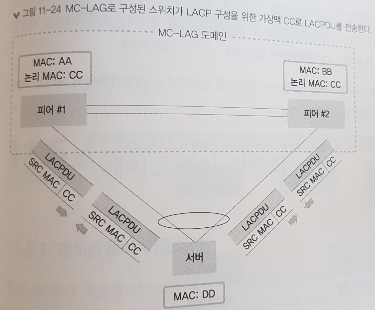

### 11.4.2 MC-LAG을 이용한 디자인

- 서로 다른 스위치로 서버를 액티브 액티브로 구성 가능
  - 루프나, STP(스패닝 트리 프로토콜)에 의한 차단이 없는 네트워크 구조를 만들 수 있다.
- 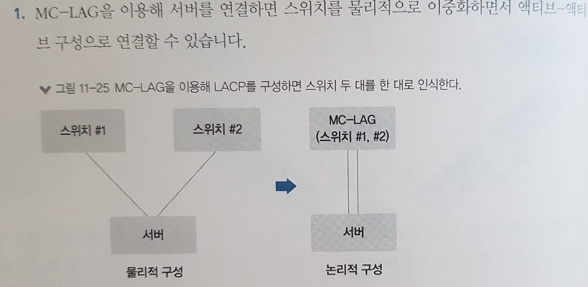
- 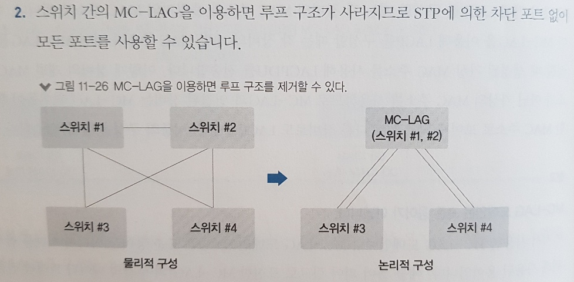
- 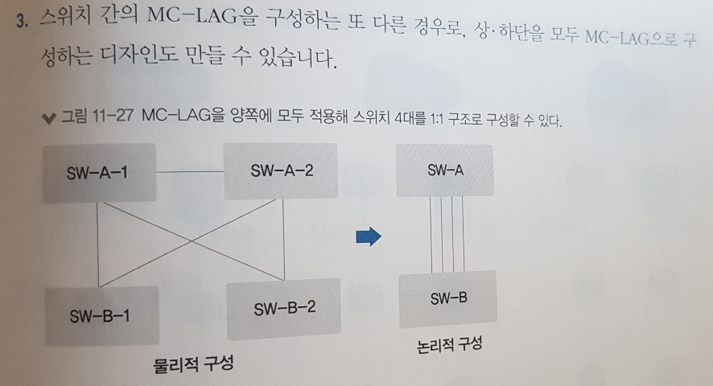

## 11.5 게이트웨이 이중화

### 11.5.1 게이트웨이 이중화란?

- 게이트웨이 장비에 장애 발생하면?
  - 장애가 발생한 게이트웨이를 바라보는 하단의 호스트들은 게이트웨이와 통신 X
  - 외부 네트워크와 통신 X
  - 장애 예시
    - 게이트웨이 자체 장애
    - 게이트웨이와 하단 장비 간 인터페이스 장애
    - 게이트웨이와 연결된 하단 장비 장애
  - 외부네트워크와 연결된 또다른 게이트웨이가 있어도
    - 하단 호스트는 하나의 게이트웨이만 바라보기 때문에 외부 네트워크 통신이 두절
    - 즉 실제로는 물리적으로는 외부 네트워크와 통신할 수 있는 또 다른 경로가 이중화되어있지만
    - 그 경로를 사용할 수 없어 통신이 두절
- 게이트웨이 역할을 하는 두 대의 장비가 하나의 IP 주소를 가지면??
  - LACP 구성과 유사하게 하나의 IP 주소와 하나의 MAC 주소를 갖고 하단 호스트들이 그 가상 IP와 MAC 주소를 알 수 있다면?
  - 이 때 사용하는 것이 FHRP(First Hop Redundancy 프로토콜)이라는 게이트웨이 이중화 프로토콜이다.
  - 게이트웨이 이중화 프로토콜 사용하면
    - 두 라우터는 실제 IP 외에 추가로 가상 IP 주소와 가상 IP에 대한 MAc 주소를 동일하게 갖는다
    - 프로토콜의 가상 IP는 그룹 내에서 우선순위가 높은 장비가 Active 상태로 유지하고 ARP 요청에 응답한다.
    - 문제가 생기면 스탠바이 상태인 장비가 액티브 상태로 변경

### 11.5.2 FHRP

- 외부 네트워크와 통신하기 위해 사용되는 게이트웨이 장비를 두 대 이상의 장비로 구성할 수 있는 프로토콜
- 우선순위 값을 이용해 어떤 장비가 가상 IP 주소에 대한 액티브 역할을 할 것인지 결정
- 하단 호스트는 게이트웨이 주소(가상IP주소)로 ARP 요청을 보내면 이것은 브로드캐스트 통신으로 동일한 네트워크의 모든 장비로 전달
  - FHRP 그룹 장비 중 액티브 장비가 ARP 요청에 응답
  - 하단 서버는 액티브 상태의 장비를 게이트웨이 장비로 인식하고 다른 네트워크와 통신할 수 있게 된다.
- 액티브 장비에 장애가 생기면?
  - 스탠바이 장비는 액티브 장비가 비정상임을 확인한 후 가상 IP 주소에 대한 액티브 역할을 가져온다
  - 가상 IP 주소의 MAC 주소에 대한 MAC 주소 테이블을 갱신해 하단 호스트들은 아무 설정 변경 없이 절체가 이루어진다.
  - 운영자의 개입 없이 자동으로 이루어지기 때문에, 서비스 연속성을 확보 가능
- FHRP 기술에 대한 표준 프로토콜은 VRRP(버츄얼 라우터 Redundancy  프로토콜)이다.
  - VRRP는 표준 프로토콜이므로 거의 모든 벤더 장비가 VRRP 기능 제공
  - 동작 방식
    - VRRP 그룹을 만들기 위해 VRID 값을 동일하게 설정
    - 각 장비 별로 (스위치) 우선 순위 값 설정
    - VRRP를 설정한 장비 간에 Hello  패킷을 주고 받는다
    - Hello 패킷은 기본 1초마다 전달하고 패킷에 있는 우선순위를 비교해 액티브가 될 마스터 장비 선정
    - 패킷을 3회 이상 수신하지 못하면 상대방은 비정상으로 간주해 자신이 마스터 장비가 된다.
    - Hello 패킷은 멀티캐스트 주소인 224.0.0.18 사용
    - 우선 순위가 높은 장비가 마스터로 선출되고, 그 장비는 VRRP에서 선언한 가상 IP, 가상 MAC 주소를 갖게 된다.
    - 하단 장비는 가상 IP를 게이트웨이로 설정하고 위 장비가 게이트웨이가 된다.
    - 마스터 장비가 문제가 생겨 다른 장비로 마스터가 변경되어도
    - ARP 테이블은 변하지 않는다.
      - 가상 IP, MAC 주소가 변경된 것은 아니기 때문

### 11.5.3 올 액티브 게이트웨이 이중화

- 위에서는 액티브-스탠바이로 동작
  - 사용자가 가상IP주소(게이트웨이주소)로 ARP 요청을 하면 액티브 장비에서 응답
  - 스탠바이 장비에서는 가상IP에대한 MAC 주소의 테이블을 액티브 장비와 연결된 인터페이스로 학습
  - 모든 트래픽이 (통신 흐름) 반드시 액티브 장비로 외부와 통신이 가능하다
    - 스탠바이 장비로 들어가도 액티브 장비로 트래픽이 우회해 통신이 된다.
  - 즉 불필요하게 우회하므로 비효율적
- MC-LAG 기술 사용할 때는 게이트웨이 이중화 가상 IP의 MAC 주소를 액티브 장비와 스탠바이 장비에서 모두 사용할 수 있도록 한다.
  - 게이트웨이를 액티브-액티브 형태로 구성하는 기능 제공
  - 스탠바이 장비로 들어오는 트래픽도 스탠바이 장비에서 직접 처리해 트래픽 흐름을 최적화 가능

### 11.5.4 애니캐스트 게이트웨이

- 위에서 살펴본 액티브-액티브 게이트웨이는 네트워크가 한 곳에 존재할 때 게이트웨이를 이중화하는 방식
- 오버레이 기반의 SDN 네트워크를 구현하면 같은 네트워크가 여러 위치에 존재하게 네트워크 디자인 가능
  - 게이트웨이가 한 곳에 위치하게 되면 모든 트래픽이 하나의 게이트웨이를 거쳐 통신하게 되어 비효율적
  - 애니캐스트 게이트웨이 기술을 적용하면 각 위치에 같은 주소를 가지는 게이트웨이가 여러 개 동작 가능
  - 여러개의 같은 IP를 가지는 게이트웨이가 존재하지만 가장 가까운 위치에 있는 게이트웨이에서 서비스 제공

