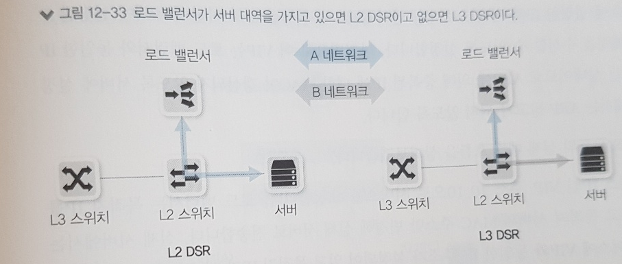

## 12.1 부하 분산이란?

- 서비스 규모가 커지면
  - 물리나 가상 서버 하나로는 모든 서비스 수용 X
  - 용량이 충분하더라도 단일 서버로 구성하면
    - 해당 서버의 애플리케이션 / 운영체제 / 하드웨어에 장애가 발생했을 때
    - 정상적인 서비스 제공 X
- 서비스 가용성을 높이기 위해 하나의 서비스는 보통 두 대 이상의 서버로 구성
  - 각 서버 IP 주소가 다르기 때문에 사용자가 서비스를 호출할 때는 어떤 IP로 서비스를 요청할 지 결정해야한다.
  - 사용자에 따라 호출하는 서버의 IP가 다르면 특정 서버에 장애가 발생했을 때
    - 전체 사용자에게 영향을 미치지 않아 장애 범위는 줄어들지만
    - 부분적으로 서비스 장애 발생
- 위의 문제점을 해결하기 위해 L4 나 L7 스위치라는 로드 밸런서 사용
- 로드 밸런서는 동일한 서비스를 하는 다수의 서버가 등록되고
  - 서비스 요청이 오면 로드 밸런서가 받아 사용자 별로 다수의 서버에 서비스 요청을 분산시켜 부하를 분산한다.
  - 로드 밸런서는 가상 IP 하나를 제공하고 사용자는 각 서버의 개별 IP 주소가 아닌 동일한 가상 IP를 통해 각 서버로 접근
  - 뿐만 아니라 로드 밸런서는 각 서버의 서비스 상태를 체크
    - 서비스가 가능한 서버로만 사용자의 요청을 분산하므로 서버에 장애가 발생하더라도 기존 요청을 분산하여 다른 서버에서 서비스 제공

## 12.2 부하 분산 방법

- 로드 밸런서는 가상 IP 주소를 가진다
  - 버츄얼 IP 혹은 서비스 IP라고 부름
- 각 서버의 실제 IP 주소(리얼 IP)가 있고, 로드밸런서의 가상 IP에 실제 서버들이 바인딩 된다.
- 로드 밸런서는 부하 분산을 위한 그룹을 만들때 3계층 IP 주소 뿐만 아니라 4계층 서비스 포트까지 지정해 만든다. (그래서 L4 스위치라 부름)
  - 7계층 정보 까지 확인해 처리하는 기능이 포함되면 (L7 스위치라고 한다, 보통은 L4 스위치)

## 12.3 헬스 체크

- 부하 분산을 하는 각 서버의 서비스를 주기적으로 헬스체크해 정상적인 서비스 쪽으로만 부하를 분산하고 
  - 비 정상적인 서버는 서비스 그룹에서 제외해 트래픽을 보내지 않는다.
  - 제외된 후에도 헬스 체크를 계속 수행해 다시 정상으로 확인되면
  - 서비스 그룹에 해당 장비를 넣어준다.

### 12.3.1 헬스체크 방식

- ICMP
  - VIP에 연결된 리얼 서버에 대해 ICMP(ping)로 헬스 체크 수행하는 방법
  - 서버가 살아 있는지 여부만 체크하기 때문에 잘 사용 X
- TCP 서버스 포트
  - 가장 기본적인 헬스 체크 방법 (서버의 서비스 포트를 확인)
  - 만약 로드 밸런서에서 서버의 서비스 포트 2000번을 등록했다면
    - 로드밸런서에서는 리얼 IP의 2000번 포트로 SYN을 보내고
    - 해당 리얼 IP를 가진 서버로부터 SYN, ACK를 받으면 
    - 서버에 다시 ACK로 응답하고 FIN을 보내 헬스 체크 종료
  - 실제 서비스 포트가 아닌 다른 서비스 포트로도 헬스 체크 가능
- TCP 서비스 포트 : Half Open
  - 일반 TCP 서비스 포트확인할 떄는
    - SYN/SYN, ACK/ACK 까지 정상적인 3방향 핸드 셰이크를 거친다
  - 헬스 체크로 인한 부하를 줄이거나 정상적인 종료 방식보다 빨리 헬스 체크 세션을 끊기 위해
    - 정상적인 3방향, 4방향 핸드 셰이크가 아닌 TCP Half Open(절반 개방) 방식 사용하기도 한다.
  - SYN을 보내고, SYN,ACK를 받지만 이후 ACK 대신 RST를 보내 세션을 끊는다.
- HTTP 상태 코드
  - 웹 서비스를 할 때 서비스 포트까지는 TCP로 정상적으로 열리지만 웹 서비스에 대한 응답을 정상적으로 해주지 못하는 경우도 있다.
  - 이 때 HTTP 상태 코드를 확인하는 방식으로
    - 로드 밸런서가 서버로 3방향 핸드 셰이크를 거치고 나서 HTTP를 요청해
    - 200 코드를 응답받는 지 여부를 체크해 헬스 체크 수행
- 콘텐츠 확인 (문자열 확인)
  - 로드밸런서에서 서버로 콘텐츠 요청하고 응답받은 내용 확인하여 지정한 콘첸츠가 정상적으로 응답했는 지 여부를 확인하는 헬스 체크 방법
    - 보통 특정 웹페이즈를 호출해 사전에 지정한 문자열이 해당 웹페이지 내에 포함되어 있는지 체크하는 기능
  - 이 방식을 사용하면
    - 로드 밸런서에서 직접 관리하는 서버의 상태 뿐만 아니라 해당 서버의 백엔드(리얼 서버가 웹 서버인 경우, WAS 서버나 데이터베이스가 백엔드)의 상태를 해당 웹페이지로 체크 가능
    - 앞단의 서버가 백엔드로 요청을하고 백엔드에서 정상적인 결과값으로 웹 페이지에 특정한 문자열을 출력하게 해 백엔드 상태까지 확인하면서 헬스 체크 수행
  - 유의사항
    - 문자열만 체크하기 때문에 비정상적인 에러 코드에 대한 응답인 경우에도 헬스 체크를 정상으로 판단할 수 있다.
    - 따라서 문자열을 이용한 헬스 체크 수행시, 정상 코드 값도 중복으로 확인하거나, 문자열 자체를 일반적이 아닌 특정 문자열로 지정해 결과가 정상일 때만 헬스 체크가 성공할 수 있도록 해야한다.

### 12.3.2 헬스 체크 주기와 타이머

- 주기
  - 로드 밸런서에서 서버로 헬스 체크 패킷을 보내는 주기
- 응답시간
  - 로드 밸런서에서 서버로 헬스 체크 패킷을 보내고 응답을 기다리는 시간
  - 해당 시간까지 응답이 오지 않으면 실패로 간주
- 시도횟수
  - 로드밸런서에서 헬스 체크 실패 시 최대 시도 횟수
  - 최대 시도 횟수 이전에 성공 시 시도 횟수는 초기화됨
- 타임아웃
  - 로드 밸런서에서 헬스 체크 실패 시 최대 대기시간
  - 헬스 체크 패킷을 서버로 전송한 후 이 시간 내에 성공하지 못하면 해당 서버는 다운
- 서비스 다운 시의 주기
  - 서비스의 기본적인 헬스 체크 주기가 아닌, 서비스 다운 시의 헬스 체크 주기
  - 서비스가 죽은 상태에서 헬스 체크 주기를 별도로 더 늘릴 때 사용

## 12.4 부하 분산 알고리즘

- 로드 밸런서가 리얼 서버로 부하를 분산할 때 로드 밸런서에서는 사전에 설정된 분산 알고리즘을 통해 부하 분산이 이루어진다.

### 12.4.1 라운드 로빈

- 특별한 규칙 없이 현재 구성된 장비에 순차적으로 돌아가면서 트래픽을 분산
- 서버 3대가 있고 요청이 4개가 있으면
  - 1번 서버 - 요청 1
  - 2번 서버 - 요청 2
  - 3번 서버 - 요청 3
  - 1번 서버 - 요청 1
- 순차적으로 모든 장비에 분산하므로 모든 장비의 총 누적 세션 수는 같아진다.

### 12.4.2 최소 접속 방식

- 서버가 가진 세션 부하를 확인해 그것에 맞게 부하를 분산하는 방식
- 로드 밸런서에서는 서비스 요청을 각 장비로 보내 줄 때 마다 세션 테이블이 생성 되므로
  - 각 장비에 연결된 현재 세션 수를 알 수 있다.
- 각 장비의 세션 수를 확인하고 현재 세션이 가장 적게 연결된 장비로 서비스 요청을 보내는 방식
  - 서비스 별로 세션 수를 관리하면서 분산해주므로 각 장비에서 처리되는 활성화 세션 수가 비슷하게 분산되면서 부하를 분산

### 12.4.3 해시

- 해시 방식은 서버의 부하를 고려하지 않고 클라이언트가 같은 서버에 지속적으로 접속하도록 하기 위해 사용하는 부하 분산 방식
- 서버 상태 고려 X, 해시 알고리즘을 이용해 얻은 결과 값으로 어떤 장비로 부하를 분산할지 결정
- 알고리즘에 의한 계산 값에 의해 부하를 분산하므로
  - 같은 알고리즘을 사용하면 항상 동일한 결과값을 가지고 서비스를 분산
  - 알고리즘 계산에 사용되는 값들을 지정 가능
    - 출발지 IP 주소, 목적지 IP 주소, 출발지 서비스 포트, 목적지 서비스 포트를 주로 사용

- 라운드 로빈이나 최소 접속 방식은 부하를 비교적 비슷한 비율로 분산시킬 수 있다는 장점
  - 동일한 출발지에서 로드 밸런서를 거친 서비스 요청이 처음에 분산된 서버와 그 다음 요청이 분산된 서버가 달라질 수 있다
  - 각 서버에서 세션을 유지해야하는 서비스는 정상적으로 서비스 X
- 해시 방식은 항상 동일한 장비로 서비스 분산
  - 즉 세션을 유지해야하는 서비스에 적합한 분산 방식
- 하지만 알고리즘의 결과값이 특정한 값으로 치우치면 부하 분산 비율이 한 쪽으로 치우칠 도 있다.
- 해시를 사용해야하는 이유와 최소 접속 방식의 장점을 묶어 부하 분산하는 방법도 존재
  - 라운드 로빈 방식 or 최소 접속 방식을 사용하면서 스티키(Sticky)옵션을 주어 한 번 접속한 커넥션을 지속적으로 유지하는 기법
  - 하지만 이렇게 하더라도, 해당 세션 테이블에는 타임아웃이 있어, 타임 아웃 이후에는 분산되는 장비가 달라질 수 있다는 것을 고려해야한다.
  - 스티키 옵션을 사용할 때는 애플리케이션 세션 유지 시간이나 일반 사용자들의 애플리케이션 행동 패턴을 충분히 감안해야한다.

## 12.5 로드 밸런서 구성 방식

### 12.5.1 원암 구성

- 로드밸런서가 스위치 옆에 있는 형태를 말한다.

  - 

- 부하 분산을 수행하는 트래픽에 대해서만 로드 밸런서 경유

- 단순히 물리 인터페이스가 하나라는 뜻은 아니다.

  - LACP와 같은 다수의 인터페이스로 스위치와 연결된 경우에도, 스위치 옆에 있는 구성이라면 동일하게 원암 구성이라고한다.
  - 또한 로드 밸런서와 스위치 간 두 개 이상의 인터페이스를 LACP 가 아닌 서로 다른 네트워크로 로드 밸런서와 구성한 경우에도 원암 구성
  - 

- 부하 분산을 이용하는 트래픽의 경우

  - 부하 분산에 사용되는 서비스 IP 정보를 로드 밸런서가 가지고 있어 서버로 유입되는 트래픽은 먼저 로드 밸런를 거친다.
  - 로드밸런서에서 실제 서버로 트래픽을 분산하고, 서버의 응답 트래픽은 다시 로드 밸런스를 거쳐 사용자에게 응답하게 된다.
  - 서버의 응답 트래픽이 로드 밸런서를 다시 거치려면, 로드 밸런서를 거칠 때 서비스 IP에 대한 실제 서버로 목적지 NAT뿐만 아니라, 
  - 서비스를 호출한 사용자 IP가 아니라 로드 밸런서가 가진 IP로 소스 NAT도 함께 이루어져야한다.
  - 또는 소스 NAT를 하지 않으려면 로드밸런서 동작 모드 중 DSR을 사용해야한다.
  - 

- 부하 분산을 이용하지 않는 경우

  - 굳이 로드 밸런서를 거치지 않아도 서버 통신 가능

  - 불필요한 트래픽이 로드 밸런서에 유입되지 않아 로드 밸런서 부하를 줄일 수 있다.

  - 스위치와 로드 밸런서 간의 대역폭을 최소화 할 수 있고, 대역폭이 부족할 때는 이 구간만 대역폭을 증설하면되므로 인라인 방식보다 상대적으로 확장에 유리

  - 

    

- 원암 구성은 로드밸런서 부하 감소는 물론 장애 영향도를 줄이기 위해서 사용

  - 로드 밸런서 장비에 장애가 발생하더라도 로드 밸런서를 거치지 않는 일반적인 서비스의 트래픽 흐름에는 문제가 없으므로 원암 구성은 로드 밸런서를 통과해야하는 트래픽과 아닌 트래픽이 섞인 경우에 많이 사용

### 12.5.2 인라인 구성

- 부하 분산을 포함한 모든 트래픽이 로드 밸런서 경유
  - 
- 구성이 직관적이고 이해하기 쉽다.
  - 
  - 대신 모든 트래픽이 로드 밸런서를 경유하므로, 로드 밸런서의 부하가 높아진다.
  - 특히 L3 역할을 하는 스위치에 비해 로드밸런스는 4 계층 이상의 데이터를 처리하므로
  - 처리 가능한 용량이 L3 장비보다 적으며, 처리 용량이 커지면서 가격도 많이 상승하므로
  - 로드 밸런서 부하에 따른 성능을 반드시 고려해야한다.
- 로드 밸런서에서 처리하지 않는 트래픽이 로드 밸런서를 거치더라도 그 부하는 크지 않다.
  - 인라인으로 로드밸런서를 선정할 때 로드 밸런싱 성능과 패킷 스루풋 성능을 구별해 디자인 해야한다.

## 12.6 로드 밸런서 동작 모드

- 구성 방식과 관련이 있고, 동작 모드에 따라 패킷 통신 방식도 달라지기 때문에 로드 밸런서의 운용 및 장애 조치를 위해서도 동작 모드를 잘 아는 것이 중요

### 12.6.1 트랜스패런트 모드 (Transparent 투명)

- 로드 밸런서가 OSI 2 계층 스위치처럼 동작하는 구성
  - 즉 로드밸런서에서 서비스하기 위해 사용하는 VIP 주소와 실제 서버가 동일한 네트워크를 사용하는 구성
- 기존에 사용하던 네트워크 대역을 그대로 사용
  - 로드 밸런서 도입으로 인한 IP 네트워크 재설계를 고려하지 않아도 되고 
  - 네트워크 L2 스위치를 주가하는 것과 동일하게 기존 망의 트래픽 흐름에 미치는 영향 없이 로드 밸런서를 손쉽게 구성할 수 있다.
- 이 구성에서는 트래픽이 로드 밸런서를 지나더라도
  - 부하 분산 서비스를 받는 트래픽인 경우에만 4계층 이상의 기능을 수행하며
  - 부하 분산 서비스가 아닌 경우에는 기존 L2 스위치와 동일하게 스위칭 기능만 수행
  - 따라서 L2 구조라고 부르기도 한다.
- 
- 
  - 사용자는 서비스 IP인 로드밸런서의 VIP 주소 10.10으로 서비스 요청
  - 로드 밸런서로 들어온 패킷은 목적지 IP 주소를 VIP에 바인딩 되어 있는 실제 서버 IP 주소로 변경하므로 목적지 IP 주소가 변경
  - 목적지 MAC 주소도 같이 변경
  - 로드밸런서와 목적지 서버가 동일한 네트워크 대역이므로 출발지 MAC 주소는 변경되지 않는다.
  - 서비스 요청 패킷의 목적지 정보가 변경되면 실제 서버로 패킷이 전달
  - 로드밸런서에서 서비스를 위한 VIP 주소가 실제 서버의 IP 주소로 변경해 전송하므로 목적지 NAT가 되었다고 한다.
- 
  - 출발지의 IP 주소가 실제 서버의 IP에서 VIP 주소로 변경되지만 목적지 MAC 주소는 변경되지 않는다.
  - 서버에서 응답할 때 목적지 MAC 주소가 이미 게이트웨이의 MAC 주소를 갖고 있어 변경할 필요가 없기 때문

### 12.6.2 라우티드 모드

- 로드 밸런서가 라우팅 역할을 수행하는 모드
  - 즉 로드 밸런서를 기준으로 사용자 방향과 서버 방향이 서로 다른 네트워크로 분리된 구성
  - 라우티드 모드는 보안 강화 목적으로 서버쪽 네트워크를 사설로 구성해 서버에 직접 접속하는 것을 막는 용도로 사용되기도 한다.
  - 
- 
  - 서비스 IP인 VIP 주소 10.10으로 서비스를 요청
  - 로드 밸런서로 들어온 패킷은 실제 서버 IP 주소인 20.11로 변경
  - 라우팅을 수행하면서 로드 밸런서를 통과하므로 일반 라우팅과 동일하게 출발지와 목적지의 MAC 주소도 각각 A->D / B->C로 변경
  - 목적지 IP와 출발지, 목적지 MAC이 변경된 패킷은 라우팅 테이블을 확인해 실제 서버로 전송
  - 목적지 NAT가 되었다.
- 
  - 응답하기 위한 패킷을 전송할 때는 출발지가 실제 서버의 IP 주소가 되고, 목적지 IP는 원래 사용자의 IP 주소가 된다.
  - 목적지 IP가 외부 네트워크 이므로 목적지 MAC은 외부로 나가는 관문인 로드밸런서의 MAC 주소가 된다.
  - 로드 밸런서로 들어온 패킷은 출발지 IP 주소를 실제 서버 IP에서 사용자가 서비스를 위해 요청했던 VIP로 변환
  - 요청 트래픽과 마찬가지로 출발지와 목적지의 MAC 주소를 변경한 후 사용자에게 응답 패킷을 전송

### 12.6.3 DSR 모드

- Direct Sever Return
- 사용자의 요청이 로드밸런서를 통해 서버로 유입된 후에, 다시 로드밸런스를 통하지 않고 서버가 사용자에게 직접 응답하는 모드
  - 로드 밸런서에는 응답 트래픽이 유입되지 않으므로 사용자가 요청하는 패킷에 대해서만 관여
  - DSR 모드는 응답할 때 로드밸런서를 경유하지 않으므로 원암 구성으로만 가능
- 로드밸런서에서 실제 서버까지의 통신이 L2 통신인지, L3 통신이지에 따라
  - L2 DSR, L3 DSR로 나눌 수 있다.
- 요청 트래픽만 로드밸런서를 통해 흐르므로, 로드밸런서의 전체 트래픽이 감소해 로드밸런서 부하 감소
  - 일반적인 서비스의 트래픽인 경우, 서비스 요청 패킷보다 응답 패킷의 크기가 더 크기 때문에 부하 감소에 더 효과적
  - 스트리밍 서비스와 같이 응답 패킷이 서비스에 필요한 대역폭의 대부분을 차지하는 경우에는 DSR 모드를 통해서 로드 밸런서를 경유하지 않고 응답 해킷의 트래픽을 전달하여 로드밸런서의 부하 감소 효과를 극대화 가능
- 반면, 서비스 응답이 로드밸런서를 경유하지 않으므로 문제가 발생했을 때, 문제 확인이 어렵다
  - 다른 동작 모드는 로드 밸런서 설정만 필요하지만 L2 DSR과 L3 DSR은 로드 밸런서 설정 외에 서버에서도 추가 설정이 필요
  - L3 DSR은 윈도 서버에서 지원하지 않으므로 L3 DSR은 윈도 서버가 있는 경우에 사용 불가

- 
- 
  - 사용자는 서비스 IP인 VIP로 서비스 요청
  - 로드 밸런서로 들어온 서비스 요청 패킷은 앞의 방식인 경우, 목적지 IP 주소가 로드 밸런서를 거치면서 실제 IP 서버의 IP로 목적지 NAT가 되고, 응답할 때는 다시 VIP로 소스 NAT를 수행
  - DSR 모드에서는 로드 밸런서를 거치지 않고 응답하기 때문에 소스 NAT 수행 X
  - 소스 NAT가 수행되지 않았기 때문에 사용자입장에서는 서비스를 요청했던 IP 주소와 응답을 해주는 IP 주소가 다르기 때문에 
  - 사용자는 비정상적인 응답으로 간주하고 패킷을 처리 X
  - 따라서 DSR 모드인 경우, 로드 밸런서는 서비스를 요청할 때 목적지 IP는 실제 서버 IP로 변경하지 않고
    -  VIP 그대로 유지하고 목적지 MAC 주소만 실제 서버의 MAC 주소로 변경해 서버로 전송한다.
    - 서버에서 해당 패킷을 수신할 때 목적지 IP 주소가 서버의 주소와 맞지 않으면 폐기되므로 루프백 인터페이스를 생성해 VIP 주소를 할당
    - 서비스 요청 트래픽이 들어오면 인터페이스에 설정한 IP가 아니므로 해당 인터페이스에 설정된 IP가 아닌 루프백에 설정된 IP 주소더라도 패킷을 수신할 수 있도록 설정
    - 마지막으로, 이 VIP는 로드밸런서와 동일한 IP가 중복 설정된 상태이므로
    - ARP에 의해 중복된 IP에 대한 MAC이 갱신되지 않도록 서버에 설정된 VIP에 대해서는 ARP 광고가 되지 않도록 한다. 
- 
  - 사용자는 VIP 주소로 서비스 요청
  - 로드 밸런서는 목적지 IP 주소는 건드리지 않고 목적지 MAC 주소만 변경해 실제 서버로 전송
  - 실제 서버에서는 루프백 인터페이스에 VIP와 동일한 IP 주소가 설정되어 있고 목적지 IP가 이 루프백 IP와 동일한 경우에도 패킷을 수신
- 
  - 응답은 로드밸런서가 개입되지 않으므로 로드 밸런서를 사용하지 않는 일반 패킷과 유사하게 전달
  - 다만 출발지 IP가 서버의 인터페이스 IP 주소가 아닌, 루프백 인터페이스의 IP 주소, 즉 사용자가 요청했던 VIP 주소로 설정해 패킷을 전송
- 즉 DSR 모드 사용하려면 서버에 추가 설정 필요
  - 루프백 인터페이스 설정
  - 리눅스 커널 파라미터 수정 / 네트워크 설정 변경 (윈도)

## 12.7 로드 밸런서 유의 사항

### 12.7.1 원암구성의 동일 네트워크 사용시

- 원암 구성에서 서비스 네트워크와 서버 네트워크가 동일한 네트워크로 구성된 상황에서 발생할 수 있는 문제
  - 사용자가 서비스 IP (VIP)로 요청하면
  - 로드 밸런서에서는 실제 서버의 IP 주소로 목적지 NAT 한 후 서버로 전달
  - 서버는 다시 사용자에게 응답할 때 게이트웨이 장비인 L3 스위치를 통해 응답
  - 인라인 구성에서는 로드 밸런서 통과하지만, 원암 구성에서는 로드 밸런서 거치지 않고 사용자에게 바로 응답
  - 사용자는 서비스 IP로 요청했지만, 실제 IP에서 응답을 받게 되므로
  - 사용자 입장에서는 요청하지않은 IP에서 응답 패킷을 받았으므로 그 응답 패킷은 폐기된다.
  - 

- 해결책
  - 게이트웨이를 로드 밸런서로 설정
    - 서버에서 동일 네트워크가 아닌 목적지로 가려면 게이트웨이를 통과해야한다
    - 따라서 로드밸런서를 통해 부하 분산이 이루어지는 실제 서버에 대해서는 게이트웨이를 로드 밸런서로 설정하면
    - 로컬 네트워크가 아닌 외부 사용자의 호출에 대한 응답이 항상 로드 밸런서를 통하므로 정상적으로 사용자에게 응답할 수 있게 된다.
    - 다만 이 경우, 물리적으로는 원암 구조이지만, 전체 트래픽 플로가 로드런서를 게이트웨이로 사용하므로, 
      - 원암 구조에서 가질 수 있는 로드 밸런서의 부하 감소효과가 줄어든다.
      - 물론 부하 부산을 사용하지 않는 서버는 기존과 동일하게 게이트웨이를 L3 스위치로 설정하면 로드 밸런서를 경유하지 않으므로 여전히 로드 밸런서의 부하 감소 효과를 줄일 수 있다.
    - 
  - 소스 NAT 사용
    - 사용자의 서비스 요청에 대해 로드밸런서가 실제 서버로 가기 위해 수행하는 목적지 NAT 뿐만 아니라 출발지 IP 주소를 로드 밸런서가 가진 IP로 함께 변경
    - 서버에서는 그럼, 사용자의 요청이 아닌 로드 밸런서가 서비스 요청을 한 것으로 보이기 때문에 응답을 로드 밸런서로 보내게 된다.
    - 응답받은 로드 밸런서는 다시 응답 패킷의 출발지를 로드밸런서로, 목적지를 사용자 IP로 변경해 사용자에게 응답
    - 즉, 서비스를 호출할 때, 응답할 때 모두 소스 / 목적지 NAT를 수행하게 된다
    - 이 경우, 서버 애플리케이션 입장에서 서비스를 호출한 IP가 아닌 로드밸런서의 IP 하나로 보이기 때문에 사용자 구분이 어렵다는 문제가 있다.
      - 웹 서비스는 이 문제를 해결하기 위해 HTTP 헤더의 X-Forwarded-For(XFF)를 사용해 실제 사용자 IP를 확인하는 방법을 사용
    - 
  - DSR 모드
    - 원암 구조의 동일 네트워크에서 DSR 모드를 사용할 수 있다.
    - DSR 모드는 사용자의 서비스 요청 트래픽에 대해 별도의 목적지 NAT를 수행하지 않고 실제 서버로 서비스 요청 패킷을 전송
    - 각 서버에는 서비스 IP 정보가 루프백 인터페이스에 설정되어 있기 때문에 서비스에 응답할 때 루프백에 설정된 서비스 IP 주소를 출발지로 응답한다.
    - 

### 12.7.2 동일 네트워크 내에서 서비스 IP (VIP) 호출

- 로드밸런서를 거치지 않고 바로 응답하게 되어, 문제가 발생
  - 로드밸런서에서 요청을 서비스 IP에서 동일한 네트워크 IP로 바꿔주고
  - 자신과 동일한 네트워크임을 확인하기 때문에 목적지에 대한 로드밸런서를 거치지 않고 응답하게 되기 때문에 발생
  - 
- 해결책
  - 소스 NAT 사용
  - DSR 모드 사용
  - 부하 분산 서비스를 받는 서버를 로드밸런서에 직접 연결해 어떤 서비스 요청에 대한 응답이든 물리적으로 로드 밸런서를 거치게 하는 것
    - 다만, 로드 밸런서의 포트 수가 제한되어 있어 서버 확장에 제한적
    - 가격이 비싸기 때문에 권장 X

## 12.8 HAProxy를 사용한 로드 밸런서 설정