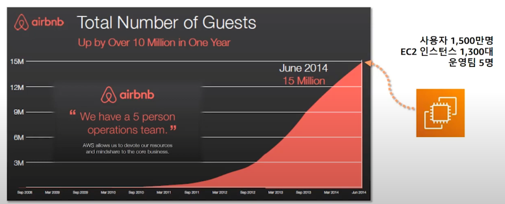
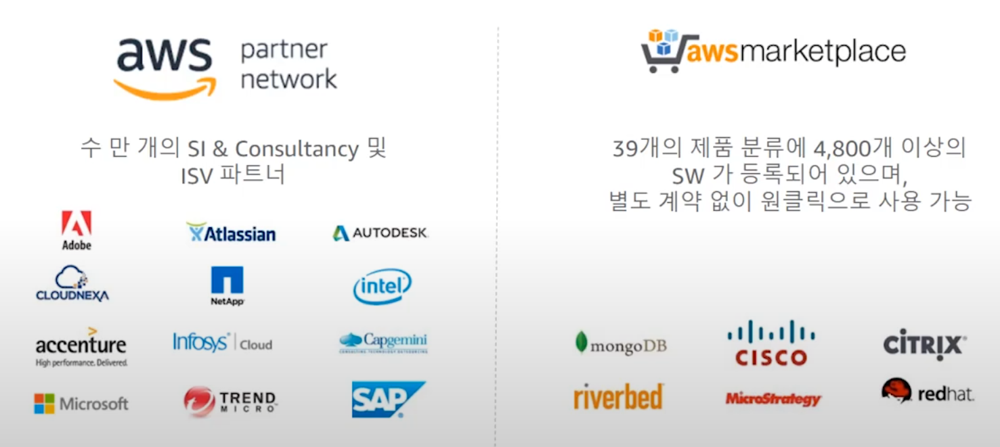

# AWS

## AWS 클라우드 소개

- AWS란?

  - AWS는 2006년 아마존닷컴에서 개발한 클라우드 컴퓨팅 플랫폼 서비스로, 전세계 클라우드 컴퓨팅 분야에서 독보적인 제계 1위의 점유율을 차지하고 있습니다.

    AWS는 규모의 경제와 대용량 저이익 구조에 최적화하여 비용 절감에 따른 이익을 통해 2006년 이후 49번의 자발적인 가격인하를 하였으며, 이로 인하여 타 클라우드 플랫폼 대비 뛰어난 기능과 저렴한 가격으로 전세계 190여 개국에 1백만 이상의 고객이 사용 중입니다.

-  클라우드 컴퓨팅?

  - 인터넷을 통해 IT 리소스와 애플리케이션을 온디맨드로 제공하는 서비스
    - 기존의 물리적인 형태의 실물 컴퓨팅 리소스를 네트워크 기반 서비스 형태로 제공하는 것
    - 사용자로 하여금 네트워크 상에서 클라우드 서비스 자원을 사용하는 것을 의미
    - IaaS, PaaS, SaaS로 분류
  - IaaS
    - AWS가 제공하는 서비스 형태
    - 가상 서버 또는 스토리지, 가상 네트워크 등의 리소스를 서비스 형태로 제공
    - 사용자는 물리적인 하드웨어를 직접 관리할 필요가 없으며, 직접적으로 서비스 이용을 통해 컴퓨터 리소스를 사용할 수 있다.
    - 클라우드 IT의 기본 구성 요소
      - 네트워킹, 컴퓨터, 데이터 스토리지 공간

 ## 유튜브 세미나 자료 

- https://www.youtube.com/watch?v=1Ddvg2dH4PE

### Cloud Computing이란?

- 기업이 웹 서비스를 하려면 (자체 데이터 센터)
  - 데이터 센터 구축 / 하드웨어 구매
  - 높은 초기 투자 비용
  - 한정된 용량
  - 많은 공수 / 소요 시간
- 클라우드 컴퓨팅
  - 필요할 때 언제나 
  - 사용한 만큼만 지불
  - 유연한 용량
  - 적은 노력 / 소요 시간
- 정리
  - 초기투자나 장기 계약 없이
  - 인터넷을 통해 IT 리소스와 애플리케이션을 원할 때 언제든지
  - 사용한 만큼만 요금을 내는 서비스

### Why AWS?

- 장점
  - 초기 선투자 비용 없음
    - 사용한 만큼만 지불
  - 운영 비용 절감
    - 
      - 주황색 부분 : 낭비되는 부분이지만 그래도 구매해야한다 (만약 서버 직접 구성시)
    - 간과하기 쉬운 숨은 비용들
      - 전력 비용
      - 항온항습 비용
      - 상면 비용
      - 운영 관리 비용
      - 라이선스 비용
      - 향후 증설 비용
  - 탄력적인 운영 및 확장
    - 
    - AWS에서는 프로그램 코드로 필요한 자원을 자동 증설 및 감소할 수 있어, 비용 효율적일 뿐만 아니라 최적의 성능 및 안정성을 제공할 수 있다.
  - 속도 및 민첩성
    - On-Premises
      - 수 주일 내 인프라 준비 / 많은 비용 소요
      - 혁신을 위한 시도가 자주 일어나지 않고, 실패의 비용이 높음
      - 혁신 속도가 느려짐
    - AWS
      - 수 분 내 인프라 준비 / 거의 0에 수렴하는 비용
      - 혁신을 위한 시도를 많이할 수 있고, 실패의 비용이 낮음
      - 많은 혁신이 가능
    - 각 산업별로 일어나는 혁신들
      - 클라우드 기반 또는 태생의 기업들이 글로벌하게 성공하는 경우가 흔하게 발생
        - 새로운 시도 민첩성
        - 에어비앤비, 넷플릭스, 배달의 민족, slack
  - 비지니스에만 집중 가능
    - 모든 부차적인 것은 AWS가 대신 관리
      - 데이터 센터 전력 공급, 냉각, 공조, 케이블 연결, 보안관리
      - 네트워킹, 서버 랙 관리, 서버 관리, 스토리지, 시설 운영
    - 기타 등등
      - 신규 하드웨어 구매 및 설치
      - 신규 소프트웨어 설치 및 구성
      - 데이터 센터 구축 및 업그레이드
    -  에어비앤비 사례
      - 
  - 글로벌 확장
    - 전 세계 어디라도 수 분 내 확장하여 서비스 구축 가능
- 13년 이상 축적된 경험
  - 가장 먼저 클라우드 서비스를 시작했고 가장 많은 경험, 시장을 선도
- 폭 넓고 깊이 있는 서비스 포트폴리오
  - 
  - 위 서비스들을 이용해 편리하게 서비스 구축 가능
- 빠르고 지속적인 혁신 속도
  - 90% 이상의 서비스 / 기능은 고객 피드백으로부터 시작되어 출시 -> 고객 지향
  - 
- AWS 글로벌 인프라
  - 22개 리전(Region) / 69개 가용 영역(Avaialability Zones) / 187 point of Presence (CloudFront Edge Location, Regional Edge Cache)
  - 리전
    - AWS 서비스가 운영되는 지역
    - 복수 개의 데이터 센터들의 집합
  - 가용 영역 (AZ)
    - 리전 내 위치한 복수 개의 데이터 센터
    - 각각 물리적으로 분리
      - 고가용성 / 이중화 구성의 기본 요소
  - 엣지 로케이션
    - 클라우드프론트 같은 엣지 서비스의 캐시 서버(POP)가 운영되는 데이터 센터
  - 
- 아마존의 가격 철학
  - 자발적인 73회 가격 인하
  - 
- 가장 넓고 많은 파트너 생태계
  - 
  - 

### 주요 AWS 서비스 소개

- AWS 서비스 포트폴리오
  - 필요한 만큼 원하는 서비스를 제공
  - 
- 컴퓨팅 / 데이터베이스 서비스 소개
  - Amazon EC2
    - 가상 서버 서비스
    - 버츄얼 머신
    - 재구성이 가능한 컴퓨팅 리소스
    - 쉽게 확장 / 축고되는 컴퓨팅 용량
    - 고객 업무 영역에 따른 다양한 인스턴스 타입 제공
    - 사용한 만큼만 과금 (pay-as-you-go)
    - 인스턴스 패밀리 종류
      - 
      - 용도에 따라 선택
    - 인스턴스의 구분
      - m5.large
      - m : 인스턴스 패밀리 / 용도별로 선택
      - 5 : 인스턴스 세대 / 높을수록 최신, / 최신 = 비용 대비 성능이 우수
      - large : 인스턴스 사이즈 / 커질 때 마다 용량 및 가격이 2배씩 증가
    - 과금 옵션 및 비용 최적화
      - 
  - Auto Scaling
    - 서버 자동 확장 / 축소
    - 
    - 
    - 
    - AWS에서는 가능하다
    - CPU, 메모리, 네트워크 사용량을 모니터링 해서 스케일링 진행
    - 기본 서비스 자체는 무료, 늘어나는 EC2 같은 리소스 자원에 대한 비용만 추가 지불
  - Amazon RDS
    - 관리형 관계형 DB 서비스
    - 
    - Amazon Aurora : 성능 및 비용효율성을 모두 확보한 DB엔진
      - 

- 스토리지 및 컨텐츠 배포 서비스 소개
  -  Amazon S3 : 무제한 객체 스토리지
    - 객체 기반의 무제한 파일 저장 스토리지
      - 이미지, 비디오, 파일, 스냅샷 등
    - URL을 통해 손쉽게 파일 공유 가능
    - 99.999999999%의 내구성
    - 사용한 만큼만 지불 (GB 당 과금)
    - 정적 웹 사이트 호스팅 가능
    - AWS 서비스들과의 통합
      - 
    - 스토리지 옵션 및 Glacier, 라이프사이클 관리
      - 
      - Amazon Glacier : 아카이빙 / 백업 스토리지
        - 99,9999999999%의 내구성
        - 백업 / 아카이빙 용도의 Cold 데이터
        - 사용한 만큼 매우 낮은 비용으로 활용 가능
      - S3 Intelligent-Tiering
        - Data Access 패턴이 변경될 때, 성능에 대한 영향 없이 스토리지 비용을 자동으로 최적화 해주는 신규 클래스
        - 객체별 월별 모니터링 및 자동화를 통해 자주 조회하거나, 자주 조회하지 않는 객체들의 티어를 자동으로 조정함으로써 비용을 최적화
          - 
  - Amazon EBS : 블록 스토리지
    - 
    - 서버에 들어가는 ssd, hdd라고 생각
  - Amazon CloudFront: 콘텐츠 전송 네트워크 (CDN)
    - 
    - AWS Shield Standard에 의한 L3/L4 DDoS 보호는 추가 비용없이 포함

### AWS 고객 사례

- 
- 디스패치
  - 기존 IDC 인프라의 한계점
    - 특종 기사가 올라왔을 때 트래픽 처리가 어려움
    - 기존 데이터센터(IDC)에서는 트래픽 최고치 기준으로 요금이 책정되어 불합리
    - 안정적이고 효율적인 인프라 운영이 중요하였음
  - Why 디스패치 chose AWS?
    - 서버 부하 문제 해결 및 확장성 확보 (Auto Scailing 활용)
    - 서버 / 인프라 비용 절감
    - 개발 및 이전 시간 단축
    - 웹사이트 성능 향상
  - 
- 지누스
  - 지누스는 어떤 회사?
    - 메모리폼 매트리스 제조 및 판매를 전문으로 하는 한국 기업
    - 혁신적인 압축 포장 기술 활용하여 매트리스를 박스에 넣어 배송하는 운영 방식으로 해당 부분, 아마존닷컴 누적 판매량 1위
    - 북미 지역 온라인 매트리스 시장 점유율 52% 을 달성하며, 한국을 포함하여 빠른 속도로 글로벌 서비스 확장 중
  - 고객이 겪고 있던 당면 과제
    - 지속적으로 성장하는 비지니스를 커버할 글로벌 인프라 필요
    - 초기 투자 비용을 절감할 수 있는 방안 모색
    - 단기간 내에 SAP를 위한 인프라 구축 필요
  - Why 지누스 chose AWs
    - APN 파트너의 도움을 받아 SAP 인프라를 단기간 내에 구축 완료
    - 아마존 S3을 활용하여 미국 동/서부에 백업을 구성함으로써 효율적인 DR 구성
    - AppStream 2.0을 활용한 SAP GUI 접속 속도, 환경 및 보안 개선
  - 주요 이득
    - 초기 구축 비용 절감
    - 인프라 구축 기간 단축
    - APN 파트너를 통한 통합 구축 및 운영
    - 인프라 관리 및 유지보수 용이

### AWS와 보안

- AWS 보안 : 책임 공유 모델
  - 
  - K-ISMS 인증
    - 

### FAQ

-------------------

참고자료

https://goddaehee.tistory.com/search/aws

https://www.megazone.com/about-aws/

https://velog.io/@swhan9404/AWS-%EA%B3%B5%EB%B6%80-1%EC%A3%BC%EC%B0%A8-AWS-%EC%86%8C%EA%B0%9C

