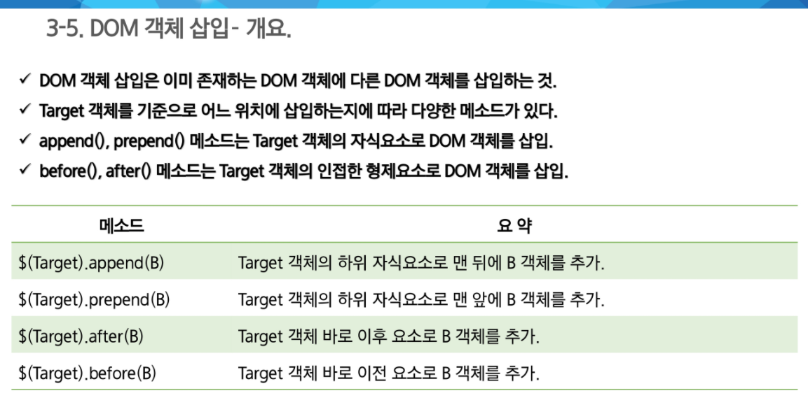

### Form과 이벤트

- method
  - GET
    - 주소 표시줄에 사용자가 입력한 내용이 표시
    - 256~2048bytes(길이 제한)의 데이터만 서버로 전송
  - POST
    - HTTP 메세지의 Body에 담아서 전송하기 때문에 전송 내용의 길이에 제한이 없다
    - 사용자가 입력한 내용이 표시되지 않는다.
- action
  - form 태그 안의 내용들을 처리해 줄 서버상의 프로그램 지정
- 이벤트
  - onsubmit
  - onreset
  - oninput
  - onchange
  - onfocus
  - onblur
  - onselect

### A태그 속성 이해

- href
  - 하이퍼링크를 클릭했을 때 이동할 문서의 URL이나 문서의 책갈피를 지정
  - id로 지정해줘야한다. # 붙여서
- target
  - 하이퍼링크를 클릭했을 때 현재 윈도우 또는 새로운 윈도우에서 이동하지를 결정
  - _blank : 링크 내용이 새 창이나 새탭에서 열린다
  - _self : target 속성의 기본 값으로 링크가 있는 화면에서 열린다

### CSS Position, display

- 포지셔닝
  - 인라인 블록에서 width, height 안 먹힌다
  - auto 
    - width : 100% 상위 블록이 허용하는 width 크기 만큼
    - height : 0% height를 결정하는 요인은 블락 박스 속의 내용물의 크기가 된다
  - position
    - static
      - 기본 값
      - 거리 지정 불가
    - relative
      - HTML 문서에서의 일반적인 내용물의 흐름, top / left 거리를 지정
    - absoulte
      - 자신의 상위 box 속에서의 top, left, right, bottom 등의 절대적인 위치를 지정
    - fixed
      - 스크롤이 일어나도 항상 화면상의 지정된 위치에 있다.
  - overflow
    - visible
      - 내용의 크기에 따라 box의 가로 세로 폭이 늘어남
    - hidden
      - 지정된 범위를 넘치는 내용 보이지 않는다
    - auto
      - 지정된 범위를 넘치는 내용은 스크롤바를 이용하여 표시
    - scroll
      - 상하, 좌우 둘다 스크롤바 생김
  - float
    - 박스가 화면의 어느 위치에 배치할 것인지 설정하기 위해 사용
    - left, right
  - clear
    - float 속성 가지고 있는 값 초기화
    - left, right, both

### 자바스크립트 CSS 스타일 적용 이해

### 자바스크립트 문자열의 숫자변환

### DOM 관련 함수

- attr(name)
  - 첫 번째 요소에 대한 속성 값을 반환
  - attr(name, value) 하면 속성값 설정 가능
- removeAttr(name)
  - 속성 삭제
- 속성 값 추가 및 삭제 메서드
  - addClass(className);
  - removeClass(className);
  - toggleClass(className);
- 스타일 속서 제어
  - $(selector).css(styleName);
  - $(selector).css(styleName, value);
  - $(selector).css(styleName, function(i, style){});
  - $(selector).css(object);

- 

### jquery 이벤트

- bind(eventType, adta, listenr)
  - 핸들러를 할당할 이벤트 타입의 이름
  - 핸들러 함수에서 사용할 데이터, 프로퍼티로 제공됨 생략 시 두 번째 인자는 리스너
  - 이벤트 발생시 수행되는 핸들러 함수
- unbind(eventType, handler)
- unbind(evnetType)
- on, off, one