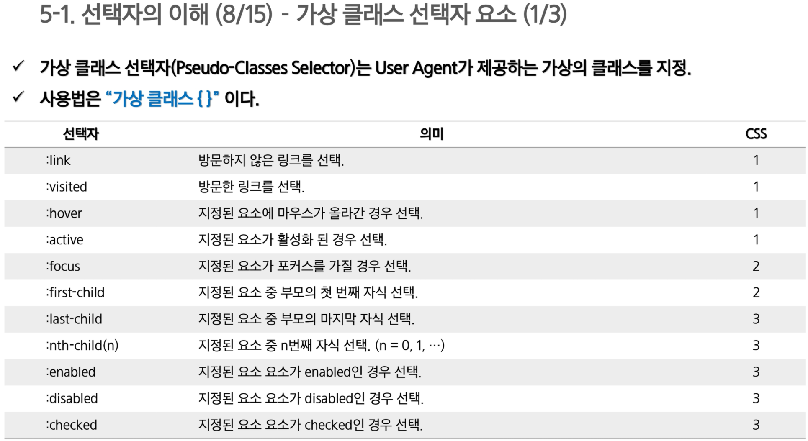

시멘틱 태그 

- HTML 5 특징
- 웹 사이트 검색 엔진이 좀 더 빠르게 검색할 수 있도록 하기 위해 특정 tag에 의미를 부여하는 방식
- 예를 들어 `<header>tga`는 문서의 주제를 나타내는 tag로써 `<header>` tag가 사용된 웹 문서의 경우 검색엔진은 웹문서의 모든 내용을 검색하는 것이 아닌 헤더 tag 내용만을 검색해서 보다 빠르게 검색 진행 가능

CSS 선택자

- CSS 규칙은 선택자와 선언 두 부분으로 구성
- 선택자는 규칙이 적용되는 엘리먼트
- 선언 부분에서는 선택자에 적용될 스타일을 작성
  - 선언은 중괄호로 감싸며
  - 속성(프로퍼티)과 값으로 이루어짐
- , 로 구분하여 여러 선택자 선택 가능
- 선언 안에 하나 이상의 속성을 작성할 수 있고 각 속성은 세미콜론으로 구분

CSS 불러오는 방법 

- 외부

  - ```html
    / link
    <link rel="stylesheet" type="text/css" href="path/filename.css"></link>
    / import
    <style type="text/css">
    @import url("path/filename.css");
    </style>
    ```

  - 가장 많이 사용

  - 하나의 CSS 파일 수정하면 해당 스타일시트 사용하는 모든 페이지에 변경 내용 적용

- 내부

  - `<style>`을 이용하여 HTML페이지 내부에 CSS 적용

    - `<head>` 안에 작성

  - 페이지마다 반복해서 작성해야한다

    - 동일한 스타일 적용할 경우 외부 스타일시트 이용

  - ```html
    <style type="text/css">
        h1 {color:pink;}
    </style>
    ```

- 인라인 스타일시트

  - style attribute를 사용하여 개별 엘리먼트에 스타일적용
  - 스타일 속성의 값은 CSS 규칙의 선언과 같다
  - 하나 이상의 속성 적용 가능, 세미 콜론으로 구분

- 밑에서부터 아래로 적용

HTML 5 웹 문서를 구성하는 3가지 요소

- 구조
  -  HTML : 웹 페이지 문서 담당

- 표현
  - CSS : 웹 페이지 디자인 담당

- 동작
  - JS : 웹 페이지 이벤트 담당


태그

- HTML 문서는 태그로 만들어진다
- 시작 tag, 종료 tag로 쌍을 이루거나 시작 태그만 존재하는 경우도 있다
- 각 태그는 속성과 속성의 값 존재

` <a href = ~~~~ >`

- attribute 알아두기
- href 지워줄 수도 있다

Class,

- 태그에 적용할 스타일의 이름을 지정
- `<div class="content">...</div>`

Id

- 태그에 유일한 ID를 지정함, 자바스크립트에서 주로 사용
- `<input type="text" id="userid">`

주석 

- 브라우저에 출력이 되지 않는다.
- HTML tag의 내용을 설명하기 위한 용도
- `<!-- ㅇㄴ마ㅓㄴ이ㅏㅓㅁㄴ아 -->`

특수문자

- 

테이블

- colspan
  - 두 개 이상의 열을 하나로 합치기 위해 사용

- rowsapn
  - 두 개 이상의 행을 하나로 합치기 위해 사용

- 

셀 패딩 살짝

이미지

- `` 태그를 사용하여 이미지를 삽입하기 위해 사용
- src 속성은 이미지 경로를 지정하기 위해 사용 (상대경로, URL 모두 가능)
- alt 속성은 이미지 표시할 수 없을 때 화면에 대신하여 보여질 텍스트 지정
- ``

3-5 링크 요소 

- `<a>` 태그 사용
- 중첩 사용 불가
- href 속성은 하이퍼링크를 클릭했을 때 이동할 문서의 URL이나 문서의 책갈피를 지정
- target 속성은 하이퍼링크를 클릭했을 때 현재 윈도우 또는 새로운 윈도우에서 이동할지 지정
  - `target="_self"`
    - 타겟 속성의 기본 값으로 링크가 있는 화면에서 열린다

  - `target="_blank"`
    - 링크 내용이 새 창이나 새 탭에서 열린다.


map, ifram

- 넘어가자

3-7 form 

- 사용자로부터 데이터를 입력 받아 서버에서 처리하기 위한 용도
  - 사용자의 요청에 따라 서버는 HTML form을 전달(회원가입 양식, 검색 양식 등)
  - 사용자는 HTML form에 적절한 데이터를 입력한 후 서버로 전송, 이를 submit이라 함
  - 서버는 사용자의 요청을 분석한 후 데이터를 등록하거나, 원하는 데이터를 조회하여 결과를 다시 반환

- 
- GET, POST 
  - 

- 다알야한다
  - 


체크박스 래디오

- 
- 

----------------------

CSS   

선택자

- 

가상 엘리멘트 - 시간 되면

- 

보더 주는 방법 

- 
- 보더속성
  - `div {border: 1px solid orange;}`

박스모델 (주관식)

- CSS는 모든 엘리먼트는 여러 겹의 상자로 둘러 쌓여 있다고 가정한다
- 컨텐츠, 패딩, 테두리(보더), 마진으로 구분
- 컨텐츠를 정렬 또는 위치를 지정하기 위해 Padding, Margin 속성을 활용
- 박스모델을 활용하여 다양한 형태의 테이블이나 버튼을 직접 작성하여 활용

마진 패딩

- 마진
  - 값이 1 개일 때는 모든 면, 
  - 2개일 때는 첫 번째는 탑 바텀, 두번째는 라이트 레프트에 적용
  - 3개일 때는 첫번째는 탑, 두번쨰는 라이트 레프트에 적용 세번째는 바텀
  - 4개일 때는 탑, 라이트, 바텀, 레프트 순으로 적용
  - 블록레벨의 경우
    - 두 개 이상의 인접 수직 마진은 통합되나, 수평마진은 통합되지 안흔다
    - 유동된(floated) 박스와 다른 박스의 수직 마진은 통합 X
    - 위치값이 absolute와 relative로 위치한 박스의 마진들은 통합되지 않는다
- 가운데 정렬
  - `E {margin: 0 auto}`
    - 첫 번째는 상하 여백, 두 번째는 좌 우 여백
    - auto는 현재 엘리먼트를 중심으로 상,하 또는 좌,우 여백을 균등하게 분배

5-7 포지셔닝

- 포지셔닝은 시작적인 측면에서 HTML의 가장 중요한 요소

- HTML 내 부분 문서의 위치를 지정하거나 객체의 보임과 안보임을 다룬다

- 엘리먼트의 위치를 고정시키거나 브라우저의 크기에 따라 이동하는 등의 설정을 한다

- 정적인 HTML을 자바스크립트를 이용하여 동적으로 만들기 위한 가장 기본적인 속성

- 포지셔닝

  - 

    

- overflow
  - 상위 엘리먼트에 속한 내용이 엘리먼트의 크기보다 클 경우 어떻게 처리할 것인 지 설정
  - 속성값을 visible로 설장하면 box 속의 내용을 모두 표시
    - 내용의 크기에 따라 box의 가로, 세로 폭이 늘어남
  - 속성값을 hidden으로 설정하면 box의 width, height를 지정했을 경우, 지정된 범위를 넘치는 내용은 보이지 않는다
  - 속성값을 auto로 설정하면 지정된 범위를 넘치는 내용은 스크롤바를 이용하여 표시

- float
  - 박스가 화면의 어느 위치에 배치할 것인지를 설정하기 위해 사용


- visibility
  - 엘리먼트를 화면에 보이거나 숨기기 위해서 사용
  - visible 설정하면 화면에 표시, hidden으로 설정하면 화면에서 숨김
  - hidden으로 설정된 엘리먼트는 화면에 표시되지는 않지만 면적은 차지하고 있음
  - 화면에서 숨기고 면적도 차지하지 않도록 하기 위해서는 display 속성을 사용

- z-index
  - auto로 설정하면 부모 엘리먼트의 레벨과 같은 값, 이 값이 기본값
  - z-index 값이 큰 엘리먼트를 위에 표시  


-------

JS

일급객체에 대한 것

- 함수는 일급 객체이다
- 함수를 변수 객체 배열 등에 저장할 수 있고, 다른 함수에 전달하는 전달 인자(콜백함수)또는 리턴 값으로 사용가능
- 함수는 프로그램 실행 중에 동적으로 생성 가능
- 함수 정의 방법은 함수 선언문, 함수 표현식, Function 생성자 함수 세 가지 방식 제공

호이스팅

- var 키워드를 사용한 변수는 중복해서 선언이 가능
- 호이스팅이란, var 선언문이나 function 선언문 등 모든 선언문이 해당 스코프의 처음으로 옮겨진 것처럼 동작하는 특성, 즉 자바스크립트는 모든 선언문이 선언되기 전에 참조가 가능
- 변수의 생성
  - 선언단계, 초기화 단계 한번에 이루어짐
  - 할당 간계 : undefined로 초기화된 변수에 실제 값 할당
- 함수 호이스팅
  - 함수 선언의 위치와 상관 없이 코드 내 어느 곳에서든지 호출이 가능
  - 함수 선언문으로 정의된 함수는 자바스크립트가 로딩되는 시점에 이를 변수 객체 저장한다. 함수 선언 초기화 할당이 한번에 이루어진다
  - 함수 표현식의 경우 함수 호이스팅이 아니라 변수 호이스팅이 발생

콜백

- 함수를 명시적으로 호출하는 방식이 아니라, 특정 이벤트가 발생했을 때 시스템에 의해 호출되는 함수를 말함
- 일반적으로 콜백 함수는 매개 변수를 통해 전달되고 전달받은 함수의 내부에서 어느 특정시점에 실행됨
- 콜백함수는 주로 비동기식 처리 모델에서 사용됨 
  - 처리가 종료되면 호출될 함수(콜백 함수)를 미리 매개변수에 전달하고 처리가 종료되면 콜백함수를 호출


4-3 window.open

- 

DOM 문서 훑어보기

- 
- setattribue, getAttribute
  - 

- innerHTML, innerText
  - 

- 객체 가져오기 반드시 알야야 된다
  - 


이벤트

- 

- 

- 

- 

- 인라인 이벤트 핸들러

  - 
  - HTML 코드를 자바스크립트 코드가 침범한다는 문제

- 이벤트 핸들러 프로퍼티 방식

  - 

  - 혼용되는 문제는 해결 가능, 하지만 하나의 이벤트핸들러만을 바인딩할 수 있다.

- addEventListener 메소드 방식

  - 

localstroage

- 

- 키와 값을 하나의 세트로 저장
- 도메인과 브라우저 별로 저장
- 값은 반드시 문자열로 저장됨
- 메서드
  - setItem(key, valu)
  - getItem(key)
  - removeItem(key)
- 
- 
- localStorage.clear() : 전체 삭제
- sessionStorage
  - 현재 떠있는 탭에서만 유지
  - 페이지 새로 고침 시에는 데이터 유지, 탭을 닫고 새로 열었을 경우 제거
  - 기본 메서드는 똑같다

---------------

jQueue

기본구문 쓰는방법

Ajax

nth-child

2-7 계층 구조 탐색